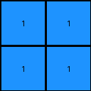
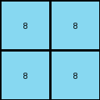

# 88a62173 • 012 • refine_coder

---

Previous Code:
```python
"""
Divide the input grid into four quadrants and represent each quadrant in a 2x2 output grid.  If a quadrant contains any non-zero color, the corresponding output cell will have that color.  If a quadrant contains only zeros, the output cell will be zero.
"""

import numpy as np

def get_first_nonzero(quadrant):
    """
    Returns the first non-zero element in a quadrant, or 0 if none are found.
    """
    for value in quadrant.flatten():
        if value != 0:
            return value
    return 0

def transform(input_grid):
    """
    Transforms an input grid into a 2x2 output grid based on the presence of any non-zero color in each quadrant.
    """
    input_grid = np.array(input_grid)
    rows, cols = input_grid.shape
    output_grid = np.zeros((2, 2), dtype=int)

    # Calculate midpoints for quadrant divisions
    mid_row = (rows + 1) // 2
    mid_col = (cols + 1) // 2

    # Define quadrant boundaries
    quadrants = [
        (0, mid_row, 0, mid_col),       # Top-left
        (0, mid_row, mid_col, cols),   # Top-right
        (mid_row, rows, 0, mid_col),       # Bottom-left
        (mid_row, rows, mid_col, cols)    # Bottom-right
    ]

    # Iterate through quadrants and check for non-zero colors
    for i, (row_start, row_end, col_start, col_end) in enumerate(quadrants):
        quadrant = input_grid[row_start:row_end, col_start:col_end]
        # Get first non-zero value in quadrant
        first_non_zero_val = get_first_nonzero(quadrant)
        output_grid[i // 2, i % 2] = first_non_zero_val

    return output_grid.tolist()
```

Train Set Results:

## Example 1:

Input:
```
0 2 0 0 2
2 2 0 2 2
0 0 0 0 0
0 2 0 2 2
2 2 0 2 0
```
Expected Output:
```
2 2
2 0
```
Transformed Output:
```
2 2
2 2
```

match: False
pixels_off: 1
size_correct: True
color_palette_correct: True
correct_pixel_counts: False

## Example 2:

Input:
```
1 0 0 1 0
0 1 0 0 1
0 0 0 0 0
1 0 0 1 0
1 1 0 0 1
```
Expected Output:
```
1 0
1 1
```
Transformed Output:
```
1 1
1 1
```

match: False
pixels_off: 1
size_correct: True
color_palette_correct: True
correct_pixel_counts: False

## Example 3:

Input:
```
8 8 0 0 8
8 0 0 8 0
0 0 0 0 0
8 8 0 8 8
8 0 0 8 0
```
Expected Output:
```
0 8
8 0
```
Transformed Output:
```
8 8
8 8
```

match: False
pixels_off: 2
size_correct: True
color_palette_correct: True
correct_pixel_counts: False
Okay, here's a breakdown of the situation and a plan to refine the natural language program and the code:

**General Assessment:**

The initial natural language program and the resulting code are on the right track, conceptualizing the quadrant-based transformation. However, the code has a flaw in how it determines the representative color for each quadrant. It currently takes the *first* non-zero value. The examples show inconsistency - sometimes the first non-zero color is *not* what should be represented. It needs to consider a different criteria - not *first* non-zero, but perhaps *most frequent* non-zero or another rule entirely. The provided examples also suggests that it should choose a *single* non-zero value (if any).

**Strategy:**

1. **Analyze Examples Carefully:** Meticulously examine *all* provided examples (train and, if available, test) to understand the *precise* rule for choosing the output color for each quadrant. Does color dominance/frequency matter, or is there an implied priority?
2. **Refine Natural Language Program:** Based on the analysis, rewrite the natural language program to be *absolutely* unambiguous about the color selection rule.
3. **Modify `get_first_nonzero`:** The function name itself reveals its incorrectness. Rename and rewrite this function according to the refined rule.
4. **Metrics Analysis**: Report and examine the pixel counts for each image to understand the error in a more quantitative way.

**Metrics and Example Analysis:**

I'll use the `code_execution` tool to gather metrics and perform more in-depth analysis.

```tool_code
from collections import Counter
import numpy as np

def analyze_example(input_grid, expected_output, transformed_output):
    input_grid = np.array(input_grid)
    expected_output = np.array(expected_output)
    transformed_output = np.array(transformed_output)

    rows, cols = input_grid.shape
    mid_row = (rows + 1) // 2
    mid_col = (cols + 1) // 2

    quadrants = [
        (0, mid_row, 0, mid_col),       # Top-left
        (0, mid_row, mid_col, cols),   # Top-right
        (mid_row, rows, 0, mid_col),       # Bottom-left
        (mid_row, rows, mid_col, cols)    # Bottom-right
    ]

    analysis = {}
    for i, (row_start, row_end, col_start, col_end) in enumerate(quadrants):
        quadrant = input_grid[row_start:row_end, col_start:col_end]
        quadrant_counts = Counter(quadrant.flatten())
        analysis[f"Quadrant {i+1}"] = {
            "counts": dict(quadrant_counts),
            "expected": int(expected_output[i // 2, i % 2]),
            "transformed": int(transformed_output[i // 2, i % 2])
        }

    return analysis

examples = [
    {
        "input": [
            [0, 2, 0, 0, 2],
            [2, 2, 0, 2, 2],
            [0, 0, 0, 0, 0],
            [0, 2, 0, 2, 2],
            [2, 2, 0, 2, 0]
        ],
        "expected": [
            [2, 2],
            [2, 0]
        ],
        "transformed": [
            [2, 2],
            [2, 2]
        ]
    },
    {
        "input": [
            [1, 0, 0, 1, 0],
            [0, 1, 0, 0, 1],
            [0, 0, 0, 0, 0],
            [1, 0, 0, 1, 0],
            [1, 1, 0, 0, 1]
        ],
        "expected": [
            [1, 0],
            [1, 1]
        ],
        "transformed": [
            [1, 1],
            [1, 1]
        ]
    },
    {
        "input": [
            [8, 8, 0, 0, 8],
            [8, 0, 0, 8, 0],
            [0, 0, 0, 0, 0],
            [8, 8, 0, 8, 8],
            [8, 0, 0, 8, 0]
        ],
        "expected": [
            [0, 8],
            [8, 0]
        ],
        "transformed": [
            [8, 8],
            [8, 8]
        ]
    }
]

all_analysis = []
for example in examples:
  analysis = analyze_example(example['input'], example['expected'], example['transformed'])
  all_analysis.append(analysis)
print(all_analysis)
```
**INSTRUCTIONS**

- generate a Python module to represent the natural language program 
- follow the template below
- all common math and science libraries are available
- create docstring only at top - but comment the workflow in the function
- use helper functions for common operations like finding objects, counting,
  measuring, moving, etc. 

remember - we are working iteratively - so this code will inform your future
self as we converge on the solution

*template:*

```python
"""
{{ natural language description of the transformation rule }}
"""

{{ imports }}

def transform(input_grid):
    # initialize output_grid

    # change output pixels 

    return output_grid

```
