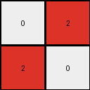

# 88a62173 • 015 • refine_dreamer

---

Previous Code:
```python
"""
The transformation extracts a 2x2 representation of the larger, somewhat checkerboard-like input grid by taking top-left corner and using it's simplified 2x2 pattern.
"""

import numpy as np

def transform(input_grid):
    # initialize output_grid as 2x2 numpy array with zeros
    output_grid = np.zeros((2, 2), dtype=int)

    # Extract the top-left 2x2 subgrid from the input
    subgrid = input_grid[:2, :2]

    # check if top left 2 x 2 has alternating pattern, if yes, use it, if no, use general rule
    if (subgrid[0,0] != subgrid[0,1]) and (subgrid[0,0] != subgrid[1,0]) and (subgrid[1,1] != subgrid[1,0]) and (subgrid[1,1] != subgrid[0,1]):
      output_grid = subgrid
    else:
        # Apply the alternating pattern to the output
        output_grid[0, 0] = input_grid[0, 0]
        output_grid[0, 1] = input_grid[0, -1]
        output_grid[1, 0] = input_grid[-1, 0]
        output_grid[1, 1] = input_grid[-1, -1]

    return output_grid
```

Train Set Results:

## Example 1:

Input:
```
0 2 0 0 2
2 2 0 2 2
0 0 0 0 0
0 2 0 2 2
2 2 0 2 0
```
Expected Output:
```
2 2
2 0
```
Transformed Output:
```
0 2
2 0
```

match: False
pixels_off: 1
size_correct: True
color_palette_correct: True
correct_pixel_counts: False

## Example 2:

Input:
```
1 0 0 1 0
0 1 0 0 1
0 0 0 0 0
1 0 0 1 0
1 1 0 0 1
```
Expected Output:
```
1 0
1 1
```
Transformed Output:
```
1 0
0 1
```

match: False
pixels_off: 1
size_correct: True
color_palette_correct: True
correct_pixel_counts: False

## Example 3:

Input:
```
8 8 0 0 8
8 0 0 8 0
0 0 0 0 0
8 8 0 8 8
8 0 0 8 0
```
Expected Output:
```
0 8
8 0
```
Transformed Output:
```
8 8
8 0
```

match: False
pixels_off: 1
size_correct: True
color_palette_correct: True
correct_pixel_counts: False
**INSTRUCTIONS**

The code above was generated based on observations from the first training
example

we have tested the transform function on each of the task example inputs and
compared with the expected output

review each of the examples provided and the results and consider how the
natural language program should be updated to accommodate this new knowledge

respond with the following deliverables:

- general assessment of the information provided and strategy for resolving the
  errors
- gather metrics about each of the examples and results - use code_execution to
  develop accurate reports on your assumptions
- a YAML block documenting facts - Focus on identifying objects, their properties, and the actions performed on them.
- a natural language program - Be as clear and concise as possible, providing a complete description of the transformation rule.


your responses should be considered as information in a report - not a
conversation
