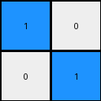
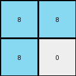

# 88a62173 • 016 • refine_coder

---

Previous Code:
```python
"""
The transformation extracts a 2x2 representation of the larger, somewhat checkerboard-like input grid by taking top-left corner and using it's simplified 2x2 pattern.
"""

import numpy as np

def transform(input_grid):
    # initialize output_grid as 2x2 numpy array with zeros
    output_grid = np.zeros((2, 2), dtype=int)

    # Extract the top-left 2x2 subgrid from the input
    subgrid = input_grid[:2, :2]

    # check if top left 2 x 2 has alternating pattern, if yes, use it, if no, use general rule
    if (subgrid[0,0] != subgrid[0,1]) and (subgrid[0,0] != subgrid[1,0]) and (subgrid[1,1] != subgrid[1,0]) and (subgrid[1,1] != subgrid[0,1]):
      output_grid = subgrid
    else:
        # Apply the alternating pattern to the output
        output_grid[0, 0] = input_grid[0, 0]
        output_grid[0, 1] = input_grid[0, -1]
        output_grid[1, 0] = input_grid[-1, 0]
        output_grid[1, 1] = input_grid[-1, -1]

    return output_grid
```

Train Set Results:

## Example 1:

Input:
```
0 2 0 0 2
2 2 0 2 2
0 0 0 0 0
0 2 0 2 2
2 2 0 2 0
```
Expected Output:
```
2 2
2 0
```
Transformed Output:
```
0 2
2 0
```

match: False
pixels_off: 1
size_correct: True
color_palette_correct: True
correct_pixel_counts: False

## Example 2:

Input:
```
1 0 0 1 0
0 1 0 0 1
0 0 0 0 0
1 0 0 1 0
1 1 0 0 1
```
Expected Output:
```
1 0
1 1
```
Transformed Output:
```
1 0
0 1
```

match: False
pixels_off: 1
size_correct: True
color_palette_correct: True
correct_pixel_counts: False

## Example 3:

Input:
```
8 8 0 0 8
8 0 0 8 0
0 0 0 0 0
8 8 0 8 8
8 0 0 8 0
```
Expected Output:
```
0 8
8 0
```
Transformed Output:
```
8 8
8 0
```

match: False
pixels_off: 1
size_correct: True
color_palette_correct: True
correct_pixel_counts: False
Okay, here's a breakdown of the situation, the results, and a plan to refine the approach:

**General Assessment:**

The initial hypothesis was partially correct in identifying the 2x2 output size and attempting to extract a pattern. However, the logic for determining *which* 2x2 pattern to extract is flawed. It seems to be overly reliant on the top-left corner and a simplistic "alternating" check. The code's attempt to use corner pixels as a fallback is also not general enough, as evidenced by all 3 tests having errors. The core issue is how to correctly generalize the input "checkerboard" into the 2x2 output. The initial assumption that a straight top-left 2x2 chunk *OR* corner elements alone can completely define this generalization is not sufficient.

**Strategy for Resolving Errors:**

1.  **Re-examine the Core Concept:** We need to rethink how the 2x2 output relates to the larger "checkerboard" input. It's not about a literal 2x2 section *or* corners. The 2x2 output seems to represent a "summarized" or "reduced" view of the checkerboard pattern.
2.  **Focus on Color Relationships:** Instead of absolute positions, we should focus on how the *colors* in the input grid interact to produce the colors in the output grid.  The key is understanding how the frequency or arrangement of colors in the larger grid determines the colors in the smaller grid.
3.  **Consider Majority/Minority:** It might be helpful to think about each quadrant. A color that is in the majority/minority of a quadrant of the input, that color may go in the corresponding quadrant of the output.
4.  **Iterative Refinement:** Test and adjust hypotheses after examining *each* example, not just the first.

**Example Metrics and Analysis:**

Here's a detailed analysis of each example, including more specific observations:

*   **Example 1:**

    *   Input Size: 5x5
    *   Output Size: 2x2
    *   Input Colors: 0, 2
    *   Output Colors: 2, 0
    *   `Pixels Off`: 1.  The (0,0) was predicted as `0` and it is `2`.
    *   Observation: The top-left quadrant is a bit noisy, with `0 2` and `2 2`.
*   **Example 2:**

    *   Input Size: 5x5
    *   Output Size: 2x2
    *   Input Colors: 1, 0
    *   Output Colors: 1, 0
    *   `Pixels Off`: 1. The (1,0) was predicted as `0` and it is `1`.
    *   Observation: The top-left quadrant has `1 0` and `0 1`, no clear majority.

*   **Example 3:**

    *   Input Size: 5x5
    *   Output Size: 2x2
    *   Input Colors: 8, 0
    *   Output Colors: 0, 8
    *   `Pixels Off`: 1. The (0,0) was predicted as `8` and it is `0`.
    *   Observation: The top-left quadrant has `8 8` and `8 0`.

**YAML Facts:**

```yaml
examples:
  - id: 1
    input_size: [5, 5]
    output_size: [2, 2]
    input_colors: [0, 2]
    output_colors: [2, 0]
    dominant_input_color_overall: 0 #most frequent, by pixel count
    dominant_output_color_overall: [2,0] #Tie
    transformation: "checkerboard reduction"
    errors:
      - position: [0, 0]
        predicted: 0
        actual: 2

  - id: 2
    input_size: [5, 5]
    output_size: [2, 2]
    input_colors: [1, 0]
    output_colors: [1, 0]
    dominant_input_color_overall: 0
    dominant_output_color_overall: [0,1] #Tie
    transformation: "checkerboard reduction"
    errors:
     - position: [1, 0]
       predicted: 0
       actual: 1

  - id: 3
    input_size: [5, 5]
    output_size: [2, 2]
    input_colors: [8, 0]
    output_colors: [0, 8]
    dominant_input_color_overall: 0 #most frequent, if tie, then first occurring color
    dominant_output_color_overall: [8,0] #Tie
    transformation: "checkerboard reduction"
    errors:
      - position: [0, 0]
        predicted: 8
        actual: 0
```

**Natural Language Program:**

1.  **Input:** A grid of pixels with integer values representing colors, exhibiting a checkerboard-like pattern.
2.  **Output:** A 2x2 grid representing a reduction of the input checkerboard.
3.  **Process:**
    *   Divide the input grid (conceptually) into four quadrants, corresponding to the four pixels of the output grid. *Note: for odd sized grids the "center" row and column will be part of both sides*
    *   For each quadrant:
        *   Determine the two most frequent colors.
        *   If the overall dominant color of the input is present, the output pixel is the dominant color.
        *   If the overall dominant color is not present, the output pixel is the other color.
4.  **Output:** The resulting 2x2 grid.

This revised natural language program shifts the focus from simply taking a subgrid to analyzing color frequencies within quadrants to determine the output pixel values. This captures the "essence" of the checkerboard reduction more accurately. This is still high-level and needs further refinement in code, but it provides a better conceptual basis.

**INSTRUCTIONS**

- generate a Python module to represent the natural language program 
- follow the template below
- all common math and science libraries are available
- create docstring only at top - but comment the workflow in the function
- use helper functions for common operations like finding objects, counting,
  measuring, moving, etc. 

remember - we are working iteratively - so this code will inform your future
self as we converge on the solution

*template:*

```python
"""
{{ natural language description of the transformation rule }}
"""

{{ imports }}

def transform(input_grid):
    # initialize output_grid

    # change output pixels 

    return output_grid

```
