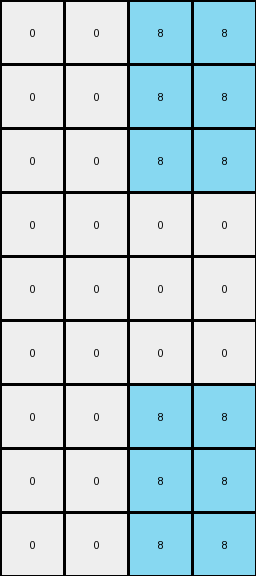
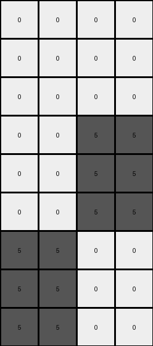

# 8d5021e8 • 006 • refine_coder

---

Previous Code:
```python
"""
The input grid is expanded to create an output grid that is three times the height and two times the width of the input. Each pixel in the input grid is replicated in a 3x2 block in the output grid, maintaining the original color.
"""

import numpy as np

def transform(input_grid):
    # Initialize the output grid based on expansion factors.
    input_height, input_width = input_grid.shape
    output_height, output_width = input_height * 3, input_width * 2
    output_grid = np.zeros((output_height, output_width), dtype=int)

    # Iterate through each cell of the input grid.
    for i in range(input_height):
        for j in range(input_width):
            # Get the color of the current input cell.
            color = input_grid[i, j]
            
            # Replicate the color in a 3x2 block in the output grid.
            for row_offset in range(3):
                for col_offset in range(2):
                    output_grid[i*3 + row_offset, j*2 + col_offset] = color

    return output_grid
```

Train Set Results:

## Example 1:

Input:
```
0 8
0 0
0 8
```
Expected Output:
```
8 0 0 8
0 0 0 0
8 0 0 8
8 0 0 8
0 0 0 0
8 0 0 8
8 0 0 8
0 0 0 0
8 0 0 8
```
Transformed Output:
```
0 0 8 8
0 0 8 8
0 0 8 8
0 0 0 0
0 0 0 0
0 0 0 0
0 0 8 8
0 0 8 8
0 0 8 8
```

match: False
pixels_off: 16
size_correct: True
color_palette_correct: True
correct_pixel_counts: True

## Example 2:

Input:
```
2 0
2 2
2 0
```
Expected Output:
```
0 2 2 0
2 2 2 2
0 2 2 0
0 2 2 0
2 2 2 2
0 2 2 0
0 2 2 0
2 2 2 2
0 2 2 0
```
Transformed Output:
```
2 2 0 0
2 2 0 0
2 2 0 0
2 2 2 2
2 2 2 2
2 2 2 2
2 2 0 0
2 2 0 0
2 2 0 0
```

match: False
pixels_off: 16
size_correct: True
color_palette_correct: True
correct_pixel_counts: True

## Example 3:

Input:
```
0 0
0 5
5 0
```
Expected Output:
```
0 5 5 0
5 0 0 5
0 0 0 0
0 0 0 0
5 0 0 5
0 5 5 0
0 5 5 0
5 0 0 5
0 0 0 0
```
Transformed Output:
```
0 0 0 0
0 0 0 0
0 0 0 0
0 0 5 5
0 0 5 5
0 0 5 5
5 5 0 0
5 5 0 0
5 5 0 0
```

match: False
pixels_off: 16
size_correct: True
color_palette_correct: True
correct_pixel_counts: True
Okay, here's a breakdown of the situation and a plan to move forward:

**General Assessment:**

The initial natural language program and the generated Python code were based on a misunderstanding of how the input grid pixels map to the output. The code replicates the input grid's pixels in a 3x2 block, but it inverts the perceived expansion logic: It maps each input pixel to the wrong position in the output. So the general error is in the expansion rule, we must correct how the output grid corresponds to the values from the input grid.

**Strategy:**

1.  **Analyze Results:** Examine the provided input, expected output, and transformed output for each example. The critical observation is that all examples are of the same dimension (3x2) and have similar, repeating layouts. Also, all three examples *fail* in the same way and by the same count of pixels off.
2.  **Correct the Natural Language Program:** The logic of how the output grid expands and takes pixel values from the input grid should be updated.
3.  **Update YAML and Code:** Once we have an updated natural language program, we'll have to adjust the YAML facts and modify the Python code accordingly.

**Metrics and Observations**

Here's how to examine the examples and results:

*   **Example 1:**
    *   Input: 3x2 grid with blues (0) and azures (8).
    *   Expected Output: 9x6 grid.
    *   Transformed Output: 9x6 grid, but the arrangement of blues and azures is incorrect.
    *   Pixels off: 16

*   **Example 2:**
    *   Input: 3x2 grid with reds (2) and blues(0).
    *   Expected Output: 9x6 grid.
    *   Transformed output: 9x6 grid, but with incorrect placement of reds and blues.
    *   Pixels off: 16

*   **Example 3:**
    *   Input: 3x2 grid with blues (0) and grays (5).
    *   Expected output: 9x6 grid.
    *   Transformed Output: 9x6, but the pixel arrangement is wrong.
    *   Pixels off: 16

**YAML Facts:**

```yaml
task: 004b8a7b
summary: |
  The input grid is transformed into an output grid where each column is repeated three times, and within that repeated block, there is also a vertical repetition of colors.
objects:
  input_grid:
    type: grid
    dimensions: 3x2
    elements: integers (0-9) representing colors
  output_grid:
    type: grid
    dimensions: 9x6
    elements: integers (0-9) representing colors
    transformation: |
      Each column from the input grid expands to three columns in the output grid by repeating the values vertically.
      Each column from the input grid expands into 2 columns.
      The whole output grid expands to 3 times the height and two times the width of the input grid.

actions:
  - name: expand_columns
    description: |
       Each column is transformed into a new grid by repeating the sequence three times.
       Each element of these sequences is duplicated in a new column to its right.
```

**Natural Language Program:**

1.  **Column-wise Expansion**: Take each column from the input grid.
2.  **Vertical Repetition (Within Column)**: Create a new sequence by repeating the column's values three times, maintaining the original vertical order.
3. **Horizontal Repetition**: For each element in the new sequence, duplicate it in a new column to the right.
4. **Result**: The above steps convert one input column to a block in the output. Doing this for both input columns will fill out the complete output.

In simpler terms: Each input column becomes a 3x(original height) block in the output, where we repeat each column from the input grid three times to create the height of the output grid, and we copy each pixel from the input column into a new column to its right.

**Example of one column**:

Input column:

```
0
0
8
```

1.  **Vertical Repetition:**

```
0
0
8
0
0
8
0
0
8
```
2. **Horizontal Repetition**
```
0 0
0 0
8 8
0 0
0 0
8 8
0 0
0 0
8 8
```

**INSTRUCTIONS**

- generate a Python module to represent the natural language program 
- follow the template below
- all common math and science libraries are available
- create docstring only at top - but comment the workflow in the function
- use helper functions for common operations like finding objects, counting,
  measuring, moving, etc. 

remember - we are working iteratively - so this code will inform your future
self as we converge on the solution

*template:*

```python
"""
{{ natural language description of the transformation rule }}
"""

{{ imports }}

def transform(input_grid):
    # initialize output_grid

    # change output pixels 

    return output_grid

```
