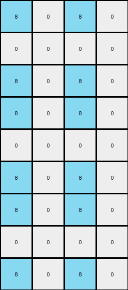

# 8d5021e8 • 011 • refine_dreamer

---

Previous Code:
```python
"""
1. Expand the Grid: The input grid's height is tripled, and its width is doubled.
2. Mirror Columns: The first column of the input grid is copied to the second and fourth columns of the output grid. The second column of the input grid is copied to the first and third columns of the output grid.
3. Repeat Vertically: This entire mirrored pattern (of the expanded width) is repeated three times vertically to achieve the tripled height.
"""

import numpy as np

def transform(input_grid):
    # Initialize output grid with tripled height and doubled width
    output_height = input_grid.shape[0] * 3
    output_width = input_grid.shape[1] * 2
    output_grid = np.zeros((output_height, output_width), dtype=int)

    # Mirror and repeat
    for i in range(3):  # Repeat the pattern three times vertically
        # Copy the input columns to the output, mirrored as per the refined rule
        output_grid[i * input_grid.shape[0]:(i + 1) * input_grid.shape[0], 1] = input_grid[:, 0]  # Input col 0 to output col 1
        output_grid[i * input_grid.shape[0]:(i + 1) * input_grid.shape[0], 3] = input_grid[:, 0]  # Input col 0 to output col 3
        output_grid[i * input_grid.shape[0]:(i + 1) * input_grid.shape[0], 0] = input_grid[:, 1]  # Input col 1 to output col 0
        output_grid[i * input_grid.shape[0]:(i + 1) * input_grid.shape[0], 2] = input_grid[:, 1]  # Input col 1 to output col 2

    return output_grid
```

Train Set Results:

## Example 1:

Input:
```
0 8
0 0
0 8
```
Expected Output:
```
8 0 0 8
0 0 0 0
8 0 0 8
8 0 0 8
0 0 0 0
8 0 0 8
8 0 0 8
0 0 0 0
8 0 0 8
```
Transformed Output:
```
8 0 8 0
0 0 0 0
8 0 8 0
8 0 8 0
0 0 0 0
8 0 8 0
8 0 8 0
0 0 0 0
8 0 8 0
```

match: False
pixels_off: 12
size_correct: True
color_palette_correct: True
correct_pixel_counts: True

## Example 2:

Input:
```
2 0
2 2
2 0
```
Expected Output:
```
0 2 2 0
2 2 2 2
0 2 2 0
0 2 2 0
2 2 2 2
0 2 2 0
0 2 2 0
2 2 2 2
0 2 2 0
```
Transformed Output:
```
0 2 0 2
2 2 2 2
0 2 0 2
0 2 0 2
2 2 2 2
0 2 0 2
0 2 0 2
2 2 2 2
0 2 0 2
```

match: False
pixels_off: 12
size_correct: True
color_palette_correct: True
correct_pixel_counts: True

## Example 3:

Input:
```
0 0
0 5
5 0
```
Expected Output:
```
0 5 5 0
5 0 0 5
0 0 0 0
0 0 0 0
5 0 0 5
0 5 5 0
0 5 5 0
5 0 0 5
0 0 0 0
```
Transformed Output:
```
0 0 0 0
5 0 5 0
0 5 0 5
0 0 0 0
5 0 5 0
0 5 0 5
0 0 0 0
5 0 5 0
0 5 0 5
```

match: False
pixels_off: 16
size_correct: True
color_palette_correct: True
correct_pixel_counts: True
**INSTRUCTIONS**

The code above was generated based on observations from the first training
example

we have tested the transform function on each of the task example inputs and
compared with the expected output

review each of the examples provided and the results and consider how the
natural language program should be updated to accommodate this new knowledge

respond with the following deliverables:

- general assessment of the information provided and strategy for resolving the
  errors
- gather metrics about each of the examples and results - use code_execution to
  develop accurate reports on your assumptions
- a YAML block documenting facts - Focus on identifying objects, their properties, and the actions performed on them.
- a natural language program - Be as clear and concise as possible, providing a complete description of the transformation rule.


your responses should be considered as information in a report - not a
conversation
