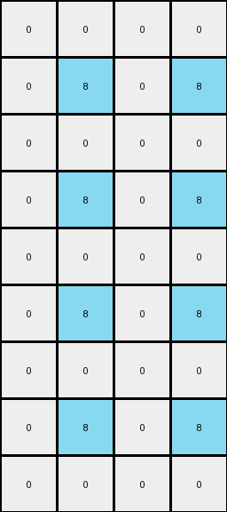

# 8d5021e8 • 015 • refine_dreamer

---


Previous Code:
```python
"""
Transforms a 3x2 input grid into a 9x4 output grid by rotating a 2x2 subgrid and tiling it.
"""

import numpy as np

def rotate_subgrid(subgrid):
    """Rotates a 2x2 subgrid 90 degrees clockwise."""
    return np.rot90(subgrid, k=-1)

def transform(input_grid):
    """Transforms the input grid according to the defined rules."""
    input_grid = np.array(input_grid)
    # 1. Define Sub-Grid: Extract the top-left 2x2 region.
    subgrid = input_grid[:2, :2]

    # 2. Transform 2x2: Rotate the sub-grid 90 degrees clockwise.
    rotated_subgrid = rotate_subgrid(subgrid)

    # 3. Output Dimensions and initialization
    output_rows = input_grid.shape[0] * 3
    output_cols = input_grid.shape[1] * 2
    output_grid = np.zeros((output_rows, output_cols), dtype=int)

    # 4. Tile and Replicate: Tile the transformed 2x2 sub-grid.
    for i in range(output_rows):
        for j in range(output_cols):
            output_grid[i, j] = rotated_subgrid[i % 2, j % 2]

    return output_grid.tolist()
```

Train Set Results:

## Example 1:

Input:
```
0 8
0 0
0 8
```
Expected Output:
```
8 0 0 8
0 0 0 0
8 0 0 8
8 0 0 8
0 0 0 0
8 0 0 8
8 0 0 8
0 0 0 0
8 0 0 8
```
Transformed Output:
```
0 0 0 0
0 8 0 8
0 0 0 0
0 8 0 8
0 0 0 0
0 8 0 8
0 0 0 0
0 8 0 8
0 0 0 0
```

match: False
pixels_off: 16
size_correct: True
color_palette_correct: True
correct_pixel_counts: False

## Example 2:

Input:
```
2 0
2 2
2 0
```
Expected Output:
```
0 2 2 0
2 2 2 2
0 2 2 0
0 2 2 0
2 2 2 2
0 2 2 0
0 2 2 0
2 2 2 2
0 2 2 0
```
Transformed Output:
```
2 2 2 2
2 0 2 0
2 2 2 2
2 0 2 0
2 2 2 2
2 0 2 0
2 2 2 2
2 0 2 0
2 2 2 2
```

match: False
pixels_off: 16
size_correct: True
color_palette_correct: True
correct_pixel_counts: False

## Example 3:

Input:
```
0 0
0 5
5 0
```
Expected Output:
```
0 5 5 0
5 0 0 5
0 0 0 0
0 0 0 0
5 0 0 5
0 5 5 0
0 5 5 0
5 0 0 5
0 0 0 0
```
Transformed Output:
```
0 0 0 0
5 0 5 0
0 0 0 0
5 0 5 0
0 0 0 0
5 0 5 0
0 0 0 0
5 0 5 0
0 0 0 0
```

match: False
pixels_off: 14
size_correct: True
color_palette_correct: True
correct_pixel_counts: False

**INSTRUCTIONS**

The code above was generated based on observations from the first training
example

we have tested the transform function on each of the task example inputs and
compared with the expected output

review each of the examples provided and the results and consider how the
natural language program should be updated to accommodate this new knowledge

respond with the following deliverables:

- general assessment of the information provided and strategy for resolving the
  errors
- gather metrics about each of the examples and results - use code_execution to
  develop accurate reports on your assumptions
- a YAML block documenting facts - Focus on identifying objects, their properties, and the actions performed on them.
- a natural language program - Be as clear and concise as possible, providing a complete description of the transformation rule.


your responses should be considered as information in a report - not a
conversation
