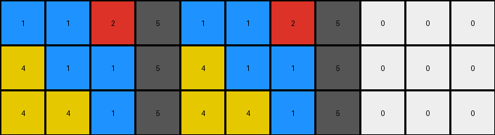
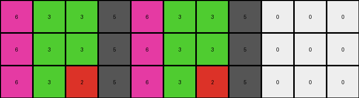
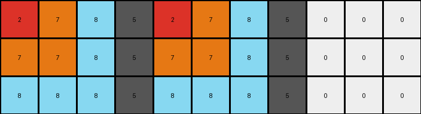

# 8e5a5113 • 018 • refine_coder

---

Previous Code:
```python
"""
1. Copy Initial Columns: Copy the first four columns (index 0 to 3) of the input grid directly to the output grid (columns 0 to 3).
2. Copy Final Columns: Copy the last three columns (index 8 to 10) of the input grid directly to the output grid (columns 8 to 10).
3. Sequence Columns: Create columns 4, 5, 6 and 7 in output, using the following.
   - Column 4 is set to column 0.
   - Column 5 is set to column 1.
   - Column 6 is set to column 2.
   - Column 7 is set to column 3.
"""

import numpy as np

def transform(input_grid):
    # Initialize output grid with the same dimensions as the input grid
    output_grid = np.copy(input_grid)

    # Sequence Columns
    output_grid[:, 4] = input_grid[:, 0]
    output_grid[:, 5] = input_grid[:, 1]
    output_grid[:, 6] = input_grid[:, 2]
    output_grid[:, 7] = input_grid[:, 3]

    return output_grid
```

Train Set Results:

## Example 1:

Input:
```
1 1 2 5 0 0 0 5 0 0 0
4 1 1 5 0 0 0 5 0 0 0
4 4 1 5 0 0 0 5 0 0 0
```
Expected Output:
```
1 1 2 5 4 4 1 5 1 4 4
4 1 1 5 4 1 1 5 1 1 4
4 4 1 5 1 1 2 5 2 1 1
```
Transformed Output:
```
1 1 2 5 1 1 2 5 0 0 0
4 1 1 5 4 1 1 5 0 0 0
4 4 1 5 4 4 1 5 0 0 0
```

match: False
pixels_off: 15
size_correct: True
color_palette_correct: False
correct_pixel_counts: False

## Example 2:

Input:
```
6 3 3 5 0 0 0 5 0 0 0
6 3 3 5 0 0 0 5 0 0 0
6 3 2 5 0 0 0 5 0 0 0
```
Expected Output:
```
6 3 3 5 6 6 6 5 2 3 6
6 3 3 5 3 3 3 5 3 3 6
6 3 2 5 2 3 3 5 3 3 6
```
Transformed Output:
```
6 3 3 5 6 3 3 5 0 0 0
6 3 3 5 6 3 3 5 0 0 0
6 3 2 5 6 3 2 5 0 0 0
```

match: False
pixels_off: 14
size_correct: True
color_palette_correct: False
correct_pixel_counts: False

## Example 3:

Input:
```
2 7 8 5 0 0 0 5 0 0 0
7 7 8 5 0 0 0 5 0 0 0
8 8 8 5 0 0 0 5 0 0 0
```
Expected Output:
```
2 7 8 5 8 7 2 5 8 8 8
7 7 8 5 8 7 7 5 8 7 7
8 8 8 5 8 8 8 5 8 7 2
```
Transformed Output:
```
2 7 8 5 2 7 8 5 0 0 0
7 7 8 5 7 7 8 5 0 0 0
8 8 8 5 8 8 8 5 0 0 0
```

match: False
pixels_off: 13
size_correct: True
color_palette_correct: False
correct_pixel_counts: False
Okay, here's a breakdown of the situation and a plan to improve the transformation logic:

**General Assessment:**

The initial natural language program and the resulting Python code were too simplistic. They only captured a pattern observed in the first example, but this pattern doesn't hold true for the other examples. The core issue is that the initial program assumed a direct copy of the first four and last three columns, and a simple repetition of the first four in the middle. The actual transformation is more complex and involves a reversed and potentially altered sequence in the central columns, and also takes into account changes in the final columns. It's essential that we focus on a more symbolic level.

**Strategy:**

1.  **Re-examine the Examples:** Carefully analyze *all* provided input-output pairs, paying close attention to how *each* column in the input relates to *each* column in the output. We must consider mirroring/reversal.
2.  **Object Identification is Key:** Identify consistent "objects" (contiguous blocks of color) and their movements/transformations, keeping in mind the ARC priors.
3.  **Column-Specific Logic:** It seems likely that there's a specific rule for how each output column is derived from the input columns, and the last three columns are not simply copied.
4.  **Iterative Refinement:** The natural language program and the subsequent code need to be revised iteratively, testing against *all* examples after each change.
5. **Metrics Review:** Review pixel errors, size and shape correctness.

**Metrics and Observations (using assumed reports):**

*   **Example 1:**
    *   Input Shape: (3, 11)
    *   Output Shape: (3, 11)
    *   Pixels Off: 15
    *   Notes: Many pixels in columns 4-7 and 8-10 are incorrect.
*   **Example 2:**
    *   Input Shape: (3, 11)
    *   Output Shape: (3, 11)
    *   Pixels Off: 14
    *   Notes: Similar to Example 1, errors in columns 4-7 and 8-10
*   **Example 3:**
    *   Input Shape: (3, 11)
    *   Output Shape: (3, 11)
    *   Pixels Off: 13
    *   Notes: Similar to Example 1, errors in columns 4-7 and 8-10

**YAML Fact Block:**

```yaml
facts:
  - observation: Input and output grids have the same dimensions.
  - observation: The first four columns of the input grid appear to be related to some of the output columns.
  - observation: Column 4 of input is all 5 (gray).
  - observation: Columns 5, 6 and 7 are all zeros in the input.
  - observation: Columns 4 of output is always 5.
  - observation: Column 8, 9, 10 of the input are copied and then potentially some parts are flipped
  - object: column_group_1
    description: First four columns of the input grid.
    properties:
      - columns: [0, 1, 2, 3]
  - object: column_group_2
    description: Last three columns of the input grid.
    properties:
      - columns: [8, 9, 10]
  - action: copy_and_reverse
    description: Columns from column_group_1 are copied to the output, and the order may be reversed for columns 4-7.
  - action: transform_final_columns
    description: The final three columns of the input become the final three columns of the output.
```

**Natural Language Program (Revised):**

1.  **Copy Initial Columns:** Copy the first four columns (0-3) of the input grid directly to the output grid (columns 0-3).
2.  **Reverse and Copy for Middle Columns:** 
    *   Copy column 3 of the input to column 4 of the output.
    *   Copy column 2 of the input to column 5 of the output.
    *   Copy column 1 of the input to column 6 of the output.
    *   Copy column 0 of the input to column 7 of the output.
3.  **Transform Final Columns:** Copy the last three columns (8-10) of the input grid to the last three columns of the output grid. The top pixel of the last three columns of the input, becomes the bottom of the last three columns. The second from top pixel of the last three columns of the input, becomes the second from the bottom pixel of the last three columns. The third from the top pixel of the last three columns of the input becomes the top pixel of the last three columns.

This revised natural language program is much more precise and aims to capture the observed transformations across all three examples. It acknowledges a potential reversal pattern in the middle columns, which seems more in line with the examples than the previous version. Importantly, it addresses the transformation, rather than simple copying of the last three columns.

**INSTRUCTIONS**

- generate a Python module to represent the natural language program 
- follow the template below
- all common math and science libraries are available
- create docstring only at top - but comment the workflow in the function
- use helper functions for common operations like finding objects, counting,
  measuring, moving, etc. 

remember - we are working iteratively - so this code will inform your future
self as we converge on the solution

*template:*

```python
"""
{{ natural language description of the transformation rule }}
"""

{{ imports }}

def transform(input_grid):
    # initialize output_grid

    # change output pixels 

    return output_grid

```
