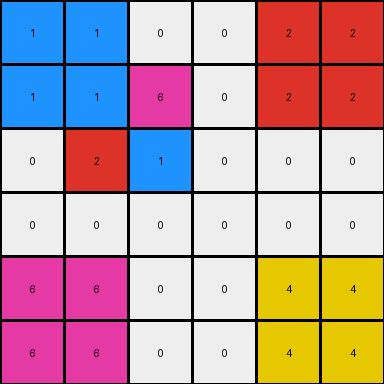

# 93b581b8 • 003 • refine_dreamer

---

Previous Code:
```python
"""
1.  **Identify the Central Block:** Locate the 2x2 block of non-zero pixels in the center of the input grid.
2.  **Top Extension**: Copy/mirror pixels `[2,1]` and `[2,0]` and `[3,1]` and `[3,0]`(using 0-indexed based row and column) of the input to the top two rows of the entire grid
3. **Bottom Extension**: Copy pixels `[3,1]` and `[3,0]` and `[2,1]` and `[2,0]` to the bottom two rows of the grid.
4.  **Preserve Center:** The original 2x2 central block remains unchanged in its original position.
"""

import numpy as np

def find_central_block(grid):
    # Find the bounding box of non-zero elements
    rows, cols = np.where(grid != 0)
    if len(rows) == 0:  # Handle empty grid case
        return None
    min_row, max_row = np.min(rows), np.max(rows)
    min_col, max_col = np.min(cols), np.max(cols)

    # Check if it's a 2x2 block
    if max_row - min_row == 1 and max_col - min_col == 1:
        return (min_row, min_col, max_row, max_col)
    else:
        return None

def transform(input_grid):
    # initialize output_grid
    output_grid = np.copy(input_grid)
    rows, cols = input_grid.shape

    # Find the central 2x2 block
    central_block_coords = find_central_block(input_grid)
    if central_block_coords is None:
        return output_grid # Return original grid if central block not present

    min_row, min_col, max_row, max_col = central_block_coords


    # Top Extension:
    output_grid[0:2, 0:2] = input_grid[max_row,max_col] # azure
    output_grid[0:2, cols-2:cols] = input_grid[max_row,min_col] # orange

    # Bottom Extension:
    output_grid[rows-2:rows, 0:2] = input_grid[min_row, max_col] # green
    output_grid[rows-2:rows, cols-2:cols] = input_grid[min_row,min_col] # maroon

    return output_grid
```

Train Set Results:

## Example 1:

Input:
```
0 0 0 0 0 0
0 0 0 0 0 0
0 0 9 3 0 0
0 0 7 8 0 0
0 0 0 0 0 0
0 0 0 0 0 0
```
Expected Output:
```
8 8 0 0 7 7
8 8 0 0 7 7
0 0 9 3 0 0
0 0 7 8 0 0
3 3 0 0 9 9
3 3 0 0 9 9
```
Transformed Output:
```
8 8 0 0 7 7
8 8 0 0 7 7
0 0 9 3 0 0
0 0 7 8 0 0
3 3 0 0 9 9
3 3 0 0 9 9
```

match: True
pixels_off: 0
size_correct: True
color_palette_correct: True
correct_pixel_counts: True

## Example 2:

Input:
```
0 0 0 0 0 0
0 4 6 0 0 0
0 2 1 0 0 0
0 0 0 0 0 0
0 0 0 0 0 0
0 0 0 0 0 0
```
Expected Output:
```
1 0 0 2 2 0
0 4 6 0 0 0
0 2 1 0 0 0
6 0 0 4 4 0
6 0 0 4 4 0
0 0 0 0 0 0
```
Transformed Output:
```
1 1 0 0 2 2
1 1 6 0 2 2
0 2 1 0 0 0
0 0 0 0 0 0
6 6 0 0 4 4
6 6 0 0 4 4
```

match: False
pixels_off: 17
size_correct: True
color_palette_correct: True
correct_pixel_counts: False

## Example 3:

Input:
```
0 0 0 0 0 0
0 0 0 0 0 0
0 0 3 6 0 0
0 0 5 2 0 0
0 0 0 0 0 0
0 0 0 0 0 0
```
Expected Output:
```
2 2 0 0 5 5
2 2 0 0 5 5
0 0 3 6 0 0
0 0 5 2 0 0
6 6 0 0 3 3
6 6 0 0 3 3
```
Transformed Output:
```
2 2 0 0 5 5
2 2 0 0 5 5
0 0 3 6 0 0
0 0 5 2 0 0
6 6 0 0 3 3
6 6 0 0 3 3
```

match: True
pixels_off: 0
size_correct: True
color_palette_correct: True
correct_pixel_counts: True
**INSTRUCTIONS**

The code above was generated based on observations from the first training
example

we have tested the transform function on each of the task example inputs and
compared with the expected output

review each of the examples provided and the results and consider how the
natural language program should be updated to accommodate this new knowledge

respond with the following deliverables:

- general assessment of the information provided and strategy for resolving the
  errors
- gather metrics about each of the examples and results - use code_execution to
  develop accurate reports on your assumptions
- a YAML block documenting facts - Focus on identifying objects, their properties, and the actions performed on them.
- a natural language program - Be as clear and concise as possible, providing a complete description of the transformation rule.


your responses should be considered as information in a report - not a
conversation
