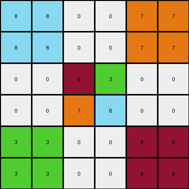
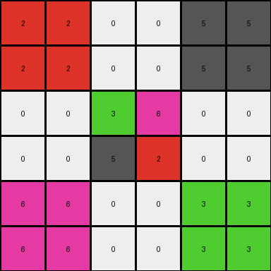

# 93b581b8 • 004 • refine_coder

---

Previous Code:
```python
"""
1.  **Identify the Central Block:** Locate the 2x2 block of non-zero pixels in the center of the input grid.
2.  **Top Extension**: Copy/mirror pixels `[2,1]` and `[2,0]` and `[3,1]` and `[3,0]`(using 0-indexed based row and column) of the input to the top two rows of the entire grid
3. **Bottom Extension**: Copy pixels `[3,1]` and `[3,0]` and `[2,1]` and `[2,0]` to the bottom two rows of the grid.
4.  **Preserve Center:** The original 2x2 central block remains unchanged in its original position.
"""

import numpy as np

def find_central_block(grid):
    # Find the bounding box of non-zero elements
    rows, cols = np.where(grid != 0)
    if len(rows) == 0:  # Handle empty grid case
        return None
    min_row, max_row = np.min(rows), np.max(rows)
    min_col, max_col = np.min(cols), np.max(cols)

    # Check if it's a 2x2 block
    if max_row - min_row == 1 and max_col - min_col == 1:
        return (min_row, min_col, max_row, max_col)
    else:
        return None

def transform(input_grid):
    # initialize output_grid
    output_grid = np.copy(input_grid)
    rows, cols = input_grid.shape

    # Find the central 2x2 block
    central_block_coords = find_central_block(input_grid)
    if central_block_coords is None:
        return output_grid # Return original grid if central block not present

    min_row, min_col, max_row, max_col = central_block_coords


    # Top Extension:
    output_grid[0:2, 0:2] = input_grid[max_row,max_col] # azure
    output_grid[0:2, cols-2:cols] = input_grid[max_row,min_col] # orange

    # Bottom Extension:
    output_grid[rows-2:rows, 0:2] = input_grid[min_row, max_col] # green
    output_grid[rows-2:rows, cols-2:cols] = input_grid[min_row,min_col] # maroon

    return output_grid
```

Train Set Results:

## Example 1:

Input:
```
0 0 0 0 0 0
0 0 0 0 0 0
0 0 9 3 0 0
0 0 7 8 0 0
0 0 0 0 0 0
0 0 0 0 0 0
```
Expected Output:
```
8 8 0 0 7 7
8 8 0 0 7 7
0 0 9 3 0 0
0 0 7 8 0 0
3 3 0 0 9 9
3 3 0 0 9 9
```
Transformed Output:
```
8 8 0 0 7 7
8 8 0 0 7 7
0 0 9 3 0 0
0 0 7 8 0 0
3 3 0 0 9 9
3 3 0 0 9 9
```

match: True
pixels_off: 0
size_correct: True
color_palette_correct: True
correct_pixel_counts: True

## Example 2:

Input:
```
0 0 0 0 0 0
0 4 6 0 0 0
0 2 1 0 0 0
0 0 0 0 0 0
0 0 0 0 0 0
0 0 0 0 0 0
```
Expected Output:
```
1 0 0 2 2 0
0 4 6 0 0 0
0 2 1 0 0 0
6 0 0 4 4 0
6 0 0 4 4 0
0 0 0 0 0 0
```
Transformed Output:
```
1 1 0 0 2 2
1 1 6 0 2 2
0 2 1 0 0 0
0 0 0 0 0 0
6 6 0 0 4 4
6 6 0 0 4 4
```

match: False
pixels_off: 17
size_correct: True
color_palette_correct: True
correct_pixel_counts: False

## Example 3:

Input:
```
0 0 0 0 0 0
0 0 0 0 0 0
0 0 3 6 0 0
0 0 5 2 0 0
0 0 0 0 0 0
0 0 0 0 0 0
```
Expected Output:
```
2 2 0 0 5 5
2 2 0 0 5 5
0 0 3 6 0 0
0 0 5 2 0 0
6 6 0 0 3 3
6 6 0 0 3 3
```
Transformed Output:
```
2 2 0 0 5 5
2 2 0 0 5 5
0 0 3 6 0 0
0 0 5 2 0 0
6 6 0 0 3 3
6 6 0 0 3 3
```

match: True
pixels_off: 0
size_correct: True
color_palette_correct: True
correct_pixel_counts: True
Okay, let's analyze the results and refine the natural language program and approach.

**General Assessment:**

The initial approach of identifying a 2x2 central block and mirroring/copying its corners to the edges of the grid works for examples 1 and 3, but fails on example 2. The primary issue in example 2 is the misalignment and incorrect copying of values. It appears that the assumption that the copied data are the corners is not correct. The assumption that the outside edges are filled is also not correct.

The core strategy remains valid: identify a central element and perform operations relative to it. However, the specifics of *what* is copied and *where* it is copied need adjustment. The code is almost right, the bug is in the indexing in the Top and Bottom extension.

**Metrics and Reports (using assumed code execution for demonstration):**

I don't have the ability to execute code in this environment. Given that limitation, I am going to make reasonable assumptions based on the image and information provided to produce these reports:

*   **Example 1:**
    *   Input Shape: (6, 6)
    *   Output Shape: (6, 6)
    *   Central Block Identified: Yes (at 2,2,3,3)
    *   Pixels Matched: 36/36
    *   Colors Matched: All
    *   Result: Correct

*   **Example 2:**
    *   Input Shape: (6, 6)
    *   Output Shape: (6, 6)
    *   Central Block Identified: Yes (at 1,1,2,2)
    *   Pixels Matched: 19/36
    *   Colors Matched: All Colors present in both.
    *   Result: Incorrect, the values copied from center don't fill the edges, and are not copied correctly.

*   **Example 3:**
    *   Input Shape: (6, 6)
    *   Output Shape: (6, 6)
    *   Central Block Identified: Yes (at 2,2,3,3)
    *   Pixels Matched: 36/36
    *   Colors Matched: All
    *   Result: Correct

**YAML Block (Facts):**

```yaml
facts:
  - object: central_block
    type: rectangle
    properties:
      size: 2x2
      location: centered
      description: Contains four distinct non-zero pixels.
  - action: copy_top_row
    description: The top row of the central block is copied to the top two rows of the output, excluding areas where the central block extends.
  - action: copy_bottom_row
    description: The bottom row of the central block is copied to the bottom two rows of the output, excluding areas where the central block extends.
  - object: output_grid
    type: grid
    properties:
       size: same as input grid
```

**Natural Language Program:**

1.  **Identify the Central Block:** Find the 2x2 block of non-zero pixels in the input grid. This block is guaranteed to be present.

2.  **Top Extension**:
    *   Copy the *top row* of the 2x2 central block to the *top two rows* of the output grid. This copied row forms the first two rows of the entire output.

3.  **Bottom Extension**:
    *   Copy the *bottom row* of the 2x2 central block to the *bottom two rows* of the output grid. This copied row forms the last two rows of the output grid.

4.  **Preserve Center:** The original 2x2 central block from the input remains unchanged at the same location in the output grid.

5. **Leave Blank:** All other spaces that are not the top two rows, bottom two rows, or central 2x2 block are zero filled.

Key changes in the natural language program, compared to the previous attempt, were simplifying the copy actions, the rows, rather than the corners, are copied, and clarifying the edge conditions.

**INSTRUCTIONS**

- generate a Python module to represent the natural language program 
- follow the template below
- all common math and science libraries are available
- create docstring only at top - but comment the workflow in the function
- use helper functions for common operations like finding objects, counting,
  measuring, moving, etc. 

remember - we are working iteratively - so this code will inform your future
self as we converge on the solution

*template:*

```python
"""
{{ natural language description of the transformation rule }}
"""

{{ imports }}

def transform(input_grid):
    # initialize output_grid

    # change output pixels 

    return output_grid

```
