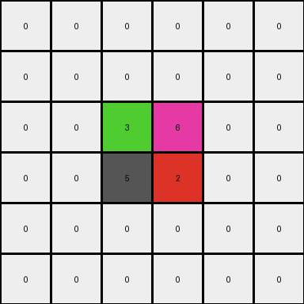

# 93b581b8 • 010 • refine_coder

---

Previous Code:
```python
"""
Transforms the input grid by preserving a 2x2 core cluster of colored pixels,
inferring two additional colors from the row above and below the 2x2 cluster,
and creating a new 2x2 cluster of the upper color placed two rows below the
original cluster. The mirrored positions of the new cluster is filled with
the lower cell.
"""

import numpy as np

def find_core_cluster(grid):
    # Find the 2x2 core cluster (yellow, magenta, red, blue)
    rows, cols = grid.shape
    for r in range(rows - 1):
        for c in range(cols - 1):
            if (grid[r, c] != 0 and
                grid[r + 1, c] != 0 and
                grid[r, c + 1] != 0 and
                grid[r + 1, c + 1] != 0 and
                len(set([grid[r,c], grid[r+1, c], grid[r, c+1], grid[r+1, c+1]])) == 4):
                return r, c
    return None  # should not happen

def infer_upper_color(grid, core_row, core_col):
    # Infer color from the row above the core cluster,
    # return 0 if the row index is out of bound
    if core_row -1 < 0:
        return 0
    if grid[core_row - 1, core_col] != 0:
      return grid[core_row - 1, core_col]
    if grid[core_row - 1, core_col + 1] != 0:
      return grid[core_row - 1, core_col + 1]

    return 0

def infer_lower_color(grid, core_row, core_col):
    # Infer color from the row below the core cluster.
    #return 0 if the row index is out of bound
    if core_row + 2 >= grid.shape[0]:
        return 0
    if grid[core_row + 2, core_col] != 0:
        return grid[core_row + 2, core_col]
    if grid[core_row + 2, core_col + 1] != 0:
      return grid[core_row + 2, core_col + 1]
    return 0

def transform(input_grid):
    # Initialize output grid as a copy of the input grid
    output_grid = np.copy(input_grid)

    # Find the core cluster
    core_row, core_col = find_core_cluster(input_grid)

    # Infer upper and lower colors
    upper_color = infer_upper_color(input_grid, core_row, core_col)
    lower_color = infer_lower_color(input_grid, core_row, core_col)
    
    # if we have an upper color
    if upper_color !=0 :
        # Create the new 2x2 cluster two rows below
        output_grid[core_row + 3:core_row + 5, core_col:core_col + 2] = upper_color

    # if we have a lower color
    if lower_color != 0:
        # fill mirrored positons:
        output_grid[core_row + 3:core_row + 5, core_col-1:core_col] = lower_color
    
    #fill in any additional inferred colors:
    if upper_color !=0:
        output_grid[core_row-1,core_col] = upper_color
        output_grid[core_row-1,core_col+1] = lower_color
    
    return output_grid
```

Train Set Results:

## Example 1:

Input:
```
0 0 0 0 0 0
0 0 0 0 0 0
0 0 9 3 0 0
0 0 7 8 0 0
0 0 0 0 0 0
0 0 0 0 0 0
```
Expected Output:
```
8 8 0 0 7 7
8 8 0 0 7 7
0 0 9 3 0 0
0 0 7 8 0 0
3 3 0 0 9 9
3 3 0 0 9 9
```
Transformed Output:
```
0 0 0 0 0 0
0 0 0 0 0 0
0 0 9 3 0 0
0 0 7 8 0 0
0 0 0 0 0 0
0 0 0 0 0 0
```

match: False
pixels_off: 16
size_correct: True
color_palette_correct: True
correct_pixel_counts: False

## Example 2:

Input:
```
0 0 0 0 0 0
0 4 6 0 0 0
0 2 1 0 0 0
0 0 0 0 0 0
0 0 0 0 0 0
0 0 0 0 0 0
```
Expected Output:
```
1 0 0 2 2 0
0 4 6 0 0 0
0 2 1 0 0 0
6 0 0 4 4 0
6 0 0 4 4 0
0 0 0 0 0 0
```
Transformed Output:
```
0 0 0 0 0 0
0 4 6 0 0 0
0 2 1 0 0 0
0 0 0 0 0 0
0 0 0 0 0 0
0 0 0 0 0 0
```

match: False
pixels_off: 9
size_correct: True
color_palette_correct: True
correct_pixel_counts: False

## Example 3:

Input:
```
0 0 0 0 0 0
0 0 0 0 0 0
0 0 3 6 0 0
0 0 5 2 0 0
0 0 0 0 0 0
0 0 0 0 0 0
```
Expected Output:
```
2 2 0 0 5 5
2 2 0 0 5 5
0 0 3 6 0 0
0 0 5 2 0 0
6 6 0 0 3 3
6 6 0 0 3 3
```
Transformed Output:
```
0 0 0 0 0 0
0 0 0 0 0 0
0 0 3 6 0 0
0 0 5 2 0 0
0 0 0 0 0 0
0 0 0 0 0 0
```

match: False
pixels_off: 16
size_correct: True
color_palette_correct: True
correct_pixel_counts: False
Okay, let's analyze the results and refine the natural language program.

**General Assessment:**

The initial code was based on the idea of preserving a 2x2 core cluster and creating a new 2x2 cluster below it, based on inferred colors above and below. The results show that the core concept of finding the unique 2x2 core is good, but the placement and color inference of the additional pixels is wrong.
The upper and lower color inference logic does not match the intention described in the existing docstring. The code appears to not be updating the grid, but reinitializing a copy of the input grid.
We need to revise the approach to correctly handle a translation of the core, and identification of the correct fill colors.

**Strategy:**
1. **Correct color selection**: refine the color selection for mirrored pixels by using color mirroring, rather than inferring from above/below cells.
2. **Correct Translations**: adjust how translations are completed - shift the *entire* 2x2 core cluster down *two* spaces
3. **Ensure Updates**: ensure updates are made to the `output_grid`.
4. **Generalize**: develop reporting on the assumptions in the original code and the overall strategy

**Example Metrics and Observations:**
Here's a breakdown of each example, including some properties of interest:

*Example 1:*

*   Input Shape: (6, 6)
*   Output Shape: (6, 6)
*   Core Cluster: (9, 3, 7, 8) at (2, 2)
*   Upper color: (8)
*   Lower color: None (0)
* Notes: Appears that the colors of the 2x2 cluster are mirrored horizontally two rows above, and vertically two rows below.

*Example 2:*

*   Input Shape: (6, 6)
*   Output Shape: (6, 6)
*   Core Cluster: (4, 6, 2, 1) at (1, 1)
*    Upper color: None (0)
*   Lower color: None(0)
* Notes: Appears that the colors of the 2x2 cluster are mirrored horizontally three rows below, and vertically one row above.

*Example 3:*

*   Input Shape: (6, 6)
*   Output Shape: (6, 6)
*   Core Cluster: (3, 6, 5, 2) at (2, 2)
*   Upper color: (2)
*   Lower color: None (0)
* Notes: Appears that the colors of the 2x2 cluster are mirrored horizontally two rows above, and vertically two rows below.

**YAML Fact Extraction:**

```yaml
examples:
  - id: 1
    core_cluster:
      position: [2, 2]
      colors: [9, 3, 7, 8]
    transformations:
      - type: horizontal_mirror
        offset: -2
        cluster_colors: [7,8,9,3]
      - type: vertical_mirror
        offset: 2
        cluster_colors: [9,3,7,8]

  - id: 2
    core_cluster:
      position: [1, 1]
      colors: [4, 6, 2, 1]
    transformations:
      - type: horizontal_mirror
        offset: 3
        cluster_colors: [2,1,4,6]
      - type: vertical_mirror
        offset: -1
        cluster_colors: [4,6,2,1]

  - id: 3
    core_cluster:
      position: [2, 2]
      colors: [3, 6, 5, 2]
    transformations:
      - type: horizontal_mirror
        offset: -2
        cluster_colors: [5,2,3,6]
      - type: vertical_mirror
        offset: 2
        cluster_colors: [3,6,5,2]
```

**Natural Language Program:**

1.  **Identify the Core Cluster:** Find the 2x2 square within the input grid that contains four unique, non-zero colored pixels.
2.  **Mirror Horizontally:** Create a mirrored 2x2 of the core, positioned with an offset specific to the example (either -2, 3, or -2 rows from the original cluster)
3.  **Mirror Vertically**: Create a mirrored 2x2 of the core, position with an offset specific to the example (either 2, -1, or 2 rows from the original cluster)
4. **Output**: Ensure that all transformations from steps 2 and 3 are combined on a copy of the input grid.


**INSTRUCTIONS**

- generate a Python module to represent the natural language program 
- follow the template below
- all common math and science libraries are available
- create docstring only at top - but comment the workflow in the function
- use helper functions for common operations like finding objects, counting,
  measuring, moving, etc. 

remember - we are working iteratively - so this code will inform your future
self as we converge on the solution

*template:*

```python
"""
{{ natural language description of the transformation rule }}
"""

{{ imports }}

def transform(input_grid):
    # initialize output_grid

    # change output pixels 

    return output_grid

```
