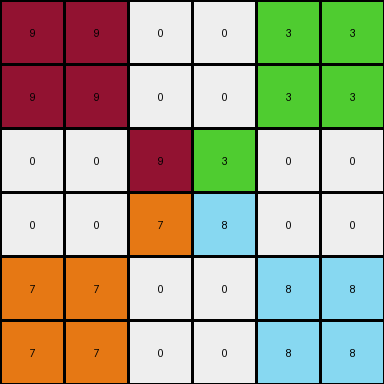
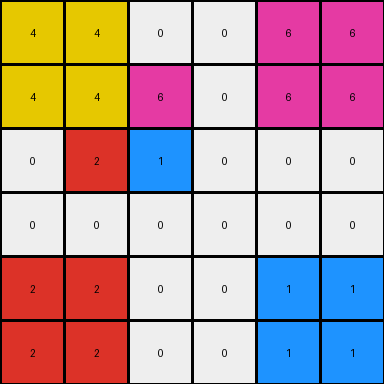
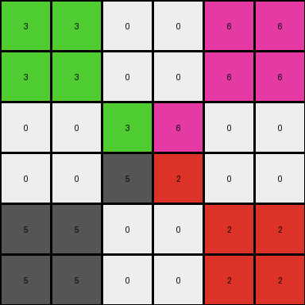

# 93b581b8 • 017 • refine_dreamer

---

Previous Code:
```python
"""
1.  **Find the Central Block:** Locate the inner-most 2x2 block of non-zero colored pixels in the input grid.
2.  **Preserve Central Block:** The central 2x2 block remains unchanged in the output grid.
3.  **Mirror All Central Colors:** For *each* cell within the central 2x2 block:
    *   Create a new 2x2 block in the output grid.
    *   The color of this new block is the same as the color of the cell in the central block.
    *   The location of the new block is in one of the four corners of the output grid.
    *   The destination of the mirrored block is determined as follows:
        * If the cell inside the 2x2 is at 0,0 (top,left): mirrored block goes in the top left corner.
        * If the cell inside the 2x2 is at 0,1 (top,right): mirrored block goes in the top right corner.
        * If the cell inside the 2x2 is at 1,0 (bottom,left): mirrored block goes in the bottom left corner.
        * If the cell inside the 2x2 is at 1,1 (bottom,right): mirrored block goes in the bottom right corner.
4. **Remaining Pixels**: All other pixels in the output grid that are not part of the central block or the mirrored blocks should be 0 (black).
"""

import numpy as np

def find_central_block(grid):
    # Find the largest 2x2 block of non-zero pixels
    rows, cols = grid.shape
    for r in range(rows - 1):
        for c in range(cols - 1):
            block = grid[r:r+2, c:c+2]
            if np.all(block != 0):
                return r, c
    return None

def transform(input_grid):
    # Initialize output_grid as all zeros
    rows, cols = input_grid.shape
    output_grid = np.zeros((rows, cols), dtype=int)

    # Find the central 2x2 block
    central_block_coords = find_central_block(input_grid)
    if central_block_coords is None:
      return output_grid # Return all zeros if no central block

    r, c = central_block_coords

    # Preserve the central block
    output_grid[r:r+2, c:c+2] = input_grid[r:r+2, c:c+2]

    # Mirror each cell of the central block to the corners
    for i in range(2):
        for j in range(2):
            color = input_grid[r+i, c+j]
            # Determine destination corner based on relative position (i, j)
            if i == 0 and j == 0:  # Top-left
                output_grid[0:2, 0:2] = color
            elif i == 0 and j == 1:  # Top-right
                output_grid[0:2, cols-2:cols] = color
            elif i == 1 and j == 0:  # Bottom-left
                output_grid[rows-2:rows, 0:2] = color
            elif i == 1 and j == 1:  # Bottom-right
                output_grid[rows-2:rows, cols-2:cols] = color

    return output_grid
```

Train Set Results:

## Example 1:

Input:
```
0 0 0 0 0 0
0 0 0 0 0 0
0 0 9 3 0 0
0 0 7 8 0 0
0 0 0 0 0 0
0 0 0 0 0 0
```
Expected Output:
```
8 8 0 0 7 7
8 8 0 0 7 7
0 0 9 3 0 0
0 0 7 8 0 0
3 3 0 0 9 9
3 3 0 0 9 9
```
Transformed Output:
```
9 9 0 0 3 3
9 9 0 0 3 3
0 0 9 3 0 0
0 0 7 8 0 0
7 7 0 0 8 8
7 7 0 0 8 8
```

match: False
pixels_off: 16
size_correct: True
color_palette_correct: True
correct_pixel_counts: True

## Example 2:

Input:
```
0 0 0 0 0 0
0 4 6 0 0 0
0 2 1 0 0 0
0 0 0 0 0 0
0 0 0 0 0 0
0 0 0 0 0 0
```
Expected Output:
```
1 0 0 2 2 0
0 4 6 0 0 0
0 2 1 0 0 0
6 0 0 4 4 0
6 0 0 4 4 0
0 0 0 0 0 0
```
Transformed Output:
```
4 4 0 0 6 6
4 4 6 0 6 6
0 2 1 0 0 0
0 0 0 0 0 0
2 2 0 0 1 1
2 2 0 0 1 1
```

match: False
pixels_off: 20
size_correct: True
color_palette_correct: True
correct_pixel_counts: False

## Example 3:

Input:
```
0 0 0 0 0 0
0 0 0 0 0 0
0 0 3 6 0 0
0 0 5 2 0 0
0 0 0 0 0 0
0 0 0 0 0 0
```
Expected Output:
```
2 2 0 0 5 5
2 2 0 0 5 5
0 0 3 6 0 0
0 0 5 2 0 0
6 6 0 0 3 3
6 6 0 0 3 3
```
Transformed Output:
```
3 3 0 0 6 6
3 3 0 0 6 6
0 0 3 6 0 0
0 0 5 2 0 0
5 5 0 0 2 2
5 5 0 0 2 2
```

match: False
pixels_off: 16
size_correct: True
color_palette_correct: True
correct_pixel_counts: True
**INSTRUCTIONS**

The code above was generated based on observations from the first training
example

we have tested the transform function on each of the task example inputs and
compared with the expected output

review each of the examples provided and the results and consider how the
natural language program should be updated to accommodate this new knowledge

respond with the following deliverables:

- general assessment of the information provided and strategy for resolving the
  errors
- gather metrics about each of the examples and results - use code_execution to
  develop accurate reports on your assumptions
- a YAML block documenting facts - Focus on identifying objects, their properties, and the actions performed on them.
- a natural language program - Be as clear and concise as possible, providing a complete description of the transformation rule.


your responses should be considered as information in a report - not a
conversation
