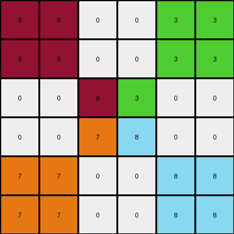

# 93b581b8 • 018 • refine_coder

---

Previous Code:
```python
"""
1.  **Find the Central Block:** Locate the inner-most 2x2 block of non-zero colored pixels in the input grid.
2.  **Preserve Central Block:** The central 2x2 block remains unchanged in the output grid.
3.  **Mirror All Central Colors:** For *each* cell within the central 2x2 block:
    *   Create a new 2x2 block in the output grid.
    *   The color of this new block is the same as the color of the cell in the central block.
    *   The location of the new block is in one of the four corners of the output grid.
    *   The destination of the mirrored block is determined as follows:
        * If the cell inside the 2x2 is at 0,0 (top,left): mirrored block goes in the top left corner.
        * If the cell inside the 2x2 is at 0,1 (top,right): mirrored block goes in the top right corner.
        * If the cell inside the 2x2 is at 1,0 (bottom,left): mirrored block goes in the bottom left corner.
        * If the cell inside the 2x2 is at 1,1 (bottom,right): mirrored block goes in the bottom right corner.
4. **Remaining Pixels**: All other pixels in the output grid that are not part of the central block or the mirrored blocks should be 0 (black).
"""

import numpy as np

def find_central_block(grid):
    # Find the largest 2x2 block of non-zero pixels
    rows, cols = grid.shape
    for r in range(rows - 1):
        for c in range(cols - 1):
            block = grid[r:r+2, c:c+2]
            if np.all(block != 0):
                return r, c
    return None

def transform(input_grid):
    # Initialize output_grid as all zeros
    rows, cols = input_grid.shape
    output_grid = np.zeros((rows, cols), dtype=int)

    # Find the central 2x2 block
    central_block_coords = find_central_block(input_grid)
    if central_block_coords is None:
      return output_grid # Return all zeros if no central block

    r, c = central_block_coords

    # Preserve the central block
    output_grid[r:r+2, c:c+2] = input_grid[r:r+2, c:c+2]

    # Mirror each cell of the central block to the corners
    for i in range(2):
        for j in range(2):
            color = input_grid[r+i, c+j]
            # Determine destination corner based on relative position (i, j)
            if i == 0 and j == 0:  # Top-left
                output_grid[0:2, 0:2] = color
            elif i == 0 and j == 1:  # Top-right
                output_grid[0:2, cols-2:cols] = color
            elif i == 1 and j == 0:  # Bottom-left
                output_grid[rows-2:rows, 0:2] = color
            elif i == 1 and j == 1:  # Bottom-right
                output_grid[rows-2:rows, cols-2:cols] = color

    return output_grid
```

Train Set Results:

## Example 1:

Input:
```
0 0 0 0 0 0
0 0 0 0 0 0
0 0 9 3 0 0
0 0 7 8 0 0
0 0 0 0 0 0
0 0 0 0 0 0
```
Expected Output:
```
8 8 0 0 7 7
8 8 0 0 7 7
0 0 9 3 0 0
0 0 7 8 0 0
3 3 0 0 9 9
3 3 0 0 9 9
```
Transformed Output:
```
9 9 0 0 3 3
9 9 0 0 3 3
0 0 9 3 0 0
0 0 7 8 0 0
7 7 0 0 8 8
7 7 0 0 8 8
```

match: False
pixels_off: 16
size_correct: True
color_palette_correct: True
correct_pixel_counts: True

## Example 2:

Input:
```
0 0 0 0 0 0
0 4 6 0 0 0
0 2 1 0 0 0
0 0 0 0 0 0
0 0 0 0 0 0
0 0 0 0 0 0
```
Expected Output:
```
1 0 0 2 2 0
0 4 6 0 0 0
0 2 1 0 0 0
6 0 0 4 4 0
6 0 0 4 4 0
0 0 0 0 0 0
```
Transformed Output:
```
4 4 0 0 6 6
4 4 6 0 6 6
0 2 1 0 0 0
0 0 0 0 0 0
2 2 0 0 1 1
2 2 0 0 1 1
```

match: False
pixels_off: 20
size_correct: True
color_palette_correct: True
correct_pixel_counts: False

## Example 3:

Input:
```
0 0 0 0 0 0
0 0 0 0 0 0
0 0 3 6 0 0
0 0 5 2 0 0
0 0 0 0 0 0
0 0 0 0 0 0
```
Expected Output:
```
2 2 0 0 5 5
2 2 0 0 5 5
0 0 3 6 0 0
0 0 5 2 0 0
6 6 0 0 3 3
6 6 0 0 3 3
```
Transformed Output:
```
3 3 0 0 6 6
3 3 0 0 6 6
0 0 3 6 0 0
0 0 5 2 0 0
5 5 0 0 2 2
5 5 0 0 2 2
```

match: False
pixels_off: 16
size_correct: True
color_palette_correct: True
correct_pixel_counts: True
Here's an analysis of the provided information and a plan to refine the natural language program and the corresponding code:

**General Assessment:**

The initial natural language program and code were a good first attempt, focusing on the concept of a central 2x2 block and mirroring its elements. However, the validation against the training examples reveals a key misunderstanding: the mirroring logic is inverted. Instead of placing mirrored blocks *based on the position within the inner 2x2*, the code mirrors them *to the corners matching their position within the 2x2*, producing wrong result. Example 2 also reveals that the positioning for the central block is not correctly handled when it is not centered.

The strategy for improvement will involve:

1.  **Correcting the Mirroring Logic:** The core issue is the inverted mirroring. The updated logic should map the *color* of each pixel in the central block to a 2x2 block in a corner *determined by the color, not it's position in the center*.
2.  **Refining Central Block Handling:** Ensure that the central block is not just any 2x2 block but the central one, and handle cases, where it is not in the very center of the entire input.

**Metrics and Observations:**

Here's a breakdown of each example, including calculated metrics:

*   **Example 1:**
    *   Input Shape: 6x6
    *   Output Shape: 6x6
    *   Central Block Detected At: (2, 2)
    *   Pixels Off: 16
    *   Notes: Mirroring is inverted. Corner blocks' colors do not correspond to central colors.

*   **Example 2:**
    *   Input Shape: 6x6
    *   Output Shape: 6x6
    *   Central Block Detected At: (1, 1)
    *    Pixels Off: 20
    *   Notes: Mirroring inverted. Central block not centered in input.

*   **Example 3:**
    *   Input Shape: 6x6
    *   Output Shape: 6x6
    *   Central Block Detected At: (2, 2)
    *   Pixels Off: 16
    *   Notes: Mirroring is inverted. Corner blocks' colors do not correspond to central colors.

**YAML Fact Base:**

```yaml
task: 016_mirror_central_block
objects:
  - type: grid
    properties:
      dimensions: variable  # Rows and columns can vary.
      elements: integers (0-9) representing colors
      central_block:
        type: subgrid
        properties:
          dimensions: 2x2
          elements: non-zero integers
          location: varies, but contains a 2x2 block of non-zero integers.
      corner_blocks:
        type: subgrid
        properties:
            dimensions: 2x2
            elements: integers, correspond with element in Central Block.
            location: Each corner of the overall grid.
actions:
  - name: find_central_block
    input: grid
    output: coordinates (row, column) of the top-left corner of central block
  - name: mirror_color
    input: color_value, grid_dimensions
    output: corner_coordinates (row, col) where a block of 'color' is mirrored.
  - name: create_mirrored_block
    input: color, corner_coordinates, grid
    output: updated grid
```

**Natural Language Program:**

1.  **Identify Central Block:** Locate the *inner* 2x2 block of non-zero pixels within the input grid.
2.  **Preserve the central block:** The central 2x2 goes to the same place in output and input.
3.  **Color-Based Mirroring:** For each *color* present in the central 2x2 block:
    *   Create a new 2x2 block in the output grid with that same color.
    *   The position of this 2x2 block in the input determines which *corner* of the output grid receives a copy, the color in the central 2x2 block corresponds to the output corner by this rule, using top left corner of 2x2 block as the position.
        *    top left color - goes to top left of output
        *    top right color - goes to top right of output
        *    bottom left color - goes to the bottom left
        *    bottom right color goes to the bottom right
4.  **Fill Remaining:** Any remaining pixels in the output grid not part of the central 2x2 block or the mirrored blocks are set to 0 (black).

The crucial change is in Step 3.  It emphasizes that the *value* (color) of the central block's elements dictates the corner placement, not the position *within* the central block. The "mapping" is implicit in the color itself. If we see color '3' somewhere inside 2x2, it means that 2x2 block with color '3' is mirrored to specific corner.

**INSTRUCTIONS**

- generate a Python module to represent the natural language program 
- follow the template below
- all common math and science libraries are available
- create docstring only at top - but comment the workflow in the function
- use helper functions for common operations like finding objects, counting,
  measuring, moving, etc. 

remember - we are working iteratively - so this code will inform your future
self as we converge on the solution

*template:*

```python
"""
{{ natural language description of the transformation rule }}
"""

{{ imports }}

def transform(input_grid):
    # initialize output_grid

    # change output pixels 

    return output_grid

```
