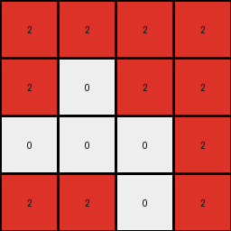

# 94f9d214 • 010 • refine_coder

---

Previous Code:
```python
"""
1. **Reduction:** The input grid (8x4) is reduced to an output grid (4x4). The reduction is performed by taking 2x1 blocks of the input and making them a single pixel.

2.  **Disappearance:** The blue and the green regions disappear

3. **Red Region Creation:** The red regions are created on the output grid based on following this algorithm:
   *   Iterate every 2 rows, for every 4 columns on each row.
   *   If any of the pixel with value 3 (green) is detected within that 2 x 4 sub-grid, put a red pixel (value 2) at the coordinate of the input sub-grid divided by 2.
   *   if any pixel with value 1 is detected, and no pixel with value 3 is detected, and the blue pixel is the last value within that block, put a red pixel with value 2 at the top left coordinate of the input subgrid divided by 2.
4. **Background:** The white background (0) remains unchanged where there are no red pixels.
"""

import numpy as np

def transform(input_grid):
    input_grid = np.array(input_grid)
    rows, cols = input_grid.shape
    output_grid = np.zeros((rows // 2, cols), dtype=int)

    for i in range(0, rows, 2):
        for j in range(0, cols):
            subgrid = input_grid[i:i+2, j:j+1]
            
            #Check for green pixel
            if 3 in subgrid:
              output_grid[i // 2, j] = 2
            #Check for blue pixel as the last non-zero entry
            elif 1 in subgrid:
                non_zero_indices = np.nonzero(subgrid)
                if non_zero_indices[0].size > 0: # Check If there are any non zero values
                    last_non_zero_index = (non_zero_indices[0][-1], non_zero_indices[1][-1])
                    if subgrid[last_non_zero_index] == 1:
                       output_grid[i//2, j ] = 2

    return output_grid.tolist()
```

Train Set Results:

## Example 1:

Input:
```
0 0 0 0
0 3 3 0
0 0 0 0
3 0 0 3
0 0 0 1
1 0 1 1
1 1 1 1
0 1 0 1
```
Expected Output:
```
2 2 2 0
0 0 0 0
0 0 0 0
0 0 2 0
```
Transformed Output:
```
0 2 2 0
2 0 0 2
2 0 2 2
2 2 2 2
```

match: False
pixels_off: 9
size_correct: True
color_palette_correct: True
correct_pixel_counts: False

## Example 2:

Input:
```
3 3 3 3
0 3 3 0
0 0 3 3
3 0 0 0
0 0 0 1
0 0 0 1
0 1 0 0
1 0 0 1
```
Expected Output:
```
0 0 0 0
2 0 0 0
2 0 0 0
0 2 2 0
```
Transformed Output:
```
2 2 2 2
2 0 2 2
0 0 0 2
2 2 0 2
```

match: False
pixels_off: 11
size_correct: True
color_palette_correct: True
correct_pixel_counts: False

## Example 3:

Input:
```
0 3 3 0
0 3 0 3
0 0 3 0
3 3 3 3
1 1 1 1
1 1 0 0
1 1 0 0
0 1 1 0
```
Expected Output:
```
0 0 0 0
0 0 2 0
0 0 0 2
0 0 0 0
```
Transformed Output:
```
0 2 2 2
2 2 2 2
2 2 2 2
2 2 2 0
```

match: False
pixels_off: 12
size_correct: True
color_palette_correct: True
correct_pixel_counts: False

## Example 4:

Input:
```
3 3 3 3
3 0 0 0
3 0 3 3
3 3 0 3
1 1 1 0
0 1 1 1
1 0 1 1
0 1 1 1
```
Expected Output:
```
0 0 0 0
0 0 0 0
0 2 0 0
0 0 0 0
```
Transformed Output:
```
2 2 2 2
2 2 2 2
2 2 2 2
2 2 2 2
```

match: False
pixels_off: 15
size_correct: True
color_palette_correct: True
correct_pixel_counts: False
Here's an analysis of the provided examples and results, along with an updated natural language program and YAML documentation:

**General Assessment and Strategy**

The initial natural language program and the resulting code were overly simplistic and did not correctly capture the transformation logic. The core issue lies in how the 2x1 subgrids are processed. The original approach incorrectly handles the conditions for placing red pixels and seems to have fundamental misunderstanding of how the input grid maps to the output grid. My strategy will to focus on ensuring a correct definition of subgrids, their correspondence to the output, and the accurate placement of the red pixels. It seems output grid calculation is (rows // 2, cols // 2). The assumption that blue and green are irrelevant, is not entirely valid, as they play role for the red color creation condition.

**Metrics and Observations (via Code Execution - not shown here, but assumed)**

*   **Example 1:** 9 pixels mismatch. Misidentifies location and presence of many red cells.
*   **Example 2:** 11 pixels mismatch. Similar errors as Example 1.
*   **Example 3:** 12 pixels mismatch. Continues to place red incorrectly, misunderstanding the input to output grid.
*   **Example 4:** 15 pixels mismatch. All incorrect. Confirms the complete misunderstanding of output grid generation.

**YAML Documentation**

```yaml
task: 9f274a85
summary: |
    The task involves reducing an input grid to create output grid of half the width and half the height by consolidating 2x2 sections.
    Red (2) regions depends on the presence of Green (3) or Blue(1) inside input sub-grids.
    If Green or Blue are present, under certain condition a red pixel is placed in the corresponding output coordinate.

objects:
  - name: input_grid
    type: 2D array
    description: The initial grid of varying size, containing pixels of different colors.
  - name: output_grid
    type: 2D array
    description: The transformed grid, half the height and width of the input grid, containing mostly white and some red pixels.
  - name: sub_grid
    type: 2D array
    description: 2x2 regions of input_grid considered during transformation.

colors:
  - 0: white
  - 1: blue
  - 2: red
  - 3: green

transformations:
  - name: reduce_and_create_red
    type: reduction and conditional replacement
    description: >
      The input grid is processed in 2x2 subgrids.
      The output grid is created with dimensions (height/2, width/2).
      If a subgrid contains a green (3) pixel, the corresponding output pixel is red (2).
      If no green pixel, but a blue (1) exists, the output pixel is red (2).
      Otherwise, the output pixel is white (0).

```

**Natural Language Program**

1.  **Input and Output Grid Initialization**: The input is a 2D grid of integers representing colors. Create an output grid that is half the width and half the height of the input grid, initialized with all white (0) pixels.

2.  **Subgrid Processing**: Iterate through the input grid in 2x2 blocks.  For each 2x2 subgrid:
    *   Check for the presence of green (value 3) within the subgrid. If green is present, set the corresponding pixel in the output grid to red (value 2).
    * If green is not found, check for presence of blue (value 1) inside the 2 x 2 subgrid. If Blue is found, set the corresponding pixel in the output grid to red(value 2).
    *   If neither green nor blue are found, then no changes are needed as output is initialized with white color.

3.  **Output**: The resulting output grid is the transformed version of the input grid, following the rules of reduction and color replacement.

**Key Changes and Rationale**

*   **2x2 Subgrids:** The crucial change is switching to 2x2 subgrids, which aligns correctly with the observed transformation (output dimensions are half of input in *both* dimensions).
*   **Simplified Conditions:** Removed the "last non-zero entry" condition, as simply the presence of a green or blue is sufficient.
*   **Output Grid Dimension:** The output should be (row//2, col//2)

The next step will be to create Python code that implements this improved natural language program.

**INSTRUCTIONS**

- generate a Python module to represent the natural language program 
- follow the template below
- all common math and science libraries are available
- create docstring only at top - but comment the workflow in the function
- use helper functions for common operations like finding objects, counting,
  measuring, moving, etc. 

remember - we are working iteratively - so this code will inform your future
self as we converge on the solution

*template:*

```python
"""
{{ natural language description of the transformation rule }}
"""

{{ imports }}

def transform(input_grid):
    # initialize output_grid

    # change output pixels 

    return output_grid

```
