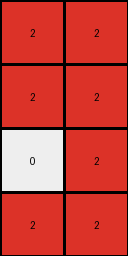
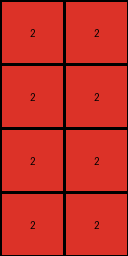

# 94f9d214 • 011 • refine_dreamer

---

Previous Code:
```python
"""
1.  **Input and Output Grid Initialization**: The input is a 2D grid of integers representing colors. Create an output grid that is half the width and half the height of the input grid, initialized with all white (0) pixels.

2.  **Subgrid Processing**: Iterate through the input grid in 2x2 blocks.  For each 2x2 subgrid:
    *   Check for the presence of green (value 3) within the subgrid. If green is present, set the corresponding pixel in the output grid to red (value 2).
    * If green is not found, check for presence of blue (value 1) inside the 2 x 2 subgrid. If Blue is found, set the corresponding pixel in the output grid to red(value 2).
    *   If neither green nor blue are found, then no changes are needed as output is initialized with white color.

3.  **Output**: The resulting output grid is the transformed version of the input grid, following the rules of reduction and color replacement.
"""

import numpy as np

def transform(input_grid):
    input_grid = np.array(input_grid)
    rows, cols = input_grid.shape
    output_grid = np.zeros((rows // 2, cols // 2), dtype=int)

    # Iterate through the input grid in 2x2 blocks
    for i in range(0, rows - rows % 2, 2):
        for j in range(0, cols - cols % 2, 2):
            subgrid = input_grid[i:i+2, j:j+2]
            
            # Check for green pixel
            if 3 in subgrid:
              output_grid[i // 2, j // 2] = 2
            # Check for blue pixel
            elif 1 in subgrid:
               output_grid[i // 2, j // 2] = 2

    return output_grid.tolist()
```

Train Set Results:

## Example 1:

Input:
```
0 0 0 0
0 3 3 0
0 0 0 0
3 0 0 3
0 0 0 1
1 0 1 1
1 1 1 1
0 1 0 1
```
Expected Output:
```
2 2 2 0
0 0 0 0
0 0 0 0
0 0 2 0
```
Transformed Output:
```
2 2
2 2
2 2
2 2
```

match: False
pixels_off: None
size_correct: False
color_palette_correct: True
correct_pixel_counts: False

## Example 2:

Input:
```
3 3 3 3
0 3 3 0
0 0 3 3
3 0 0 0
0 0 0 1
0 0 0 1
0 1 0 0
1 0 0 1
```
Expected Output:
```
0 0 0 0
2 0 0 0
2 0 0 0
0 2 2 0
```
Transformed Output:
```
2 2
2 2
0 2
2 2
```

match: False
pixels_off: None
size_correct: False
color_palette_correct: True
correct_pixel_counts: False

## Example 3:

Input:
```
0 3 3 0
0 3 0 3
0 0 3 0
3 3 3 3
1 1 1 1
1 1 0 0
1 1 0 0
0 1 1 0
```
Expected Output:
```
0 0 0 0
0 0 2 0
0 0 0 2
0 0 0 0
```
Transformed Output:
```
2 2
2 2
2 2
2 2
```

match: False
pixels_off: None
size_correct: False
color_palette_correct: True
correct_pixel_counts: False

## Example 4:

Input:
```
3 3 3 3
3 0 0 0
3 0 3 3
3 3 0 3
1 1 1 0
0 1 1 1
1 0 1 1
0 1 1 1
```
Expected Output:
```
0 0 0 0
0 0 0 0
0 2 0 0
0 0 0 0
```
Transformed Output:
```
2 2
2 2
2 2
2 2
```

match: False
pixels_off: None
size_correct: False
color_palette_correct: True
correct_pixel_counts: False
**INSTRUCTIONS**

The code above was generated based on observations from the first training
example

we have tested the transform function on each of the task example inputs and
compared with the expected output

review each of the examples provided and the results and consider how the
natural language program should be updated to accommodate this new knowledge

respond with the following deliverables:

- general assessment of the information provided and strategy for resolving the
  errors
- gather metrics about each of the examples and results - use code_execution to
  develop accurate reports on your assumptions
- a YAML block documenting facts - Focus on identifying objects, their properties, and the actions performed on them.
- a natural language program - Be as clear and concise as possible, providing a complete description of the transformation rule.


your responses should be considered as information in a report - not a
conversation
