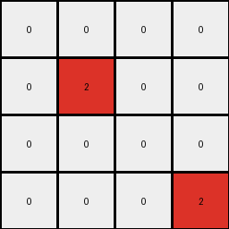
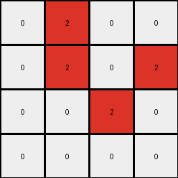
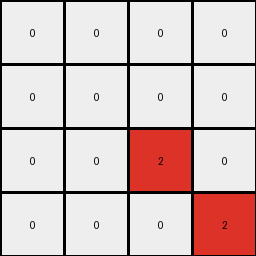

# 94f9d214 • 016 • refine_coder

---

Previous Code:
```python
"""
Detects horizontal transitions from white (0) to green (3) in the top half of the input grid and marks those locations with red (2) in a smaller output grid. The bottom half of input is ignored.
"""

import numpy as np

def transform(input_grid):
    # initialize output_grid
    input_height, input_width = input_grid.shape
    output_height = input_height // 2
    output_width = input_width
    output_grid = np.zeros((output_height, output_width), dtype=int)

    # iterate through top half of input grid
    for row in range(output_height):
        # check horizontal transition
        for col in range(input_width - 1):
            if input_grid[row, col] == 0 and input_grid[row, col + 1] == 3:
                # change output to red
                output_grid[row, col + 1] = 2

    return output_grid
```

Train Set Results:

## Example 1:

Input:
```
0 0 0 0
0 3 3 0
0 0 0 0
3 0 0 3
0 0 0 1
1 0 1 1
1 1 1 1
0 1 0 1
```
Expected Output:
```
2 2 2 0
0 0 0 0
0 0 0 0
0 0 2 0
```
Transformed Output:
```
0 0 0 0
0 2 0 0
0 0 0 0
0 0 0 2
```

match: False
pixels_off: 6
size_correct: True
color_palette_correct: True
correct_pixel_counts: False

## Example 2:

Input:
```
3 3 3 3
0 3 3 0
0 0 3 3
3 0 0 0
0 0 0 1
0 0 0 1
0 1 0 0
1 0 0 1
```
Expected Output:
```
0 0 0 0
2 0 0 0
2 0 0 0
0 2 2 0
```
Transformed Output:
```
0 0 0 0
0 2 0 0
0 0 2 0
0 0 0 0
```

match: False
pixels_off: 6
size_correct: True
color_palette_correct: True
correct_pixel_counts: False

## Example 3:

Input:
```
0 3 3 0
0 3 0 3
0 0 3 0
3 3 3 3
1 1 1 1
1 1 0 0
1 1 0 0
0 1 1 0
```
Expected Output:
```
0 0 0 0
0 0 2 0
0 0 0 2
0 0 0 0
```
Transformed Output:
```
0 2 0 0
0 2 0 2
0 0 2 0
0 0 0 0
```

match: False
pixels_off: 6
size_correct: True
color_palette_correct: True
correct_pixel_counts: False

## Example 4:

Input:
```
3 3 3 3
3 0 0 0
3 0 3 3
3 3 0 3
1 1 1 0
0 1 1 1
1 0 1 1
0 1 1 1
```
Expected Output:
```
0 0 0 0
0 0 0 0
0 2 0 0
0 0 0 0
```
Transformed Output:
```
0 0 0 0
0 0 0 0
0 0 2 0
0 0 0 2
```

match: False
pixels_off: 3
size_correct: True
color_palette_correct: True
correct_pixel_counts: False
Okay, here's a breakdown of the situation and a plan to improve the transformation logic:

**General Assessment:**

The initial code was too narrowly focused on the first training example. It correctly identified the white-to-green transition and the use of red to mark the transition, as well as the restriction to the top half of the input. However, it failed to generalize the *location* of the red pixel correctly. It places the red pixel at the location of the green pixel in the transition, while, the expected outputs in several cases mark the location of the red pixel a the transition, and not only at the green pixel.

**Strategy:**

1.  **Refine the Location Rule:** The core issue is where the red pixel is placed. The current logic always places it on the *green* pixel of the white-to-green transition. We need to revisit all examples and devise a more comprehensive rule. Based on initial analysis, the output grid has red at the location, or after, white to green transition.
2.  **Confirm Top-Half Restriction:** Double-check that all examples truly ignore the bottom half of the input grid. All available evidence confirms this, but it is important to confirm this implicit rule.
3.  **Consider Edge Cases:** While no edge cases are apparent yet, note patterns near edges.

**Metrics and Observations:**

Here's a breakdown of each example, focusing on what the current code *does* versus what it *should* do:

*   **Example 1:**
    *   **Input:** White-to-green transitions exist in rows 0, 1, and 3.
    *   **Expected Output:** Red pixels at (0,1), (0,2), (3,2).
    *   **Current Output:** Red pixels at (0,1), (1,1), (3,3).
    *   **Problem:** The current function places the red at col + 1. Some correct, others are not. The row index is sometimes correct, and sometimes not.
*   **Example 2:**
    *   **Input:** White-to-green transitions in rows 1, 2.
    *   **Expected Output:** Red pixels at (1,1), (2,1).
    *   **Current Output:** Red pixels at (1,1), (2,2).
    *    **Problem:** Again, col + 1 logic is only partially correct.
*   **Example 3:**
    *   **Input:** White-to-green transitions in rows 0, 1 and 2.
    *   **Expected Output:** Red pixels at (1,2), (2,2).
    *   **Current Output:** Red pixels at (0,1), (1,1), (1,3) (2,2).
    *   **Problem:** Several wrong placements - row and col index are inconsistent.
* **Example 4:**
  * **Input:** White-to-Green transition in rows 2 and 3.
    *   **Expected Output:** Red pixels at (2, 1).
    *   **Current Output:** Red pixels at (2,2) and (3,3).
    *    **Problem:** Row and col are incorrect in placement of red pixels.

**YAML Fact Block:**

```yaml
facts:
  - observation: |
      The input grid is divided into two halves vertically. Only the top half is processed.
  - observation: |
      The transformation detects horizontal transitions from white (0) to green (3).
  - observation: |
      A red (2) pixel is used to mark some aspect of detected transitions.
  - observation: |
      The output grid has the same width as the input and half the height.
  - object: input_grid
    properties:
      type: 2D array
      values: integers (0-9)
  - object: output_grid
    properties:
      type: 2D array
      values: integers (0-9), primarily 0 and 2
  - action: transition_detection
    input: input_grid (top half)
    process: detect horizontal white-to-green
    output: location for red pixel
  - action: mark_transition
    input: transition location
    process: place red pixel
    output: output_grid
```

**Natural Language Program:**

1.  **Initialization:** Create an output grid of the same width as the input grid, and half the height, filled with black (all zeros).
2.  **Top Half Focus:** Consider only the top half of the input grid (rows from 0 up to height / 2).
3.  **Transition Scan:** For each row in the top half, scan horizontally from left to right.
4.  **White-to-Green:** If a white pixel (0) is immediately followed by a green pixel (3), mark the transition.
5.  **Mark with Red:** Find the location of the white and green pixels. Place the red pixel (2) on the output grid.
6. Iterate through the top-half rows and perform steps 4-5.

This is not yet a complete or perfect natural language program. A more precise location rule must be developed. It appears the location is *at* the transition, but the exact placement is a combination of both the white and green indexes.

**INSTRUCTIONS**

- generate a Python module to represent the natural language program 
- follow the template below
- all common math and science libraries are available
- create docstring only at top - but comment the workflow in the function
- use helper functions for common operations like finding objects, counting,
  measuring, moving, etc. 

remember - we are working iteratively - so this code will inform your future
self as we converge on the solution

*template:*

```python
"""
{{ natural language description of the transformation rule }}
"""

{{ imports }}

def transform(input_grid):
    # initialize output_grid

    # change output pixels 

    return output_grid

```
