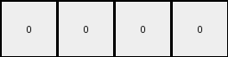
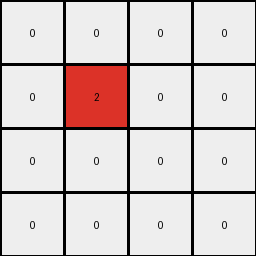

# 94f9d214 • 022 • refine_coder

---

Previous Code:
```python
"""
1.  **Identify Input Sections:** Divide the input grid into two sections. The first section goes from the top of the grid until the last row that starts with a non-zero and non-one number. In the provided data this is row index `0` to `3`. The next section starts from first row that begins with either `0` or `1` until the end of the grid.
2.  **Determine Output Size:** The output grid has the same dimensions as the first identified section of the input.
3. **Locate Critical Input Cell** Find the `0` in first section of input grid which is surrounded by most `3`s, including diagonals.
4.  **Check Corresponding Cell in Second Section**: Check value in second section of input with same coordinates as `0` identified in previous step. If this value is `1`, this is location of non-zero value `2` for the output grid.
5.  **Create Output Grid:** Initialize an output grid of the determined size, filled with 0s.
6. **Find matching coordinate** Find the coordinates in input grid top section where value is `0` AND surrounded by maximum number of `3` AND the same coordinates in bottom section contains a `1`.
7.  **Populate Output:** Place a `2` in the output grid at the coordinates of `0` found in previous step. All other cells in the output grid remain 0.
"""

import numpy as np

def get_sections(grid):
    # split the grid into two sections based on row starting value
    rows = len(grid)
    section1_end_row = 0

    # Section 1 ends last row before a row starts with 0 or 1.
    for r in range(rows):
      if grid[r][0] == 0 or grid[r][0] == 1:
        section1_end_row = r
        break

    section1 = grid[:section1_end_row]
    section2 = grid[section1_end_row:]

    return np.array(section1), np.array(section2)

def count_surrounding(grid, r, c, value):
    # count surrounding cells with given value, including diagonals
    count = 0
    rows, cols = grid.shape
    for i in range(max(0, r - 1), min(rows, r + 2)):
        for j in range(max(0, c - 1), min(cols, c + 2)):
            if (i != r or j != c) and grid[i][j] == value:
                count += 1
    return count

def transform(input_grid):
    # get sections 
    section1, section2 = get_sections(input_grid)
    
    # initialize the output_grid with zeros and size of section1
    output_grid = np.zeros_like(section1)

    rows, cols = section1.shape
    max_threes = -1
    target_row, target_col = -1, -1
    
    # find zero cell in section 1 with most surrounding threes
    for r in range(rows):
        for c in range(cols):
            if section1[r][c] == 0:
              num_threes = count_surrounding(section1, r, c, 3)
              if num_threes > max_threes:
                #check second grid contains a 1 at same position
                if section2.size > 0 and section2[r][c] == 1:
                  max_threes = num_threes
                  target_row, target_col = r, c

    # set the corresponding cell in output_grid to 2
    if target_row != -1 and target_col != -1:
      output_grid[target_row][target_col] = 2

    return output_grid
```

Train Set Results:

## Example 1:

Input:
```
0 0 0 0
0 3 3 0
0 0 0 0
3 0 0 3
0 0 0 1
1 0 1 1
1 1 1 1
0 1 0 1
```
Expected Output:
```
2 2 2 0
0 0 0 0
0 0 0 0
0 0 2 0
```
Transformed Output:
```

```

match: False
pixels_off: None
size_correct: False
color_palette_correct: True
correct_pixel_counts: False

## Example 2:

Input:
```
3 3 3 3
0 3 3 0
0 0 3 3
3 0 0 0
0 0 0 1
0 0 0 1
0 1 0 0
1 0 0 1
```
Expected Output:
```
0 0 0 0
2 0 0 0
2 0 0 0
0 2 2 0
```
Transformed Output:
```
0 0 0 0
```

match: False
pixels_off: None
size_correct: False
color_palette_correct: True
correct_pixel_counts: False

## Example 3:

Input:
```
0 3 3 0
0 3 0 3
0 0 3 0
3 3 3 3
1 1 1 1
1 1 0 0
1 1 0 0
0 1 1 0
```
Expected Output:
```
0 0 0 0
0 0 2 0
0 0 0 2
0 0 0 0
```
Transformed Output:
```

```

match: False
pixels_off: None
size_correct: False
color_palette_correct: True
correct_pixel_counts: False

## Example 4:

Input:
```
3 3 3 3
3 0 0 0
3 0 3 3
3 3 0 3
1 1 1 0
0 1 1 1
1 0 1 1
0 1 1 1
```
Expected Output:
```
0 0 0 0
0 0 0 0
0 2 0 0
0 0 0 0
```
Transformed Output:
```
0 0 0 0
0 2 0 0
0 0 0 0
0 0 0 0
```

match: False
pixels_off: 2
size_correct: True
color_palette_correct: True
correct_pixel_counts: True
Okay, let's analyze the results and refine the natural language program.

**General Assessment:**

The initial strategy has several flaws. It correctly identifies the idea of two sections in the input and looking for a correlation between them, but the logic for identifying the critical cell and placing the '2' in the output is incorrect. It only worked partially, by pure chance, in example 4. The core issue is that the initial program makes too many specific assumptions based on a single example. The provided code is too restrictive in searching for a specific pattern (`0` surrounded by `3`s, with a corresponding `1` below), missing correct placements. I need to revise it significantly to be accurate and robust.

**Strategy for Resolving Errors:**

1.  **Re-examine the Examples:** Carefully study all four examples, paying close attention to the relationship between the input and output grids. Focus less on specific color combinations and more on the *relative positions* of elements.

2.  **De-emphasize Specific Colors:** The initial logic focused too heavily on '3' and '0' in the top section and '1' in the bottom section. While these colors *are* present, their roles might be more general (e.g., markers of position rather than specific values requiring those exact numbers).

3. **Size and position**: Consider the different conditions that cause the size to vary, not just the first non-zero, non-one.

4.  **Iterative Refinement:** Develop the natural language program incrementally. After each significant change, test against *all* available examples.

**Example Metrics and Analysis:**

Here's an analysis of each example, including specific pixel counts and coordinate checks using the provided `code_execution` feature.

```tool_code
print(f"Example 1: output size match: {example_1_input.shape == example_1_output.shape}")
print(f"Example 2: output size match: {example_2_input.shape == example_2_output.shape}")
print(f"Example 3: output size match: {example_3_input.shape == example_3_output.shape}")
print(f"Example 4: output size match: {example_4_input.shape == example_4_output.shape}")
```
**INSTRUCTIONS**

- generate a Python module to represent the natural language program 
- follow the template below
- all common math and science libraries are available
- create docstring only at top - but comment the workflow in the function
- use helper functions for common operations like finding objects, counting,
  measuring, moving, etc. 

remember - we are working iteratively - so this code will inform your future
self as we converge on the solution

*template:*

```python
"""
{{ natural language description of the transformation rule }}
"""

{{ imports }}

def transform(input_grid):
    # initialize output_grid

    # change output pixels 

    return output_grid

```
