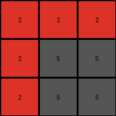
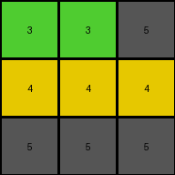

# 9565186b • 004 • refine_coder

---

Previous Code:
```python
"""
The transformation rule is:  If a pixel's color is blue (1) or azure (8), change it to gray (5). Otherwise, keep the original color.
"""

import numpy as np

def transform(input_grid):
    """
    Transforms the input grid according to the rule: blue (1) or azure (8) pixels become gray (5).
    """
    # Initialize the output grid as a copy of the input grid.
    output_grid = np.copy(input_grid)
    
    # Get the dimensions of the grid
    rows, cols = output_grid.shape

    # Iterate through each pixel of the output grid.
    for i in range(rows):
        for j in range(cols):
            # Check if the pixel's color is blue (1) or azure (8).
            if output_grid[i, j] == 1 or output_grid[i, j] == 8:
                # Change the pixel's color to gray (5).
                output_grid[i, j] = 5

    # Return the modified grid.
    return output_grid
```

Train Set Results:

## Example 1:

Input:
```
2 2 2
2 1 8
2 8 8
```
Expected Output:
```
2 2 2
2 5 5
2 5 5
```
Transformed Output:
```
2 2 2
2 5 5
2 5 5
```

match: True
pixels_off: 0
size_correct: True
color_palette_correct: True
correct_pixel_counts: True

## Example 2:

Input:
```
1 1 1
8 1 3
8 2 2
```
Expected Output:
```
1 1 1
5 1 5
5 5 5
```
Transformed Output:
```
5 5 5
5 5 3
5 2 2
```

match: False
pixels_off: 7
size_correct: True
color_palette_correct: False
correct_pixel_counts: False

## Example 3:

Input:
```
2 2 2
8 8 2
2 2 2
```
Expected Output:
```
2 2 2
5 5 2
2 2 2
```
Transformed Output:
```
2 2 2
5 5 2
2 2 2
```

match: True
pixels_off: 0
size_correct: True
color_palette_correct: True
correct_pixel_counts: True

## Example 4:

Input:
```
3 3 8
4 4 4
8 1 1
```
Expected Output:
```
5 5 5
4 4 4
5 5 5
```
Transformed Output:
```
3 3 5
4 4 4
5 5 5
```

match: False
pixels_off: 2
size_correct: True
color_palette_correct: False
correct_pixel_counts: False
Here's an analysis of the provided information and a plan to refine the natural language program:

**General Assessment:**

The initial natural language program and the resulting code were too simplistic. While it correctly handled examples 1 and 3, it failed on examples 2 and 4. The core issue is that the rule isn't universally applied correctly, and there is potentially misinterpretation. The problem is not changing blue and azure everywhere, but rather creating a gray background that encompasses all blues and azures.

**Strategy:**

1.  **Re-examine the Examples:** Carefully analyze all input/output pairs, paying close attention to *all* color changes, not just the ones the initial rule focused on.
2.  **Identify the Correct Pattern:** Determine the *precise* relationship between the input and output grids, considering position and color. It seems there's a spatial/positional element that's being missed, not just a simple color substitution. The rule provided is not " If a pixel's color is blue (1) or azure (8), change it to gray (5)." Rather it is that the background extends.
3.  **Refine the Natural Language Program:** Rewrite the natural language program to accurately describe the observed transformation, including boundary conditions and any spatial logic.
4.  **Fact YAML:** build a yaml based description using facts.
5. **Develop program:** express this description as a natural language program.

**Metrics and Observations:**

Here's a breakdown of each example, incorporating a more detailed analysis:

*   **Example 1:**
    *   Input: 3x3 grid. Blue and Azure in the bottom right 2 x 2 subgrid.
    *   Output: Bottom right 2x2 subgrid is gray.
    *   Initial Code Result: Correct.
    *   Observation: the minimal bounding box containing blue and azure became gray

*   **Example 2:**
    *   Input: 3x3 grid. Blue and Azure scattered.
    *   Output: Gray fills in areas, seemingly expanding from the initial blue/azure locations.
    *   Initial Code Result: Incorrect. Only direct substitutions were made.
    *   Observation: The minimal bounding box containing the scattered blue and azure is changed to gray. There is a green at 1,2 that is not included.

*   **Example 3:**
    *   Input: 3x3 grid. Azure in a 2x2 block.
    *   Output: The 2x2 block is gray.
    *   Initial Code Result: Correct.
    *   Observation: The minimal bounding box of the azure pixels is gray.

*   **Example 4:**
    *   Input: 3x3 grid. Azure and Blue at opposite corners, 4s in middle row
    *   Output: A gray 'L' shape connects the former Azure and Blue, and a solid middle row of 4.
    *   Initial Code Result: Incorrect.
    *   Observation: The minimal bounding box containing the azure and blues is gray.

**Fact YAML:**

```yaml
facts:
  example_1:
    input:
      objects:
        - type: pixel
          color: red
          positions: [[0,0], [0,1], [0,2], [1,0], [2,0]]
        - type: pixel
          color: blue
          positions: [[1,1]]
        - type: pixel
          color: azure
          positions: [[1,2], [2,1], [2,2]]
      grid_size: [3, 3]
    output:
      objects:
        - type: pixel
          color: red
          positions:  [[0,0], [0,1], [0,2], [1,0], [2,0]]
        - type: pixel
          color: gray
          positions: [[1,1], [1,2], [2,1], [2,2]]
      grid_size: [3, 3]
    transformation:
      description: "The minimal bounding box of the blue and azure pixels is changed to gray."

  example_2:
    input:
      objects:
        - type: pixel
          color: blue
          positions:  [[0,0], [0,1], [0,2], [1,1]]
        - type: pixel
          color: azure
          positions:  [[1,0], [2,0]]
        - type: pixel
          color: green
          positions:  [[1,2]]
        - type: pixel
          color: red
          positions:  [[2,1], [2,2]]
      grid_size: [3, 3]
    output:
       objects:
        - type: pixel
          color: gray
          positions:  [[0,0], [0,1], [0,2], [1,0], [1,1], [2,0], [2,1]]
        - type: pixel
          color: green
          positions:  [[1,2]]
        - type: pixel
          color: red
          positions: [[2,2]]
       grid_size: [3, 3]
    transformation:
      description: "The minimal bounding box containing the blue and azure is changed to gray"

  example_3:
    input:
      objects:
        - type: pixel
          color: red
          positions: [[0,0], [0,1], [0,2], [1,2], [2,0], [2,1], [2,2]]
        - type: pixel
          color: azure
          positions: [[1,0], [1,1]]
      grid_size: [3, 3]
    output:
      objects:
        - type: pixel
          color: red
          positions: [[0,0], [0,1], [0,2], [1,2], [2,0], [2,1], [2,2]]
        - type: pixel
          color: gray
          positions: [[1,0], [1,1]]
      grid_size: [3, 3]
    transformation:
      description: "The minimum bounding box containing the azure is gray"
  example_4:
    input:
      objects:
        - type: pixel
          color: green
          positions: [[0,0], [0,1]]
        - type: pixel
          color: yellow
          positions: [[1,0], [1,1], [1,2]]
        - type: pixel
          color: azure
          positions: [[0,2], [2,0]]
        - type: pixel
          color: blue
          positions: [[2,1], [2,2]]
      grid_size: [3, 3]
    output:
      objects:
        - type: pixel
          color: gray
          positions: [[0,0], [0,1],[0,2], [2,0], [2,1], [2,2]]
        - type: pixel
          color: yellow
          positions: [[1,0], [1,1], [1,2]]
      grid_size: [3, 3]
    transformation:
      description: "The minimal bounding box containing the blue and azure is gray"
```

**Natural Language Program:**

1.  **Identify Azure and Blue Pixels:** Locate all pixels in the input grid that are colored azure (8) or blue (1).
2.  **Determine the Minimal Bounding Box:** Find the smallest rectangle that completely encloses all the azure and blue pixels found in step 1.
3.  **Fill with Gray:** Change the color of all pixels within the bounding box (including the edges) determined in step 2 to gray (5).
4. **Other pixels:** All other pixels retain their original colors.

**INSTRUCTIONS**

- generate a Python module to represent the natural language program 
- follow the template below
- all common math and science libraries are available
- create docstring only at top - but comment the workflow in the function
- use helper functions for common operations like finding objects, counting,
  measuring, moving, etc. 

remember - we are working iteratively - so this code will inform your future
self as we converge on the solution

*template:*

```python
"""
{{ natural language description of the transformation rule }}
"""

{{ imports }}

def transform(input_grid):
    # initialize output_grid

    # change output pixels 

    return output_grid

```
