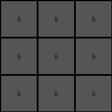

# 9565186b • 005 • refine_dreamer

---


Previous Code:
```python
"""
1.  **Identify Azure and Blue Pixels:** Locate all pixels in the input grid that are colored azure (8) or blue (1).
2.  **Determine the Minimal Bounding Box:** Find the smallest rectangle that completely encloses all the azure and blue pixels found in step 1.
3.  **Fill with Gray:** Change the color of all pixels within the bounding box (including the edges) determined in step 2 to gray (5).
4. **Other pixels:** All other pixels retain their original colors.
"""

import numpy as np

def find_bounding_box(grid, colors):
    """Finds the minimal bounding box containing specified colors."""
    rows, cols = grid.shape
    min_row, min_col = rows, cols
    max_row, max_col = -1, -1

    for r in range(rows):
        for c in range(cols):
            if grid[r, c] in colors:
                min_row = min(min_row, r)
                min_col = min(min_col, c)
                max_row = max(max_row, r)
                max_col = max(max_col, c)

    if max_row == -1: # No matching colors found
        return None

    return min_row, min_col, max_row, max_col

def transform(input_grid):
    """Transforms the input grid by filling the bounding box of blue/azure pixels with gray."""

    # Initialize output_grid as a copy of the input.
    output_grid = np.copy(input_grid)
    rows, cols = output_grid.shape

    # Find the bounding box coordinates for blue (1) and azure (8) pixels.
    bounding_box = find_bounding_box(input_grid, [1, 8])

    # If no blue or azure pixels are found, return the original grid.
    if bounding_box is None:
        return output_grid

    min_row, min_col, max_row, max_col = bounding_box

    # Fill the bounding box with gray (5).
    for r in range(min_row, max_row + 1):
        for c in range(min_col, max_col + 1):
            output_grid[r, c] = 5

    return output_grid
```

Train Set Results:

## Example 1:

Input:
```
2 2 2
2 1 8
2 8 8
```
Expected Output:
```
2 2 2
2 5 5
2 5 5
```
Transformed Output:
```
2 2 2
2 5 5
2 5 5
```

match: True
pixels_off: 0
size_correct: True
color_palette_correct: True
correct_pixel_counts: True

## Example 2:

Input:
```
1 1 1
8 1 3
8 2 2
```
Expected Output:
```
1 1 1
5 1 5
5 5 5
```
Transformed Output:
```
5 5 5
5 5 5
5 5 5
```

match: False
pixels_off: 4
size_correct: True
color_palette_correct: True
correct_pixel_counts: False

## Example 3:

Input:
```
2 2 2
8 8 2
2 2 2
```
Expected Output:
```
2 2 2
5 5 2
2 2 2
```
Transformed Output:
```
2 2 2
5 5 2
2 2 2
```

match: True
pixels_off: 0
size_correct: True
color_palette_correct: True
correct_pixel_counts: True

## Example 4:

Input:
```
3 3 8
4 4 4
8 1 1
```
Expected Output:
```
5 5 5
4 4 4
5 5 5
```
Transformed Output:
```
5 5 5
5 5 5
5 5 5
```

match: False
pixels_off: 3
size_correct: True
color_palette_correct: True
correct_pixel_counts: False

**INSTRUCTIONS**

The code above was generated based on observations from the first training
example

we have tested the transform function on each of the task example inputs and
compared with the expected output

review each of the examples provided and the results and consider how the
natural language program should be updated to accommodate this new knowledge

respond with the following deliverables:

- general assessment of the information provided and strategy for resolving the
  errors
- gather metrics about each of the examples and results - use code_execution to
  develop accurate reports on your assumptions
- a YAML block documenting facts - Focus on identifying objects, their properties, and the actions performed on them.
- a natural language program - Be as clear and concise as possible, providing a complete description of the transformation rule.


your responses should be considered as information in a report - not a
conversation
