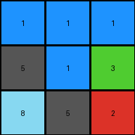
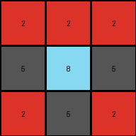

# 9565186b • 009 • refine_dreamer

---

Previous Code:
```python
"""
Transforms a 3x3 input grid to a 3x3 output grid based on color adjacency rules.
Pixels in the top row remain unchanged. Other non-blue pixels are replaced with gray if 
they are horizontally or vertically adjacent to an azure pixel.
"""

import numpy as np

def get_adjacent_pixels(grid, row, col):
    """
    Gets the horizontally and vertically adjacent pixels to a given cell.
    
    Args:
      grid: The 2D numpy array representing the grid.
      row: Row index of the cell.
      col: Column index of the cell.
      
    Returns:
      A list of (row, col) tuples representing adjacent pixels.
    """

    rows, cols = grid.shape
    adjacent = []
    if row > 0:
        adjacent.append((row - 1, col))  # Up
    if row < rows - 1:
        adjacent.append((row + 1, col))  # Down
    if col > 0:
        adjacent.append((row, col - 1))  # Left
    if col < cols - 1:
        adjacent.append((row, col + 1))  # Right
    return adjacent

def transform(input_grid):
    # Initialize output grid as a copy of the input grid
    output_grid = np.copy(input_grid)
    rows, cols = output_grid.shape

    # Iterate through the grid, skipping the top row
    for row in range(rows):
        for col in range(cols):
            # Preserve top row
            if row == 0:
                continue

            # Check for adjacency to azure (8) for non-blue pixels
            if output_grid[row, col] != 1:
                adjacent_coords = get_adjacent_pixels(output_grid, row, col)
                for adj_row, adj_col in adjacent_coords:
                    if output_grid[adj_row, adj_col] == 8:
                        output_grid[row, col] = 5  # Replace with gray (5)
                        break  # Once replaced, no need to check other neighbors

    return output_grid
```

Train Set Results:

## Example 1:

Input:
```
2 2 2
2 1 8
2 8 8
```
Expected Output:
```
2 2 2
2 5 5
2 5 5
```
Transformed Output:
```
2 2 2
2 1 5
5 5 8
```

match: False
pixels_off: 3
size_correct: True
color_palette_correct: False
correct_pixel_counts: False

## Example 2:

Input:
```
1 1 1
8 1 3
8 2 2
```
Expected Output:
```
1 1 1
5 1 5
5 5 5
```
Transformed Output:
```
1 1 1
5 1 3
8 5 2
```

match: False
pixels_off: 3
size_correct: True
color_palette_correct: False
correct_pixel_counts: False

## Example 3:

Input:
```
2 2 2
8 8 2
2 2 2
```
Expected Output:
```
2 2 2
5 5 2
2 2 2
```
Transformed Output:
```
2 2 2
5 8 5
2 5 2
```

match: False
pixels_off: 3
size_correct: True
color_palette_correct: False
correct_pixel_counts: False

## Example 4:

Input:
```
3 3 8
4 4 4
8 1 1
```
Expected Output:
```
5 5 5
4 4 4
5 5 5
```
Transformed Output:
```
3 3 8
5 4 5
8 1 1
```

match: False
pixels_off: 8
size_correct: True
color_palette_correct: False
correct_pixel_counts: False
**INSTRUCTIONS**

The code above was generated based on observations from the first training
example

we have tested the transform function on each of the task example inputs and
compared with the expected output

review each of the examples provided and the results and consider how the
natural language program should be updated to accommodate this new knowledge

respond with the following deliverables:

- general assessment of the information provided and strategy for resolving the
  errors
- gather metrics about each of the examples and results - use code_execution to
  develop accurate reports on your assumptions
- a YAML block documenting facts - Focus on identifying objects, their properties, and the actions performed on them.
- a natural language program - Be as clear and concise as possible, providing a complete description of the transformation rule.


your responses should be considered as information in a report - not a
conversation
