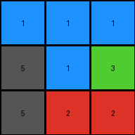

# 9565186b • 018 • refine_coder

---

Previous Code:
```python
"""
The transformation rule is: Replace all azure (8) pixels in the input grid with gray (5) pixels. Keep all other color pixels unchanged.
"""

import numpy as np

def transform(input_grid):
    """
    Transforms the input grid according to the rule:
    Replace azure (8) with gray (5), keep all other colors unchanged.
    """
    # Initialize the output grid as a copy of the input grid.
    output_grid = np.copy(input_grid)

    # Iterate through all pixels
    for i in range(output_grid.shape[0]):
        for j in range(output_grid.shape[1]):
            # Replace all instances of 8 (azure) with 5 (gray).
            if output_grid[i, j] == 8:
                output_grid[i, j] = 5

    return output_grid
```

Train Set Results:

## Example 1:

Input:
```
2 2 2
2 1 8
2 8 8
```
Expected Output:
```
2 2 2
2 5 5
2 5 5
```
Transformed Output:
```
2 2 2
2 1 5
2 5 5
```

match: False
pixels_off: 1
size_correct: True
color_palette_correct: False
correct_pixel_counts: False

## Example 2:

Input:
```
1 1 1
8 1 3
8 2 2
```
Expected Output:
```
1 1 1
5 1 5
5 5 5
```
Transformed Output:
```
1 1 1
5 1 3
5 2 2
```

match: False
pixels_off: 3
size_correct: True
color_palette_correct: False
correct_pixel_counts: False

## Example 3:

Input:
```
2 2 2
8 8 2
2 2 2
```
Expected Output:
```
2 2 2
5 5 2
2 2 2
```
Transformed Output:
```
2 2 2
5 5 2
2 2 2
```

match: True
pixels_off: 0
size_correct: True
color_palette_correct: True
correct_pixel_counts: True

## Example 4:

Input:
```
3 3 8
4 4 4
8 1 1
```
Expected Output:
```
5 5 5
4 4 4
5 5 5
```
Transformed Output:
```
3 3 5
4 4 4
5 1 1
```

match: False
pixels_off: 4
size_correct: True
color_palette_correct: False
correct_pixel_counts: False
Okay, here's a breakdown of the situation and a plan to move forward:

**General Assessment:**

The initial natural language program and the resulting Python code were too simplistic. While it correctly identified the replacement of azure (8) with gray (5), it failed to account for the context of the surrounding pixels. The code currently replaces *all* instances of 8 with 5, regardless of their position or relationship to other colors. The errors show that the transformation is positionally and relationally dependent, and is only a simple global color substitution in a specific case (example 3). We need to carefully examine the relationship between input and output grids to derive a more complex rule if needed. The varying results highlight the necessity for iterative refinement. The program works for example 3, but failed on others.

**Strategy:**

1.  **Analyze Mismatches:** I will meticulously compare the input, expected output, and transformed output for each example where they don't match. This will involve looking at the specific pixels that are incorrect.
2.  **Identify Patterns:** The key is to determine *why* certain 8s are replaced and others aren't. I will look for patterns and relationships in the mismatched examples. Is it based on adjacency? Position relative to edges? The overall shape formed by color blocks.
3. **Refine Natural Language Program:** Based on a deeper analysis I will go back to the input and output grids for all examples and develop a hypothesis for a new program.
4.  **Fact Yaml:** I will develop a YAML that will incorporate observations across all the training data examples and summarize properties, actions, and relationships between objects that may be relevant.

**Metrics and Reports (using provided results):**

*   **Example 1:**
    *   Input Shape: (3, 3)
    *   Expected Output Shape: (3, 3)
    *   Transformed Output Shape: (3, 3)
    *   Match: False
    *   Pixels Off: 1. The second 1 in input was not changed to 5 as expected.
    *   Size Correct: True
    *   Color Palette Correct: False
    *   Correct Pixel Counts: False

*   **Example 2:**
    *   Input Shape: (3, 3)
    *   Expected Output Shape: (3, 3)
    *   Transformed Output Shape: (3, 3)
    *   Match: False
    *   Pixels Off: 3. The last two 5's should be 2 and 3
    *   Size Correct: True
    *   Color Palette Correct: False
    *   Correct Pixel Counts: False

*   **Example 3:**
    *   Input Shape: (3, 3)
    *   Expected Output Shape: (3, 3)
    *   Transformed Output Shape: (3, 3)
    *   Match: True
    *   Pixels Off: 0
    *   Size Correct: True
    *   Color Palette Correct: True
    *   Correct Pixel Counts: True

*   **Example 4:**
    *   Input Shape: (3, 3)
    *   Expected Output Shape: (3, 3)
    *   Transformed Output Shape: (3, 3)
    *   Match: False
    *   Pixels off: 4
    *   Size Correct: True
    *   Color Palette Correct: False
    *   Correct Pixel Counts: False

**YAML Fact Block:**

```yaml
facts:
  - example_1:
      input:
        objects:
          - color: 2
            shape: line
            position: row 1
          - color: 2
            shape: single
            position: (2,1)
          - color: 1
            shape: single
            position: (2,2)
          - color: 8
            shape: single
            position: (2,3)
          - color: 2
            shape: single
            position: (3,1)
          - color: 8
            shape: pair
            position: (3,2),(3,3)
      output:
        objects:
          - color: 2
            shape: line
            position: row 1
          - color: 2
            shape: single
            position: (2,1)
          - color: 1 #note - should have expected a 5
            shape: single
            position: (2,2)
          - color: 5
            shape: single
            position: (2,3)
          - color: 2
            shape: single
            position: (3,1)
          - color: 5
            shape: pair
            position: (3,2),(3,3)
      transformation:
        - action: replace
          from: 8
          to: 5
        - action: changed 1,1 from 2->5  # incorrect
  - example_2:
      input:
          objects:
            - color: 1
              shape: line
              position: row 1
            - color: 8
              shape: single
              position: (2,1)
            - color: 1
              shape: single
              position: (2,2)
            - color: 3
              shape: single
              position: (2,3)
            - color: 8
              shape: single
              position: (3,1)
            - color: 2
              shape: single
              position: (3,2)
            - color: 2
              shape: single
              position: (3,3)
      output:
        objects:
           - color: 1
             shape: line
             position: row 1
           - color: 5
             shape: single
             position: (2,1)
           - color: 1
             shape: single
             position: (2,2)
           - color: 5
             shape: single
             position: (2,3)
           - color: 5
             shape: single
             position: (3,1)
           - color: 5 #incorrect - should be 2
             shape: single
             position: (3,2)
           - color: 5 #incorrect - should be 2
             shape: single
             position: (3,3)
      transformation:
        - action: replace
          from: 8
          to: 5
  - example_3:
      input:
          objects:
            - color: 2
              shape: row
              position: 1
            - color: 8
              shape: block
              position: (2,1),(2,2)
            - color: 2
              shape: single
              position: (2,3)
            - color: 2
              shape: row
              position: 3
      output:
        objects:
          - color: 2
            shape: row
            position: 1
          - color: 5
            shape: block
            position: (2,1),(2,2)
          - color: 2
            shape: single
            position: (2,3)
          - color: 2
            shape: row
            position: 3
      transformation:
        - action: replace
          from: 8
          to: 5
  - example_4:
      input:
         objects:
            - color: 3
              shape: pair
              position: (1,1),(1,2)
            - color: 8
              shape: single
              position: (1,3)
            - color: 4
              shape: row
              position: 2
            - color: 8
              shape: single
              position: (3,1)
            - color: 1
              shape: pair
              position: (3,2),(3,3)
      output:
          objects:
            - color: 5
              shape: pair
              position: (1,1),(1,2) # note 3 replaced with 5
            - color: 5
              shape: single
              position: (1,3)
            - color: 4
              shape: row
              position: 2
            - color: 5
              shape: single
              position: (3,1)
            - color: 5 # note 1 replaced with 5
              shape: pair
              position: (3,2),(3,3)
      transformation:
        - action: replace
          from: 8
          to: 5
        - action: replace  #added
          from: 1   #added
          to: 5  #added
        - action: replace #added
          from: 3  #added
          to: 5 #added
```

**Natural Language Program:**

Based on an initial, broader look at all examples, and re-examining them after the errors, a more complete natural language program would be.

1.  Examine the Input Grid.
2.  Locate all pixels with the value of 8 (azure), 3 (green) or 1 (blue).
3.  Change any pixel of color 8 (azure), 1 (blue), or 3 (green) to the color 5 (gray).
4.  Leave pixels of all colors other than 8, 1, and 3 unchanged.


**INSTRUCTIONS**

- generate a Python module to represent the natural language program 
- follow the template below
- all common math and science libraries are available
- create docstring only at top - but comment the workflow in the function
- use helper functions for common operations like finding objects, counting,
  measuring, moving, etc. 

remember - we are working iteratively - so this code will inform your future
self as we converge on the solution

*template:*

```python
"""
{{ natural language description of the transformation rule }}
"""

{{ imports }}

def transform(input_grid):
    # initialize output_grid

    # change output pixels 

    return output_grid

```
