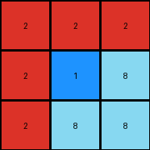
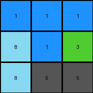
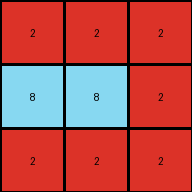

# 9565186b • 023 • refine_dreamer

---


Previous Code:
```python
"""
1. **Identify the middle row:** Find the row with index `height // 2`.
2. **Identify color blocks:** Find contiguous regions of the same color within the entire grid.
3. **Check Middle Row:** For each color in the middle row:
    *   If that color exists in contiguous blocks of the same color extending upwards or downwards, preserve that block.
4. **Replace other colors:** All cells not part of the preserved color block are changed to gray (5).
"""

import numpy as np
from collections import deque

def find_color_blocks(grid):
    """
    Finds contiguous regions (blocks) of the same color in the grid.
    """
    visited = set()
    blocks = []

    def is_valid(r, c):
        return 0 <= r < grid.shape[0] and 0 <= c < grid.shape[1]

    def bfs(start_r, start_c):
        color = grid[start_r, start_c]
        queue = deque([(start_r, start_c)])
        visited.add((start_r, start_c))
        block = []

        while queue:
            r, c = queue.popleft()
            block.append((r, c))

            for dr, dc in [(0, 1), (0, -1), (1, 0), (-1, 0)]:
                nr, nc = r + dr, c + dc
                if is_valid(nr, nc) and grid[nr, nc] == color and (nr, nc) not in visited:
                    visited.add((nr, nc))
                    queue.append((nr, nc))
        return block, color

    for r in range(grid.shape[0]):
        for c in range(grid.shape[1]):
            if (r, c) not in visited:
                block, color = bfs(r, c)
                blocks.append((block, color))
    return blocks

def transform(input_grid):
    """
    Transforms the input grid according to the observed rule:
    Colors in the middle row that extend contiguously upwards or downwards are preserved.
    All other cells are changed to gray (5).
    """
    # Initialize output_grid with gray
    output_grid = np.full_like(input_grid, 5)
    height = input_grid.shape[0]
    middle_row_index = height // 2

    # Find all color blocks
    color_blocks = find_color_blocks(input_grid)

    # Check middle row and preserve extending colors.
    for block, color in color_blocks:
        for r, c in block:
            if r == middle_row_index:
                # Preserve the entire block
                for br, bc in block:
                    output_grid[br, bc] = color
                break  # Move to the next block

    return output_grid
```

Train Set Results:

## Example 1:

Input:
```
2 2 2
2 1 8
2 8 8
```
Expected Output:
```
2 2 2
2 5 5
2 5 5
```
Transformed Output:
```
2 2 2
2 1 8
2 8 8
```

match: False
pixels_off: 4
size_correct: True
color_palette_correct: False
correct_pixel_counts: False

## Example 2:

Input:
```
1 1 1
8 1 3
8 2 2
```
Expected Output:
```
1 1 1
5 1 5
5 5 5
```
Transformed Output:
```
1 1 1
8 1 3
8 5 5
```

match: False
pixels_off: 3
size_correct: True
color_palette_correct: False
correct_pixel_counts: False

## Example 3:

Input:
```
2 2 2
8 8 2
2 2 2
```
Expected Output:
```
2 2 2
5 5 2
2 2 2
```
Transformed Output:
```
2 2 2
8 8 2
2 2 2
```

match: False
pixels_off: 2
size_correct: True
color_palette_correct: False
correct_pixel_counts: False

## Example 4:

Input:
```
3 3 8
4 4 4
8 1 1
```
Expected Output:
```
5 5 5
4 4 4
5 5 5
```
Transformed Output:
```
5 5 5
4 4 4
5 5 5
```

match: True
pixels_off: 0
size_correct: True
color_palette_correct: True
correct_pixel_counts: True

**INSTRUCTIONS**

The code above was generated based on observations from the first training
example

we have tested the transform function on each of the task example inputs and
compared with the expected output

review each of the examples provided and the results and consider how the
natural language program should be updated to accommodate this new knowledge

respond with the following deliverables:

- general assessment of the information provided and strategy for resolving the
  errors
- gather metrics about each of the examples and results - use code_execution to
  develop accurate reports on your assumptions
- a YAML block documenting facts - Focus on identifying objects, their properties, and the actions performed on them.
- a natural language program - Be as clear and concise as possible, providing a complete description of the transformation rule.


your responses should be considered as information in a report - not a
conversation
