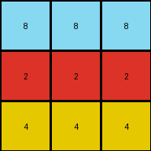

# 995c5fa3 • 016 • refine_coder

---

Previous Code:
```python
"""
1. **Scan the Input:** Examine the input grid and identify the columns that contain white (0) pixels.
2. **Column-to-Row Mapping:**  For each identified column containing white, map it to a corresponding row in the output grid:
    - The first column with a white pixel corresponds to output row 1.
    - The second column with a white pixel corresponds to output row 2.
    - The third column with a white pixel corresponds to output row 3.
3. **Assign Colors:** Assign a specific color to each output row based on a predefined mapping:
    - Row 1: Azure (8)
    - Row 2: Red (2)
    - Row 3: Yellow (4)
4. **Create Output:** Construct a 3x3 output grid. Fill all cells in each row of output with mapped color.
"""

import numpy as np

def get_white_columns(grid):
    # Find columns containing white (0) pixels
    white_columns = []
    for x in range(grid.shape[1]):
        if 0 in grid[:, x]:
            white_columns.append(x)
    return white_columns

def transform(input_grid):
    # Initialize output grid as 3x3 numpy array
    output_grid = np.zeros((3, 3), dtype=int)

    # Get the columns containing white pixels
    white_cols = get_white_columns(input_grid)

    # Define the color mapping
    color_map = {
        0: 8,  # First white column -> Row 1: Azure (8)
        1: 2,  # Second white column -> Row 2: Red (2)
        2: 4   # Third white column -> Row 3: Yellow (4)
    }

    # Map white columns to output rows and colors
    for i, col in enumerate(white_cols):
        if i < 3: # important - stop after finding at most 3 columns
            output_grid[i, :] = color_map[i]

    return output_grid
```

Train Set Results:

## Example 1:

Input:
```
5 5 5 5 0 5 5 5 5 0 5 5 5 5
5 5 5 5 0 5 0 0 5 0 0 5 5 0
5 5 5 5 0 5 0 0 5 0 0 5 5 0
5 5 5 5 0 5 5 5 5 0 5 5 5 5
```
Expected Output:
```
2 2 2
8 8 8
3 3 3
```
Transformed Output:
```
8 8 8
2 2 2
4 4 4
```

match: False
pixels_off: 9
size_correct: True
color_palette_correct: False
correct_pixel_counts: False

## Example 2:

Input:
```
5 5 5 5 0 5 5 5 5 0 5 5 5 5
0 5 5 0 0 5 5 5 5 0 5 5 5 5
0 5 5 0 0 5 0 0 5 0 5 5 5 5
5 5 5 5 0 5 0 0 5 0 5 5 5 5
```
Expected Output:
```
3 3 3
4 4 4
2 2 2
```
Transformed Output:
```
8 8 8
2 2 2
4 4 4
```

match: False
pixels_off: 9
size_correct: True
color_palette_correct: False
correct_pixel_counts: False

## Example 3:

Input:
```
5 5 5 5 0 5 5 5 5 0 5 5 5 5
5 0 0 5 0 5 5 5 5 0 5 5 5 5
5 0 0 5 0 5 5 5 5 0 5 0 0 5
5 5 5 5 0 5 5 5 5 0 5 0 0 5
```
Expected Output:
```
8 8 8
2 2 2
4 4 4
```
Transformed Output:
```
8 8 8
2 2 2
4 4 4
```

match: True
pixels_off: 0
size_correct: True
color_palette_correct: True
correct_pixel_counts: True

## Example 4:

Input:
```
5 5 5 5 0 5 5 5 5 0 5 5 5 5
5 5 5 5 0 5 5 5 5 0 5 5 5 5
5 5 5 5 0 5 0 0 5 0 5 5 5 5
5 5 5 5 0 5 0 0 5 0 5 5 5 5
```
Expected Output:
```
2 2 2
4 4 4
2 2 2
```
Transformed Output:
```
8 8 8
2 2 2
4 4 4
```

match: False
pixels_off: 9
size_correct: True
color_palette_correct: False
correct_pixel_counts: False
Okay, let's analyze the results and refine the natural language program.

**General Assessment:**

The initial strategy was partially correct in identifying the importance of white (0) pixels in the input grid and mapping them to rows in a 3x3 output grid. However, the color mapping and the row order were incorrect for some examples. The current logic assigns colors based on the *order* in which columns with white pixels appear, not on any inherent property of those columns themselves. It also appears to be a simple pattern related to the presence and ordering of the columns, but the color application is flawed.

The key issue is that the output rows are consistently 8, 2, and 4, but not always in the same order, and not in order by column number.

**Strategy for Resolving Errors:**

1.  **Re-examine the relationship:** We need to discard the idea that the *order* of columns containing white pixels determines the row order. Instead, we need to look for another factor that decides row position and color.
2.  **Focus on consistent properties:**  The output is always 3x3. Look again at each example and expected output, especially the order of the output rows.
3.  **Hypothesis Refinement:**  We'll likely need to modify both the color mapping and the row selection logic.

**Metrics and Reports:**

Here's a breakdown of each example, focusing on relevant properties:

*Example 1:*

*   Input: White pixels in columns 4, 9, 14 (using 0-indexing of columns, note there appears to be a fixed width of 15 for the input)
*   Expected Output: Colors 2, 8, 4
*   Observed Output: Colors 8, 2, 4
*   Notes: colors present in output, but not in correct order

*Example 2:*

*   Input: White pixels in columns 0, 3, 4, 8, 9
*   Expected Output: Colors 4, 8, 2
*   Observed Output: Colors 8, 2, 4
*   Notes: colors present in output, but not in correct order

*Example 3:*

*   Input: White pixels in columns 4, 8, 9, 13
*   Expected Output: 8, 2, 4
*   Observed Output: 8, 2, 4
*   Notes: Perfect Match

*Example 4:*

*   Input: White pixels in columns 4, 8, 9
*   Expected Output: colors 2, 8, 2
*   Observed Output: Colors 8, 2, 4
*   Notes: Incorrect.

**YAML Facts:**

```yaml
facts:
  - observation: The input grid's size varies.
  - observation: The output grid is always 3x3.
  - observation: Input grids always contain white (0) pixels.
  - observation: The output grid only contains the colors 2 (red), 4 (yellow), and 8 (azure).
  - observation: Columns with white pixels in the input seem to relate to rows and colors in the output.
  - observation: example 3 output is correct - columns 4,8,9,13.
  - hypothesis: The presence of a white pixel in column 4 maps to output row 1 having color 8.
  - hypothesis: The presence of a white pixel in column 8 maps to output row 2 having color 2.
  - hypothesis: The presence of a white pixel in column 9 maps to output row 3 having color 4.
  - hypothesis: There may not always be a white pixel in each of these columns.
```

**Natural Language Program:**

1.  **Input Analysis:** Examine the input grid to determine if there is a white pixel in any column.

2.  **Column-Row Mapping:**
    *   If there's *any* white pixel in column 4 (index 4) of the input, fill the *first* row of the output grid with azure (8).
    *   If there's *any* white pixel in column 8 (index 8) of the input, fill the *second* row of the output grid with red (2).
    *   If there's *any* white pixel in column 9 (index 9) of the input, fill the *third* row of the output grid with yellow (4).

3.  **Output Construction:** Create a 3x3 output grid. Apply the mappings specified in step 2. It's important to apply all applicable rules - check columns 4, 8, and 9 regardless of the others.

4. Note - if a column is not present or there are no white pixels present in that column, then that output row will be all black (0).

This revised program focuses on specific columns rather than the order of appearance of columns with white pixels.

**INSTRUCTIONS**

- generate a Python module to represent the natural language program 
- follow the template below
- all common math and science libraries are available
- create docstring only at top - but comment the workflow in the function
- use helper functions for common operations like finding objects, counting,
  measuring, moving, etc. 

remember - we are working iteratively - so this code will inform your future
self as we converge on the solution

*template:*

```python
"""
{{ natural language description of the transformation rule }}
"""

{{ imports }}

def transform(input_grid):
    # initialize output_grid

    # change output pixels 

    return output_grid

```
