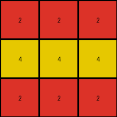

# 995c5fa3 • 021 • refine_dreamer

---


Previous Code:
```python
"""
1. **Locate Key Features:** Identify the two vertical white lines (columns 5 and 10) and the 2x2 white square at the center of the input grid.
2. **Extract and Analyze:** Extract the central 2x2 white square. Consider the position of the central square *relative to* the vertical lines.
3. **Create output:** Create an output grid of size 3x3
4. **Determine central pixel and its color:** From the input grid we find that the central square is surrounded on four sides by the gray color '5'. Since the columns of the vertical lines are 5 and 10 and the central square occupies column 7 and 8, there are 2 columns of color 5 between vertical lines and central square. Replace '5' with '4'
5. **Encode Output:** Create a 3x3 output grid. Fill the center row with the new color, here '4' for yellow. The top and bottom rows are color '2' for red.
"""

import numpy as np

def find_vertical_lines(grid, color):
    lines = []
    for j in range(grid.shape[1]):
        if all(grid[:, j] == color):
            lines.append(j)
    return lines

def find_central_square(grid, color):
    rows, cols = grid.shape
    for i in range(rows - 1):
        for j in range(cols - 1):
            if (grid[i, j] == color and grid[i+1, j] == color and
                grid[i, j+1] == color and grid[i+1, j+1] == color):
                return i, j  # Top-left corner
    return None

def transform(input_grid):
    # Locate Key Features: Identify vertical white lines and the central white square.
    white_lines = find_vertical_lines(input_grid, 0)
    square_row, square_col = find_central_square(input_grid, 0)

    # Create output: Create an output grid of size 3x3
    output_grid = np.zeros((3, 3), dtype=int)

    # Determine central pixel and its color
    # Find color surrounding central square
    if square_row is not None and square_col is not None:
      surrounding_color = None
      if square_col > 0 :
        surrounding_color = input_grid[square_row,square_col-1]

      # Determine central color replacement
      if surrounding_color == 5 :
          central_color = 4
      else:
          central_color = surrounding_color

      # Encode central row
      output_grid[1, :] = central_color

    # Encode Output: Fill the center row with central color, others rows as red (2)
    output_grid[0, :] = 2
    output_grid[2, :] = 2

    return output_grid
```

Train Set Results:

## Example 1:

Input:
```
5 5 5 5 0 5 5 5 5 0 5 5 5 5
5 5 5 5 0 5 0 0 5 0 0 5 5 0
5 5 5 5 0 5 0 0 5 0 0 5 5 0
5 5 5 5 0 5 5 5 5 0 5 5 5 5
```
Expected Output:
```
2 2 2
8 8 8
3 3 3
```
Transformed Output:
```
2 2 2
4 4 4
2 2 2
```

match: False
pixels_off: 6
size_correct: True
color_palette_correct: False
correct_pixel_counts: False

## Example 2:

Input:
```
5 5 5 5 0 5 5 5 5 0 5 5 5 5
0 5 5 0 0 5 5 5 5 0 5 5 5 5
0 5 5 0 0 5 0 0 5 0 5 5 5 5
5 5 5 5 0 5 0 0 5 0 5 5 5 5
```
Expected Output:
```
3 3 3
4 4 4
2 2 2
```
Transformed Output:
```
2 2 2
4 4 4
2 2 2
```

match: False
pixels_off: 3
size_correct: True
color_palette_correct: True
correct_pixel_counts: False

## Example 3:

Input:
```
5 5 5 5 0 5 5 5 5 0 5 5 5 5
5 0 0 5 0 5 5 5 5 0 5 5 5 5
5 0 0 5 0 5 5 5 5 0 5 0 0 5
5 5 5 5 0 5 5 5 5 0 5 0 0 5
```
Expected Output:
```
8 8 8
2 2 2
4 4 4
```
Transformed Output:
```
2 2 2
4 4 4
2 2 2
```

match: False
pixels_off: 9
size_correct: True
color_palette_correct: True
correct_pixel_counts: False

## Example 4:

Input:
```
5 5 5 5 0 5 5 5 5 0 5 5 5 5
5 5 5 5 0 5 5 5 5 0 5 5 5 5
5 5 5 5 0 5 0 0 5 0 5 5 5 5
5 5 5 5 0 5 0 0 5 0 5 5 5 5
```
Expected Output:
```
2 2 2
4 4 4
2 2 2
```
Transformed Output:
```
2 2 2
4 4 4
2 2 2
```

match: True
pixels_off: 0
size_correct: True
color_palette_correct: True
correct_pixel_counts: True

**INSTRUCTIONS**

The code above was generated based on observations from the first training
example

we have tested the transform function on each of the task example inputs and
compared with the expected output

review each of the examples provided and the results and consider how the
natural language program should be updated to accommodate this new knowledge

respond with the following deliverables:

- general assessment of the information provided and strategy for resolving the
  errors
- gather metrics about each of the examples and results - use code_execution to
  develop accurate reports on your assumptions
- a YAML block documenting facts - Focus on identifying objects, their properties, and the actions performed on them.
- a natural language program - Be as clear and concise as possible, providing a complete description of the transformation rule.


your responses should be considered as information in a report - not a
conversation
