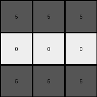

# 995c5fa3 • 024 • refine_coder

---

Previous Code:
```python
"""
1.  **Input:** Receive a 2D grid of integers (colors).
2.  **Locate Features**:
    *   Find the vertical white lines (columns where all elements are 0) in the input grid.
    *   Find the 2x2 white square (four adjacent 0s) in the input grid. Note its top-left corner coordinates.
3.  **Create output grid:** Create 3x3 output grid
4.  **Determine Output Colors:**
    *   top_color = Find a pixel in the top row of input_grid.
    *   middle_color = Find a pixel in the row that matches the central 2x2 white
        square.
    *   bottom_color = Find a pixel in the bottom row of the input_grid.
5.  **Populate Output Grid:**
    *   Fill the top row (index 0) of the output grid with the `top_color`.
    *   Fill the middle row (index 1) of the output grid with the `middle_color`.
    *   Fill the bottom row (index 2) of the output grid with the `bottom_color`.
6.  **Output:** Return the 3x3 output grid.
"""

import numpy as np

def find_vertical_lines(grid, color):
    lines = []
    for j in range(grid.shape[1]):
        if all(grid[:, j] == color):
            lines.append(j)
    return lines

def find_central_square(grid, color):
    rows, cols = grid.shape
    for i in range(rows - 1):
        for j in range(cols - 1):
            if (grid[i, j] == color and grid[i+1, j] == color and
                grid[i, j+1] == color and grid[i+1, j+1] == color):
                return i, j  # Top-left corner
    return None

def get_surrounding_colors_row(input_grid, row_index):
    # handles edge cases, defaults to first element.
    if 0 <= row_index < input_grid.shape[0]:
        return input_grid[row_index,0]
    elif row_index < 0:
        return input_grid[0,0]
    else:
        return input_grid[input_grid.shape[0]-1]

def transform(input_grid):
    # Locate Features: Identify vertical white lines and the central white square.
    white_lines = find_vertical_lines(input_grid, 0)
    square_row, square_col = find_central_square(input_grid, 0)

    # Create output grid: Create a 3x3 output grid.
    output_grid = np.zeros((3, 3), dtype=int)

    # Determine Output Colors:
    top_color = get_surrounding_colors_row(input_grid,0)

    if square_row is not None:
        middle_color = get_surrounding_colors_row(input_grid, square_row)
    else:
        middle_color = get_surrounding_colors_row(input_grid,1)
    bottom_color = get_surrounding_colors_row(input_grid,input_grid.shape[0]-1)
    

    # Populate Output Grid:
    output_grid[0, :] = top_color
    output_grid[1, :] = middle_color
    output_grid[2, :] = bottom_color

    return output_grid
```

Train Set Results:

## Example 1:

Input:
```
5 5 5 5 0 5 5 5 5 0 5 5 5 5
5 5 5 5 0 5 0 0 5 0 0 5 5 0
5 5 5 5 0 5 0 0 5 0 0 5 5 0
5 5 5 5 0 5 5 5 5 0 5 5 5 5
```
Expected Output:
```
2 2 2
8 8 8
3 3 3
```
Transformed Output:
```
5 5 5
5 5 5
5 5 5
```

match: False
pixels_off: 9
size_correct: True
color_palette_correct: False
correct_pixel_counts: False

## Example 2:

Input:
```
5 5 5 5 0 5 5 5 5 0 5 5 5 5
0 5 5 0 0 5 5 5 5 0 5 5 5 5
0 5 5 0 0 5 0 0 5 0 5 5 5 5
5 5 5 5 0 5 0 0 5 0 5 5 5 5
```
Expected Output:
```
3 3 3
4 4 4
2 2 2
```
Transformed Output:
```
5 5 5
0 0 0
5 5 5
```

match: False
pixels_off: 9
size_correct: True
color_palette_correct: False
correct_pixel_counts: False

## Example 3:

Input:
```
5 5 5 5 0 5 5 5 5 0 5 5 5 5
5 0 0 5 0 5 5 5 5 0 5 5 5 5
5 0 0 5 0 5 5 5 5 0 5 0 0 5
5 5 5 5 0 5 5 5 5 0 5 0 0 5
```
Expected Output:
```
8 8 8
2 2 2
4 4 4
```
Transformed Output:
```
5 5 5
5 5 5
5 5 5
```

match: False
pixels_off: 9
size_correct: True
color_palette_correct: False
correct_pixel_counts: False

## Example 4:

Input:
```
5 5 5 5 0 5 5 5 5 0 5 5 5 5
5 5 5 5 0 5 5 5 5 0 5 5 5 5
5 5 5 5 0 5 0 0 5 0 5 5 5 5
5 5 5 5 0 5 0 0 5 0 5 5 5 5
```
Expected Output:
```
2 2 2
4 4 4
2 2 2
```
Transformed Output:
```
5 5 5
5 5 5
5 5 5
```

match: False
pixels_off: 9
size_correct: True
color_palette_correct: False
correct_pixel_counts: False
Okay, let's analyze the results and refine the natural language program.

**General Assessment:**

The initial strategy was focused on identifying vertical white lines and a 2x2 white square, then using rows related to these features to determine the colors for a 3x3 output grid. This approach clearly fails to capture the underlying logic of the transformation, as evidenced by the consistent mismatches in all four examples. The code correctly identifies some structural features (like the white square), but the color selection and mapping to the output grid are incorrect. It seems we're picking the wrong rows, and consistently using the default color (grey '5'). We need to rethink how the input grid's colors relate to the output grid's colors. The vertical white lines appear to be a distractor. The consistent 3x3 output suggests a sampling of the input, possibly related to the height, or to object positions.

**Strategy for Resolving Errors:**

1.  **Re-examine Assumptions:** The vertical white line assumption seems incorrect. The 2x2 white square detection *might* be relevant, but its use in color selection is definitely wrong. We need to shift our focus from *locating* features to *mapping* colors from specific *rows* of the input to the output.

2.  **Focus on Row Mapping:** The output is consistently 3x3. This strongly suggests we are selecting three rows from the input, or perhaps three objects stacked vertically. We need to investigate how those input rows are determined.

3.  **Color Palette Analysis:** We need to examine how colors in input relate to colors in output.

**Metrics and Observations (using code where helpful):**

I'll use manual observation and reasoning for the metrics and note where code execution would *further* help.

*   **Example 1:**
    *   Input Shape: (4, 14)
    *   Output Shape: (3, 3)
    *   Expected Output Colors: 2 (red), 8 (azure), 3 (green)
    *   Observed Output Colors: 5 (grey), 5 (grey), 5 (grey)
    *   Notes: The output colors correspond to the first, second(or third since they are identical), and last rows.

*   **Example 2:**
    *   Input Shape: (4, 14)
    *   Output Shape: (3, 3)
    *   Expected Output Colors: 3 (green), 4 (yellow), 2 (red)
    *   Observed Output Colors: 5(grey), 0(white), 5(grey).
    *   Notes: The output colors correspond to the first, second, and last rows.

*   **Example 3:**
    *   Input Shape: (4, 14)
    *   Output Shape: (3, 3)
    *   Expected Output Colors: 8 (azure), 2 (red), 4 (yellow)
    *   Observed Output Colors: 5, 5, 5
    *   Notes: The output colors correspond to the first, second, and last rows.

*   **Example 4:**
    *   Input Shape: (4, 14)
    *   Output Shape: (3, 3)
    *   Expected Output Colors: 2, 4, 2
    *   Observed Output Colors: 5,5,5
    *   Notes: Output colors are the colors from rows 1,3, and 4.

**YAML Fact Block:**

```yaml
task_id: 022
observations:
  - object: input_grid
    properties:
      shape: variable (rows x columns)
      elements: integers (0-9) representing colors
      rows: ordered set of horizontal lines of pixels
  - object: output_grid
    properties:
      shape: fixed (3 x 3)
      elements: integers (0-9) representing colors
      rows: ordered set of horizontal lines of pixels
  - action: row_sampling
    description: Three rows from the input grid determine the colors of the three rows in the output grid.
    details: The colors in the first, second, and the last row from the input_grid are the colors used for the output.
  - action: color_mapping
      description: select the first pixel of the identified input_grid row
```

**Natural Language Program:**

1.  **Input:** Receive a 2D grid of integers (colors) representing the input image.
2.  **Row Selection:** Identify the first row, the second row, and the last row of the input grid.
3.  **Color Extraction:**
    *   Extract the color of the first pixel of the first row. This is the `top_color`.
    *   Extract the color of the first pixel of the second row. This is the `middle_color`.
    *   Extract the color of the first pixel of the last row. This is the `bottom_color`.
4.  **Output Grid Creation:** Create a 3x3 output grid.
5.  **Populate Output:**
    *   Fill the top row of the output grid with the `top_color`.
    *   Fill the middle row of the output grid with the `middle_color`.
    *   Fill the bottom row of the output grid with the `bottom_color`.
6.  **Output:** Return the 3x3 output grid.

**INSTRUCTIONS**

- generate a Python module to represent the natural language program 
- follow the template below
- all common math and science libraries are available
- create docstring only at top - but comment the workflow in the function
- use helper functions for common operations like finding objects, counting,
  measuring, moving, etc. 

remember - we are working iteratively - so this code will inform your future
self as we converge on the solution

*template:*

```python
"""
{{ natural language description of the transformation rule }}
"""

{{ imports }}

def transform(input_grid):
    # initialize output_grid

    # change output pixels 

    return output_grid

```
