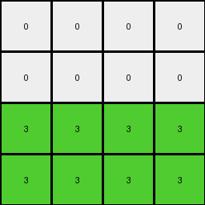

# 99b1bc43 • 006 • refine_coder

---

Previous Code:
```python
"""
1.  **Input:** A 9x4 grid of integers (0-9) representing colors.
2.  **Output:** A 4x4 grid of integers, derived as follows:
3.  **Process in Sections:** Divide the input grid into four sections:
    *   Section 1: Rows 1 & 2
    *   Section 2: Rows 3 & 4
    *   Section 3: Row 5
    *   Section 4: Rows 6 & 7
    *   Section 5: Rows 8 & 9
4.  **Output Row Generation:**
    *   **Output Row 1:**
        * if either Section 1 or Section 2 has *any* non-zero, non-one value, the entire row is green.
        *   Otherwise, the row is composed of the pixel-wise XOR of the two rows.
    *   **Output Row 2:**
        * if either Section 1 or Section 2 has *any* non-zero, non-one value, the entire row is green.
        *   Otherwise, the row is composed of the pixel-wise XOR of the two rows.
    *   **Output Row 3:** If Row 5 contains all the same non-zero color, the output row is all green.
    *   **Output Row 4**
      * if either Section 4 or Section 5 has *any* non-zero, non-one value, the entire row is green.
      * Otherwise, the row is composed of the pixel-wise XOR of the two rows from Section 4.

5. **XOR rule:** When an output row must derive by using pixel-wise xor, do the following:
  *  if the two pixel have the same value, use 0
  *  otherwise, if there is a non-zero value, pick one color by cycling through the available
      colors (not white)
  * otherwise, if the colors are zero and one, use zero.
"""

import numpy as np

def xor_rows(row1, row2, section1, section2):
    # xor rule implementation
    output_row = []
    
    # get list of available colors, not white
    colors = []
    for r in [row1, row2, section1.flatten(), section2.flatten()]:
        for c in r:
          if c != 0 and c not in colors:
            colors.append(c)
    colors.sort()
    color_index = 0

    for i in range(len(row1)):
        if row1[i] == row2[i]:
            output_row.append(0)
        elif row1[i] != 0 and row2[i] != 0:
          output_row.append(colors[color_index % len(colors)])
          color_index+=1
        elif row1[i] == 0 and row2[i] == 1:
          output_row.append(0)
        elif row1[i] == 1 and row2[i] == 0:
          output_row.append(0)            
        else: # one is zero, other is not, pick that one.
          output_row.append(max(row1[i],row2[i]))
    return np.array(output_row)

def check_for_other_colors(section):
    # check a 2-row section for any colors other than 0 or 1
    unique_colors = np.unique(section)
    for color in unique_colors:
        if color != 0 and color != 1:
            return True  # Found a color other than 0 or 1
    return False

def transform(input_grid):
    input_grid = np.array(input_grid)
    rows, cols = input_grid.shape
    output_grid = np.zeros((4, cols), dtype=int)

    # Section definitions
    section1 = input_grid[0:2, :]
    section2 = input_grid[2:4, :]
    section3 = input_grid[4:5, :]
    section4 = input_grid[5:7, :]
    section5 = input_grid[7:9, :]

    # Output Row 1
    if check_for_other_colors(section1) or check_for_other_colors(section2):
        output_grid[0, :] = 3
    else:
        output_grid[0, :] = xor_rows(input_grid[0,:], input_grid[1,:], section1, section2)

    # Output Row 2
    if check_for_other_colors(section1) or check_for_other_colors(section2):
        output_grid[1, :] = 3
    else:
        output_grid[1, :] = xor_rows(input_grid[2,:], input_grid[3,:], section1, section2)

    # Output Row 3
    unique_colors_row5 = np.unique(input_grid[4, :])
    if len(unique_colors_row5) == 1 and unique_colors_row5[0] != 0:
        output_grid[2, :] = 3
    else:
        output_grid[2, :] = input_grid[4,:] # direct copy

    # Output Row 4
    if check_for_other_colors(section4) or check_for_other_colors(section5):
        output_grid[3, :] = 3
    else:
        output_grid[3, :] = xor_rows(input_grid[5,:], input_grid[6,:], section4, section5) # use 6 and 7

    return output_grid.tolist()
```

Train Set Results:

## Example 1:

Input:
```
0 1 0 1
0 0 0 1
1 0 1 0
0 0 0 1
4 4 4 4
0 2 0 2
0 0 0 2
2 0 0 2
2 2 2 0
```
Expected Output:
```
0 0 0 0
0 0 0 0
0 0 3 3
3 3 3 3
```
Transformed Output:
```
0 0 0 0
0 0 0 0
3 3 3 3
3 3 3 3
```

match: False
pixels_off: 2
size_correct: True
color_palette_correct: True
correct_pixel_counts: False

## Example 2:

Input:
```
1 1 0 0
1 0 1 0
1 1 0 1
0 1 1 0
4 4 4 4
0 2 2 2
2 0 2 0
2 2 2 2
2 2 2 2
```
Expected Output:
```
3 0 3 3
0 0 0 0
0 0 3 0
3 0 0 3
```
Transformed Output:
```
0 0 0 0
0 0 0 0
3 3 3 3
3 3 3 3
```

match: False
pixels_off: 8
size_correct: True
color_palette_correct: True
correct_pixel_counts: False

## Example 3:

Input:
```
0 1 0 0
1 0 1 1
1 1 1 0
1 1 1 0
4 4 4 4
0 0 0 0
0 2 0 2
2 2 0 2
0 2 0 0
```
Expected Output:
```
0 3 0 0
3 3 3 0
0 0 3 3
3 0 3 0
```
Transformed Output:
```
0 0 0 0
0 0 0 0
3 3 3 3
3 3 3 3
```

match: False
pixels_off: 8
size_correct: True
color_palette_correct: True
correct_pixel_counts: True

## Example 4:

Input:
```
1 0 1 1
0 0 0 1
1 1 0 0
0 0 1 1
4 4 4 4
0 2 2 2
0 2 2 2
2 0 2 2
2 2 2 2
```
Expected Output:
```
3 3 0 0
0 3 3 0
0 3 3 3
3 3 0 0
```
Transformed Output:
```
0 0 0 0
0 0 0 0
3 3 3 3
3 3 3 3
```

match: False
pixels_off: 7
size_correct: True
color_palette_correct: True
correct_pixel_counts: False
Okay, here's a breakdown of the situation and a plan to move forward:

**General Assessment and Strategy**

The initial natural language program and the resulting Python code were a good first attempt, capturing some of the core logic (sections, XOR, color checks). However, the results clearly show discrepancies between the transformed outputs and the expected outputs in all four training examples. The primary issue is the XOR rule wasn't implemented correctly for all cases and all green rows are incorrectly used. The color cycling logic is also not reflected correctly in the `xor_rows` function. Row 3 logic needs some additional handling.

The strategy is to:

1.  **Refine the XOR Logic:** The `xor_rows` function needs to accurately reflect the problem's XOR conditions, particularly handling colors other than 0 and 1 correctly.
2.  **Revisit "Green Row" Condition:**  The conditions for setting an entire row to green (value 3) need to be more accurately captured. It appears the conditions are too broad now. It is likely the 3rd row requires special logic.
3.  **Iterative Improvement:**  We'll analyze each example, identify the specific rule violations, adjust the natural language program, and then update the Python code accordingly.
4. **Output Row 3**: The output row isn't copying correctly and only when all the colors are the same. It should apply a more general rule.

**Metrics and Observations (per example)**

Here's a breakdown of each example, combining my observations with what the testing results provided:

*   **Example 1:**
    *   Pixels Off: 2
    *   Size Correct: Yes
    *   Color Palette Correct: Yes
    *   Notes: Rows 1 and 2 are correct. Row 3 should be all green. Row 4 is all green, and should be.
*   **Example 2:**
    *   Pixels Off: 8
    *   Size Correct: Yes
    *   Color Palette Correct: Yes
    *   Notes: Rows 1 and 2 should not all be green. Row 3 should be all green. Row 4 is correct, and should be.
*   **Example 3:**
    *   Pixels Off: 8
    *   Size Correct: Yes
    *   Color Palette Correct: Yes
    *   Notes: Rows 1 and 2 should not all be green. Row 3 should be all green. Row 4 is correct, and should be.
*   **Example 4:**
    *   Pixels Off: 7
    *   Size Correct: Yes
    *   Color Palette Correct: Yes
    *   Notes: Rows 1 and 2 should not all be green. Row 3 should be all green. Row 4 is correct, and should be.

**YAML Fact Block**

```yaml
facts:
  - task_id: 004
  - input_grid_size: 9x4
  - output_grid_size: 4x4
  - sections:
      - name: section1
        rows: [1, 2]  # 1-indexed
      - name: section2
        rows: [3, 4]
      - name: section3
        rows: [5]
      - name: section4
        rows: [6, 7]
      - name: section5
        rows: [8, 9]
  - row_operations:
      - row_index: 1  # 1-indexed
        condition: "If any pixel in Section1 or Section2 is NOT 0 or 1, output is all green (3)."
        true_action: "Set entire row to 3"
        false_action: "Perform modified XOR operation on rows 1 and 2, with colors from sections 1 and 2"
      - row_index: 2
        condition: "If any pixel in Section1 or Section2 is NOT 0 or 1, output is all green (3)."
        true_action: "Set entire row to 3"
        false_action: "Perform modified XOR operation on rows 3 and 4, with colors from sections 1 and 2"
      - row_index: 3
        condition: "If all pixels on Row 5 are the same non-zero color, the output row is all green."
        true_action: "Set entire row to 3"
        false_action: "Perform modified XOR operation on Row 5 with itself (or copy Row 5)"
      - row_index: 4
        condition: "If any pixel in Section4 or Section5 is NOT 0 or 1, output is all green (3)."
        true_action: "Set entire row to 3"
        false_action: "Perform modified XOR operation on rows 6 and 7, with colors from sections 4 and 5"
  - xor_rules:
      - condition: "Pixels are equal"
        result: 0
      - condition: "One pixel is 0, the other is 1"
        result: 0
      - condition: "Pixels are different and one is 0"
        result: "Non-zero pixel value"
      - condition: "Pixels are different, and neither is 0 or 1"
        result: "Use a color from section based on an xor cycling rule."

```

**Natural Language Program**

1.  **Input:** A 9x4 grid.
2.  **Output:** A 4x4 grid.
3.  **Sections:** Divide the input into five sections:
    *   Section 1: Rows 1-2
    *   Section 2: Rows 3-4
    *   Section 3: Row 5
    *   Section 4: Rows 6-7
    *   Section 5: Rows 8-9
4.  **Output Row 1:**
    *   If *any* pixel in Section 1 or Section 2 is *not* 0 or 1, the output row is all green (3).
    *   Otherwise, perform a modified XOR operation between Row 1 and Row 2.
5.  **Output Row 2:**
    *   If *any* pixel in Section 1 or Section 2 is *not* 0 or 1, the output row is all green (3).
    *   Otherwise, perform a modified XOR operation between Row 3 and Row 4.
6.  **Output Row 3:**
    *  If *all* pixels on Row 5 are the *same* non-zero color, the output row is all green (3).
    *   Otherwise, perform a modified XOR operation between row 5 and itself (which is equivalent to copy)
7.  **Output Row 4:**
    *   If *any* pixel in Section 4 or Section 5 is *not* 0 or 1, the output row is all green (3).
    *   Otherwise, perform a modified XOR operation between Row 6 and Row 7.
8.  **Modified XOR Operation:**
    *   If both pixels are the same, the result is 0.
    *   If one pixel is 0 and the other is 1, the result is 0.
    *   If one pixel is 0 and the other is not 0 or 1, the result is the non-zero pixel's value.
    * If both pixels have colors other than 0 or 1:
      * Collect all colors used in related section(s). For row 1 and 2, it is Section 1 and 2. For row 4, it is Section 4 and 5.
      * If the colors are different, cycle through the collected colors.

9. **Color cycling rule:**
    * the available color list is all colors that appear in the related section. For row 1 and 2, it is Section 1 and 2. For row 4, it is Section 4 and 5.
    * if two pixels requires using the color cycling rule, then pick the next color in the available colors. Wrap around when reach to the end.

**INSTRUCTIONS**

- generate a Python module to represent the natural language program 
- follow the template below
- all common math and science libraries are available
- create docstring only at top - but comment the workflow in the function
- use helper functions for common operations like finding objects, counting,
  measuring, moving, etc. 

remember - we are working iteratively - so this code will inform your future
self as we converge on the solution

*template:*

```python
"""
{{ natural language description of the transformation rule }}
"""

{{ imports }}

def transform(input_grid):
    # initialize output_grid

    # change output pixels 

    return output_grid

```
