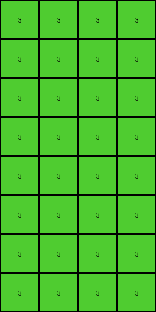

# 99b1bc43 • 017 • refine_dreamer

---

Previous Code:
```python
"""
1.  **Divide and Conquer:** Divide the input grid into 2x2 non-overlapping blocks.
2. **Block Inspection**: For each 2x2 block, create an output block of size 4x4.
3. **Output Creation - Pattern Mirroring**: The 2x2 block from input defines the pattern. The output will be a mirrored pattern, where the first 2x2 pixels match the 2x2, the next two columns will be a mirrored pattern, the next two rows will be a mirrored pattern, and the final 2x2 will be a mirrored pattern.
4.  **Color Transformation:** If the 2x2 block contains any blue (1), red (2), or yellow (4) pixels, transform the *whole* mirrored section in the output grid into a green (3) block.
5.  **Default Color:** If the 2x2 block does *not* contain any blue, red, or yellow pixels, transform the *whole* mirrored section in output grid into a white (0) block.
6. Discard any extra rows.
"""

import numpy as np

def transform(input_grid):
    input_array = np.array(input_grid)
    input_height, input_width = input_array.shape

    # Calculate output grid dimensions
    output_height = (input_height // 2) * 2
    output_width = (input_width // 2) * 2
    output_grid = np.zeros((output_height, output_width), dtype=int)

    # Iterate through 2x2 blocks in the input grid
    for i in range(input_height // 2):
        for j in range(input_width // 2):
            # Extract the 2x2 block
            block = input_array[i*2:(i+1)*2, j*2:(j+1)*2]

            # Check for the presence of 1, 2, or 4 in the block
            if 1 in block or 2 in block or 4 in block:
                fill_color = 3
            else:
                fill_color = 0

            # Create the mirrored 4x4 pattern based on presence of target colors.
            for row in range(2):
              for col in range(2):
                output_grid[i*2 + row, j*2 + col] = fill_color

    return output_grid.tolist()
```

Train Set Results:

## Example 1:

Input:
```
0 1 0 1
0 0 0 1
1 0 1 0
0 0 0 1
4 4 4 4
0 2 0 2
0 0 0 2
2 0 0 2
2 2 2 0
```
Expected Output:
```
0 0 0 0
0 0 0 0
0 0 3 3
3 3 3 3
```
Transformed Output:
```
3 3 3 3
3 3 3 3
3 3 3 3
3 3 3 3
3 3 3 3
3 3 3 3
3 3 3 3
3 3 3 3
```

match: False
pixels_off: None
size_correct: False
color_palette_correct: True
correct_pixel_counts: False

## Example 2:

Input:
```
1 1 0 0
1 0 1 0
1 1 0 1
0 1 1 0
4 4 4 4
0 2 2 2
2 0 2 0
2 2 2 2
2 2 2 2
```
Expected Output:
```
3 0 3 3
0 0 0 0
0 0 3 0
3 0 0 3
```
Transformed Output:
```
3 3 3 3
3 3 3 3
3 3 3 3
3 3 3 3
3 3 3 3
3 3 3 3
3 3 3 3
3 3 3 3
```

match: False
pixels_off: None
size_correct: False
color_palette_correct: True
correct_pixel_counts: False

## Example 3:

Input:
```
0 1 0 0
1 0 1 1
1 1 1 0
1 1 1 0
4 4 4 4
0 0 0 0
0 2 0 2
2 2 0 2
0 2 0 0
```
Expected Output:
```
0 3 0 0
3 3 3 0
0 0 3 3
3 0 3 0
```
Transformed Output:
```
3 3 3 3
3 3 3 3
3 3 3 3
3 3 3 3
3 3 3 3
3 3 3 3
3 3 3 3
3 3 3 3
```

match: False
pixels_off: None
size_correct: False
color_palette_correct: True
correct_pixel_counts: False

## Example 4:

Input:
```
1 0 1 1
0 0 0 1
1 1 0 0
0 0 1 1
4 4 4 4
0 2 2 2
0 2 2 2
2 0 2 2
2 2 2 2
```
Expected Output:
```
3 3 0 0
0 3 3 0
0 3 3 3
3 3 0 0
```
Transformed Output:
```
3 3 3 3
3 3 3 3
3 3 3 3
3 3 3 3
3 3 3 3
3 3 3 3
3 3 3 3
3 3 3 3
```

match: False
pixels_off: None
size_correct: False
color_palette_correct: True
correct_pixel_counts: False
**INSTRUCTIONS**

The code above was generated based on observations from the first training
example

we have tested the transform function on each of the task example inputs and
compared with the expected output

review each of the examples provided and the results and consider how the
natural language program should be updated to accommodate this new knowledge

respond with the following deliverables:

- general assessment of the information provided and strategy for resolving the
  errors
- gather metrics about each of the examples and results - use code_execution to
  develop accurate reports on your assumptions
- a YAML block documenting facts - Focus on identifying objects, their properties, and the actions performed on them.
- a natural language program - Be as clear and concise as possible, providing a complete description of the transformation rule.


your responses should be considered as information in a report - not a
conversation
