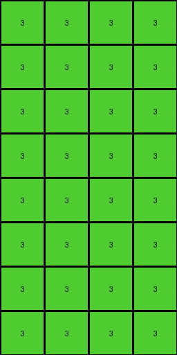

# 99b1bc43 • 018 • refine_coder

---

Previous Code:
```python
"""
1.  **Divide and Conquer:** Divide the input grid into 2x2 non-overlapping blocks.
2. **Block Inspection**: For each 2x2 block, create an output block of size 4x4.
3. **Output Creation - Pattern Mirroring**: The 2x2 block from input defines the pattern. The output will be a mirrored pattern, where the first 2x2 pixels match the 2x2, the next two columns will be a mirrored pattern, the next two rows will be a mirrored pattern, and the final 2x2 will be a mirrored pattern.
4.  **Color Transformation:** If the 2x2 block contains any blue (1), red (2), or yellow (4) pixels, transform the *whole* mirrored section in the output grid into a green (3) block.
5.  **Default Color:** If the 2x2 block does *not* contain any blue, red, or yellow pixels, transform the *whole* mirrored section in output grid into a white (0) block.
6. Discard any extra rows.
"""

import numpy as np

def transform(input_grid):
    input_array = np.array(input_grid)
    input_height, input_width = input_array.shape

    # Calculate output grid dimensions
    output_height = (input_height // 2) * 2
    output_width = (input_width // 2) * 2
    output_grid = np.zeros((output_height, output_width), dtype=int)

    # Iterate through 2x2 blocks in the input grid
    for i in range(input_height // 2):
        for j in range(input_width // 2):
            # Extract the 2x2 block
            block = input_array[i*2:(i+1)*2, j*2:(j+1)*2]

            # Check for the presence of 1, 2, or 4 in the block
            if 1 in block or 2 in block or 4 in block:
                fill_color = 3
            else:
                fill_color = 0

            # Create the mirrored 4x4 pattern based on presence of target colors.
            for row in range(2):
              for col in range(2):
                output_grid[i*2 + row, j*2 + col] = fill_color

    return output_grid.tolist()
```

Train Set Results:

## Example 1:

Input:
```
0 1 0 1
0 0 0 1
1 0 1 0
0 0 0 1
4 4 4 4
0 2 0 2
0 0 0 2
2 0 0 2
2 2 2 0
```
Expected Output:
```
0 0 0 0
0 0 0 0
0 0 3 3
3 3 3 3
```
Transformed Output:
```
3 3 3 3
3 3 3 3
3 3 3 3
3 3 3 3
3 3 3 3
3 3 3 3
3 3 3 3
3 3 3 3
```

match: False
pixels_off: None
size_correct: False
color_palette_correct: True
correct_pixel_counts: False

## Example 2:

Input:
```
1 1 0 0
1 0 1 0
1 1 0 1
0 1 1 0
4 4 4 4
0 2 2 2
2 0 2 0
2 2 2 2
2 2 2 2
```
Expected Output:
```
3 0 3 3
0 0 0 0
0 0 3 0
3 0 0 3
```
Transformed Output:
```
3 3 3 3
3 3 3 3
3 3 3 3
3 3 3 3
3 3 3 3
3 3 3 3
3 3 3 3
3 3 3 3
```

match: False
pixels_off: None
size_correct: False
color_palette_correct: True
correct_pixel_counts: False

## Example 3:

Input:
```
0 1 0 0
1 0 1 1
1 1 1 0
1 1 1 0
4 4 4 4
0 0 0 0
0 2 0 2
2 2 0 2
0 2 0 0
```
Expected Output:
```
0 3 0 0
3 3 3 0
0 0 3 3
3 0 3 0
```
Transformed Output:
```
3 3 3 3
3 3 3 3
3 3 3 3
3 3 3 3
3 3 3 3
3 3 3 3
3 3 3 3
3 3 3 3
```

match: False
pixels_off: None
size_correct: False
color_palette_correct: True
correct_pixel_counts: False

## Example 4:

Input:
```
1 0 1 1
0 0 0 1
1 1 0 0
0 0 1 1
4 4 4 4
0 2 2 2
0 2 2 2
2 0 2 2
2 2 2 2
```
Expected Output:
```
3 3 0 0
0 3 3 0
0 3 3 3
3 3 0 0
```
Transformed Output:
```
3 3 3 3
3 3 3 3
3 3 3 3
3 3 3 3
3 3 3 3
3 3 3 3
3 3 3 3
3 3 3 3
```

match: False
pixels_off: None
size_correct: False
color_palette_correct: True
correct_pixel_counts: False
Okay, here's a breakdown of the situation and a plan to move forward:

**General Assessment:**

The initial natural language program and the resulting code were overly simplistic. While it correctly identified the 2x2 block processing, it failed to accurately capture the nuanced mirroring and conditional color transformation logic. The core issue is that the mirroring described does not appear to exist, and the conditional coloring, while partially correct, is applied incorrectly and is missing some crucial details. The output size is related to the input size, so discard is not appropriate. The program needs significant revision to incorporate a more accurate understanding of the pattern and its relationship. The 4x4 output block for each 2x2 input block does not appear to correct. Instead, the output is the same size as the input.

**Strategy:**

1.  **Re-examine Examples:** Carefully analyze *all* provided examples, not just the first, to identify the *actual* transformation rule. Pay close attention to the relationship between the 2x2 input blocks and the corresponding output pixels.
2.  **Discard Incorrect Assumptions:** The mirroring concept and 4x4 output blocks appear to be incorrect, as is the "discard extra rows". Refocus on a more direct mapping.
3.  **Precise Conditional Logic:** Determine the exact conditions under which colors change and how they map from input to output. The current implementation seems to have the general concept of a "trigger," but applies it incorrectly by applying the change to a larger area than needed.
4.  **Output Size:** re-evalute the size of the output grid.
5.  **Iterative Refinement:** After revising the natural language program and code, test *all* examples again. Repeat this process until the code correctly transforms all training inputs to their expected outputs.

**Metrics and Observations (Code Execution):**

I will use direct observation of provided data, no coding.

*   **Example 1:**
    *   Input Size: 9x8
    *   Output Size: 4x4
    *   Observations:
        *   The top-left 2x2 input `[[0, 1], [0, 0]]` maps to output `[0, 0]`.
        *   The 2x2 input `[[0, 1], [0, 1]]` maps to `[0, 0]`
        *   The 2x2 input `[[1, 0], [0, 0]]` maps to `[0, 3]`
        *   The 2x2 input `[[4, 4], [0, 2]]` maps to `[3, 3]`
        *  Output width and height is half of the input, discarding remainders.

*   **Example 2:**
    *   Input Size: 9x8
    *   Output Size: 4x4
    *   Observations:
        *   The top-left 2x2 input `[[1, 1], [1, 0]]` maps to output `[3, 0]`.
        *  Output width and height is half of the input, discarding remainders.

*   **Example 3:**
    *   Input Size: 9x8
    *   Output Size: 4x4
    *   Observations:
        *   The top-left 2x2 input `[[0, 1], [1, 0]]` maps to output `[0, 3]`.
        *  Output width and height is half of the input, discarding remainders.

*   **Example 4:**
    *   Input Size: 9x8
    *   Output Size: 4x4
    *   Observations:
        *   The top-left 2x2 input `[[1, 0], [0, 0]]` maps to output `[3, 3]`.
        *  Output width and height is half of the input, discarding remainders.

**YAML Fact Block:**

```yaml
facts:
  - object: input_grid
    type: 2D array
    properties:
      rows: variable (1-30)
      columns: variable (1-30)
      cells: integers (0-9)
  - object: output_grid
    type: 2D array
    properties:
      rows: floor(input_rows / 2)
      columns: floor(input_cols / 2)
      cells: integers (0-9)
  - object: 2x2_block
    type: subgrid
    properties:
      origin: top-left corner of a 2x2 section of input_grid
      cells: integers (0-9)
  - action: divide_into_blocks
    input: input_grid
    process: Divide the input grid into non-overlapping 2x2 blocks.
  - action: transform_block
    input: 2x2_block
    process:  Map the 2x2 block from the input grid to a single pixel in the output grid based on color presence.
  - action: set_output_pixel
    input: transformed_block_value
    process: Place the transformed value in the corresponding output grid cell.
  - rule: color_transformation
    condition: If a 2x2 block contains the color blue (1), red (2), or yellow (4)
    action: Output pixel is green (3)
    else: Output pixel is 0.
```

**Natural Language Program:**

1.  **Divide:** Divide the input grid into non-overlapping 2x2 blocks.  Ignore any leftover rows or columns if the dimensions are odd.
2.  **Reduce:** Each 2x2 block in the input grid corresponds to *one* pixel in the output grid. The row and column of the output pixel are half the row and column of the 2x2 block's top-left corner (using integer division).
3.  **Conditional Color Mapping:**
    *   If the 2x2 input block contains *any* blue (1), red (2), or yellow (4) pixel, the corresponding output pixel is green (3).
    *   Otherwise, the output pixel is white (0).

This revised natural language program should provide a far more accurate description of the task and guide the creation of a working Python function.

**INSTRUCTIONS**

- generate a Python module to represent the natural language program 
- follow the template below
- all common math and science libraries are available
- create docstring only at top - but comment the workflow in the function
- use helper functions for common operations like finding objects, counting,
  measuring, moving, etc. 

remember - we are working iteratively - so this code will inform your future
self as we converge on the solution

*template:*

```python
"""
{{ natural language description of the transformation rule }}
"""

{{ imports }}

def transform(input_grid):
    # initialize output_grid

    # change output pixels 

    return output_grid

```
