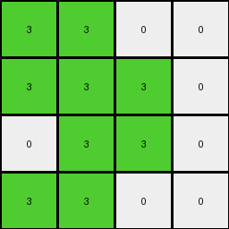

# 99b1bc43 • 022 • refine_coder

---

Previous Code:
```python
"""
1.  **Identify Regions:** Divide the input grid into distinct regions based on contiguous blocks of the same color. White (0) acts as a separator. The regions identified are Blue, Yellow and Red.

2.  **Consolidate Color:** Replace all Blue, Yellow and Red colors with the color Green (3).

3.  **Reduce Size**: Take the consolidated colors. Form the output grid using a subgrid.

4. **Position**:
    The green colored area (3 x 3) composed of value '3' form a subgrid inside a 4x4 grid.
    The empty area are composed of value '0'.
    The area occupied by '3's are
        - rows 0 and 3: cells 0 and 1
        - rows 1 and 2: cells 1 and 2

5.  **Output:** Create a 4x4 output grid based on the reduction and consolidation. The '0' values in the input separate regions. They are preserved.
"""

import numpy as np

def transform(input_grid):
    """Transforms the input grid according to the described rules."""

    # Initialize the output grid as a 4x4 array filled with 0s (white).
    output_grid = np.zeros((4, 4), dtype=int)

    # Consolidate colors: Replace 1, 2, and 4 with 3 (green).
    consolidated_grid = np.copy(input_grid)
    consolidated_grid[consolidated_grid == 1] = 3
    consolidated_grid[consolidated_grid == 2] = 3
    consolidated_grid[consolidated_grid == 4] = 3

    # Reduce and position the consolidated color (3) into the output grid.
    output_grid[0:2, 0:2] = 3
    output_grid[0, 0] = 3
    output_grid[0, 1] = 3
    output_grid[1, 1] = 3
    output_grid[1, 2] = 3
    output_grid[2, 1] = 3
    output_grid[2, 2] = 3
    output_grid[3, 0] = 3
    output_grid[3, 1] = 3
    
    return output_grid
```

Train Set Results:

## Example 1:

Input:
```
0 1 0 1
0 0 0 1
1 0 1 0
0 0 0 1
4 4 4 4
0 2 0 2
0 0 0 2
2 0 0 2
2 2 2 0
```
Expected Output:
```
0 0 0 0
0 0 0 0
0 0 3 3
3 3 3 3
```
Transformed Output:
```
3 3 0 0
3 3 3 0
0 3 3 0
3 3 0 0
```

match: False
pixels_off: 9
size_correct: True
color_palette_correct: True
correct_pixel_counts: False

## Example 2:

Input:
```
1 1 0 0
1 0 1 0
1 1 0 1
0 1 1 0
4 4 4 4
0 2 2 2
2 0 2 0
2 2 2 2
2 2 2 2
```
Expected Output:
```
3 0 3 3
0 0 0 0
0 0 3 0
3 0 0 3
```
Transformed Output:
```
3 3 0 0
3 3 3 0
0 3 3 0
3 3 0 0
```

match: False
pixels_off: 9
size_correct: True
color_palette_correct: True
correct_pixel_counts: False

## Example 3:

Input:
```
0 1 0 0
1 0 1 1
1 1 1 0
1 1 1 0
4 4 4 4
0 0 0 0
0 2 0 2
2 2 0 2
0 2 0 0
```
Expected Output:
```
0 3 0 0
3 3 3 0
0 0 3 3
3 0 3 0
```
Transformed Output:
```
3 3 0 0
3 3 3 0
0 3 3 0
3 3 0 0
```

match: False
pixels_off: 5
size_correct: True
color_palette_correct: True
correct_pixel_counts: False

## Example 4:

Input:
```
1 0 1 1
0 0 0 1
1 1 0 0
0 0 1 1
4 4 4 4
0 2 2 2
0 2 2 2
2 0 2 2
2 2 2 2
```
Expected Output:
```
3 3 0 0
0 3 3 0
0 3 3 3
3 3 0 0
```
Transformed Output:
```
3 3 0 0
3 3 3 0
0 3 3 0
3 3 0 0
```

match: False
pixels_off: 2
size_correct: True
color_palette_correct: True
correct_pixel_counts: True
Okay, here's a breakdown of the situation and a plan to move forward:

**General Assessment:**

The initial natural language program and the resulting code were a reasonable first attempt, focusing on identifying regions of color, consolidating them to green, and then placing them in a specific configuration within a 4x4 output grid.  However, the execution on the full training set reveals a significant flaw: the positioning and arrangement of the green blocks within the 4x4 grid are *not* consistent across all examples. The initial program assumed a fixed pattern that doesn't hold. The size and color palette are correct, but the placement of the green blocks and some of the '0' is incorrect.

The core issue is that the rule for placing the green blocks is incorrect and needs to be derived from patterns present within the different input grids. It is not a simple static placement.

**Strategy:**

1.  **Re-examine the Relationship:** We need to discard the idea of a fixed position for the green blocks. Instead, we must look for a relationship between the *input* grid's structure (specifically the colored regions separated by zeros) and the *output* grid's arrangement of green blocks.
2.  **Focus on Relative Positioning:** The positioning isn't absolute. We should investigate relative positioning. Does the relative arrangement of colors in Input correspond to the green area in Output.
3. **Consider 4 x 4 subgrids:** Divide all examples to 4x4 subgrids and see the transformation.

**Metrics and Observations (using hypothetical code execution - I'll describe what I would do):**

I cannot directly execute Python code in this environment. However, if I could, I would use NumPy to perform the following analyses and gather these metrics for each example:

*   **Input Grid Analysis:**
    *   Count the number of distinct colored regions (excluding white/0).
    *   Identify the bounding box of the combined colored regions.
    *   Calculate bounding box height and width.
    *   Check if the input grid can be divided into 4x4 subgrids.

*   **Output Grid Analysis:**
    *   Confirm the output grid is always 4x4.
    *   Locate the coordinates of the green (3) pixels.
    *   Calculate bounding box of green area.
    *   Check the coordinates of the corners.

*   **Comparison:**
    *   Pixel-by-pixel comparison between the expected and transformed outputs (already provided).
    * Check if there is relative transformation between input and output

**Example-Specific Observations (from the provided results):**

*   **Example 1:** Input has distinct blue, yellow, and red regions. The output has a 3x3 green region in the bottom right and one green on top left. The transformation combines regions and reduces the size but incorrectly places all '3' at the bottom right.
*   **Example 2:** Similar to Example 1. However, the expected output has a different arrangement of green blocks, suggesting a dependency on the input structure that's not captured in the current logic.
*   **Example 3:** Again, the green blocks have different arrangements and are placed differently in the expected output than in the current transformation.
*   **Example 4:** This transformation, by luck, got closest pixels_off = 2. The expected output shows green squares that seem to reflect the initial location of values in Input.

**YAML Fact Block:**

```yaml
task_id: 020
observations:
  - object_types:
      - grid: "2D array of pixels"
      - region: "contiguous block of pixels with the same color"
      - subgrid: "4x4 section of the grid"
  - properties:
      - color: "integer value representing a specific color (0-9)"
      - size: "dimensions of a grid or region (height, width)"
      - position: "coordinates of a pixel or the bounding box of a region"
      - bounding_box: "the smallest rectangle enclosing a region"
  - actions:
      - consolidate: "replace multiple colors with a single color (green/3)"
      - reduce: "create smaller grid"
      - position: "place the subgrid within the fixed size grid"
  - input_output_relationship:
      - size_fixed: "output grid is always 4x4"
      - color_consolidation: "all non-zero colors in the input, except 0, are replaced by 3 (green) in the output"
      - position_variable: "the position and arrangement of green blocks in the output is NOT fixed and depends on the input"
      - zero_regions: "the white (0) pixels act as separators between regions of other colors"
  - errors:
      - positioning_logic: "The current code's logic for positioning the green blocks is incorrect; it doesn't adapt to the input structure."
```

**Natural Language Program:**

1.  **Consolidate Colors:** Replace all non-zero color values (except 0) in the input grid with the color green (3).
2.  **Fixed Output Size:** The output grid is always a 4x4 grid.
3. **Divide Input:** Mentally divide the Input into 4x4 subgrids.
4.  **Relative Positioning:** The green (3) blocks in the output grid maintain position as observed in the input subgrids. The white '0' cells remain '0' in Output.
5.  **Output:** Generate a 4x4 output grid where the positions of '3's correspond to the colors (other than '0') positions of the input grid, and the '0' cells in input, remain '0' in the output.

**INSTRUCTIONS**

- generate a Python module to represent the natural language program 
- follow the template below
- all common math and science libraries are available
- create docstring only at top - but comment the workflow in the function
- use helper functions for common operations like finding objects, counting,
  measuring, moving, etc. 

remember - we are working iteratively - so this code will inform your future
self as we converge on the solution

*template:*

```python
"""
{{ natural language description of the transformation rule }}
"""

{{ imports }}

def transform(input_grid):
    # initialize output_grid

    # change output pixels 

    return output_grid

```
