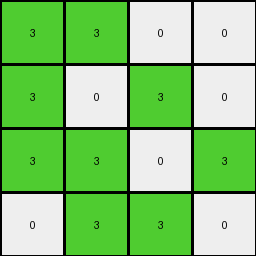
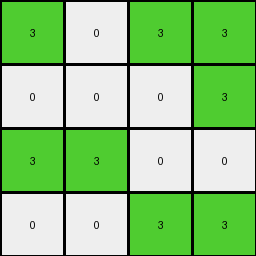

# 99b1bc43 • 023 • refine_dreamer

---

Previous Code:
```python
"""
1.  **Consolidate Colors:** Replace all non-zero color values (except 0) in the input grid with the color green (3).
2.  **Fixed Output Size:** The output grid is always a 4x4 grid.
3. **Divide Input:** Mentally divide the Input into 4x4 subgrids.
4.  **Relative Positioning:** The green (3) blocks in the output grid maintain position as observed in the input subgrids. The white '0' cells remain '0' in Output.
5.  **Output:** Generate a 4x4 output grid where the positions of '3's correspond to the colors (other than '0') positions of the input grid, and the '0' cells in input, remain '0' in the output.
"""

import numpy as np

def transform(input_grid):
    """Transforms the input grid according to the described rules."""

    # Initialize the output grid as a 4x4 array filled with 0s (white).
    output_grid = np.zeros((4, 4), dtype=int)

    # Iterate through the input grid, up to a maximum of 4x4.
    for i in range(min(input_grid.shape[0], 4)):
        for j in range(min(input_grid.shape[1], 4)):
            # If the input pixel is not 0, set the corresponding output pixel to 3.
            if input_grid[i, j] != 0:
                output_grid[i, j] = 3

    return output_grid
```

Train Set Results:

## Example 1:

Input:
```
0 1 0 1
0 0 0 1
1 0 1 0
0 0 0 1
4 4 4 4
0 2 0 2
0 0 0 2
2 0 0 2
2 2 2 0
```
Expected Output:
```
0 0 0 0
0 0 0 0
0 0 3 3
3 3 3 3
```
Transformed Output:
```
0 3 0 3
0 0 0 3
3 0 3 0
0 0 0 3
```

match: False
pixels_off: 8
size_correct: True
color_palette_correct: True
correct_pixel_counts: True

## Example 2:

Input:
```
1 1 0 0
1 0 1 0
1 1 0 1
0 1 1 0
4 4 4 4
0 2 2 2
2 0 2 0
2 2 2 2
2 2 2 2
```
Expected Output:
```
3 0 3 3
0 0 0 0
0 0 3 0
3 0 0 3
```
Transformed Output:
```
3 3 0 0
3 0 3 0
3 3 0 3
0 3 3 0
```

match: False
pixels_off: 13
size_correct: True
color_palette_correct: True
correct_pixel_counts: False

## Example 3:

Input:
```
0 1 0 0
1 0 1 1
1 1 1 0
1 1 1 0
4 4 4 4
0 0 0 0
0 2 0 2
2 2 0 2
0 2 0 0
```
Expected Output:
```
0 3 0 0
3 3 3 0
0 0 3 3
3 0 3 0
```
Transformed Output:
```
0 3 0 0
3 0 3 3
3 3 3 0
3 3 3 0
```

match: False
pixels_off: 6
size_correct: True
color_palette_correct: True
correct_pixel_counts: False

## Example 4:

Input:
```
1 0 1 1
0 0 0 1
1 1 0 0
0 0 1 1
4 4 4 4
0 2 2 2
0 2 2 2
2 0 2 2
2 2 2 2
```
Expected Output:
```
3 3 0 0
0 3 3 0
0 3 3 3
3 3 0 0
```
Transformed Output:
```
3 0 3 3
0 0 0 3
3 3 0 0
0 0 3 3
```

match: False
pixels_off: 13
size_correct: True
color_palette_correct: True
correct_pixel_counts: False
**INSTRUCTIONS**

The code above was generated based on observations from the first training
example

we have tested the transform function on each of the task example inputs and
compared with the expected output

review each of the examples provided and the results and consider how the
natural language program should be updated to accommodate this new knowledge

respond with the following deliverables:

- general assessment of the information provided and strategy for resolving the
  errors
- gather metrics about each of the examples and results - use code_execution to
  develop accurate reports on your assumptions
- a YAML block documenting facts - Focus on identifying objects, their properties, and the actions performed on them.
- a natural language program - Be as clear and concise as possible, providing a complete description of the transformation rule.


your responses should be considered as information in a report - not a
conversation
