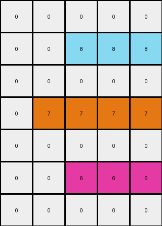

# 99fa7670 • 004 • refine_coder

---

Previous Code:
```python
"""
Identifies non-white pixels in the input grid and expands them to the right, filling their respective rows in the output grid.
"""

import numpy as np

def get_non_white_pixels(grid):
    """Finds coordinates of all non-white pixels in the grid."""
    non_white_pixels = []
    for row_index, row in enumerate(grid):
        for col_index, pixel_value in enumerate(row):
            if pixel_value != 0:
                non_white_pixels.append((row_index, col_index, pixel_value))
    return non_white_pixels

def transform(input_grid):
    """Transforms the input grid by expanding non-white pixels to the right."""
    # Initialize output_grid as a copy of the input_grid
    output_grid = np.copy(input_grid)
    
    # Get non-white pixels and their locations
    non_white_pixels = get_non_white_pixels(input_grid)
    
    # Iterate through the non-white pixels
    for row, col, value in non_white_pixels:
        # Fill the row to the right with the pixel's value
        output_grid[row, col:] = value
    
    return output_grid
```

Train Set Results:

## Example 1:

Input:
```
0 0 0 0 0 0
0 0 2 0 0 0
0 0 0 0 0 0
0 3 0 0 0 0
0 0 0 0 0 0
0 0 0 0 0 0
```
Expected Output:
```
0 0 0 0 0 0
0 0 2 2 2 2
0 0 0 0 0 2
0 3 3 3 3 3
0 0 0 0 0 3
0 0 0 0 0 3
```
Transformed Output:
```
0 0 0 0 0 0
0 0 2 2 2 2
0 0 0 0 0 0
0 3 3 3 3 3
0 0 0 0 0 0
0 0 0 0 0 0
```

match: False
pixels_off: 3
size_correct: True
color_palette_correct: True
correct_pixel_counts: False

## Example 2:

Input:
```
0 0 0
0 6 0
0 0 0
```
Expected Output:
```
0 0 0
0 6 6
0 0 6
```
Transformed Output:
```
0 0 0
0 6 6
0 0 0
```

match: False
pixels_off: 1
size_correct: True
color_palette_correct: True
correct_pixel_counts: False

## Example 3:

Input:
```
0 0 0 0 0 0
0 8 0 0 0 0
0 0 0 0 0 0
0 0 0 0 0 0
0 0 0 5 0 0
0 0 0 0 0 0
```
Expected Output:
```
0 0 0 0 0 0
0 8 8 8 8 8
0 0 0 0 0 8
0 0 0 0 0 8
0 0 0 5 5 5
0 0 0 0 0 5
```
Transformed Output:
```
0 0 0 0 0 0
0 8 8 8 8 8
0 0 0 0 0 0
0 0 0 0 0 0
0 0 0 5 5 5
0 0 0 0 0 0
```

match: False
pixels_off: 3
size_correct: True
color_palette_correct: True
correct_pixel_counts: False

## Example 4:

Input:
```
0 0 0 0 0
0 0 8 0 0
0 0 0 0 0
0 7 0 0 0
0 0 0 0 0
0 0 6 0 0
0 0 0 0 0
```
Expected Output:
```
0 0 0 0 0
0 0 8 8 8
0 0 0 0 8
0 7 7 7 7
0 0 0 0 7
0 0 6 6 6
0 0 0 0 6
```
Transformed Output:
```
0 0 0 0 0
0 0 8 8 8
0 0 0 0 0
0 7 7 7 7
0 0 0 0 0
0 0 6 6 6
0 0 0 0 0
```

match: False
pixels_off: 3
size_correct: True
color_palette_correct: True
correct_pixel_counts: False
Here's an analysis of the provided examples and results, along with a strategy for improving the transformation rule:

**General Assessment:**

The initial code correctly identifies non-white pixels and expands them to the right within their respective rows. However, it fails to account for the diagonal filling pattern observed in the expected outputs. The transformed outputs only fill to the right, whereas the expected outputs fill both to the right *and* diagonally down-right. The core issue is that the code doesn't incorporate the diagonal expansion.

**Strategy for Resolving Errors:**

The key to fixing the errors is to modify the filling logic. Instead of just filling to the right, we need to implement a diagonal fill. After filling a pixel to the right, we also need to fill the pixel diagonally down-right. Furthermore it is not just diagonally, the fill extends down in a rectangular shape, that is, to the end of the input grid.

**Metrics and Observations:**

Here's a breakdown of each example, focusing on the discrepancies:

*   **Example 1:**
    *   Input has a red (2) pixel at (1, 2) and a green (3) pixel at (3, 1).
    *   Expected output shows red filling right and down-right from (1,2) and green (3) filling right and down right from (3,1).
    *   Actual output only fills to the right. The additional down right fill is incorrect.

*   **Example 2:**
    *   Input has a magenta (6) pixel at (1, 1).
    *   Expected output shows magenta filling to the right and down.
    *   Actual output only fills to the right.

*   **Example 3:**
    *   Input has an azure (8) pixel at (1, 1) and a gray (5) pixel at (4, 3).
    *   Expected output shows azure and gray filling right and down.
    *   Actual output only fills to the right.

*   **Example 4:**
    *   Input has azure (8) at (1,2), orange (7) at (3,1) and magenta (6) at (5,2).
    *   Expected Output fills correctly.
    *   Actual Output does horizontal fill only.

**YAML Fact Block:**

```yaml
observations:
  - object: non-white_pixels
    description: Pixels with a value other than 0. These are the active elements in the transformation.
    properties:
      color: Varies (not 0).
      location: (row, column) coordinates.
      fill_direction: right and down.
    actions:
      fill_right: Extends the pixel's color to the right edge of the grid, in the same row.
      fill_down: Extends color down, to fill the grid to the end.
  - object: grid
    description: 2D array of color values.
    properties:
      dimensions: height x width.
      background: 0 (white)
```

**Natural Language Program:**

1.  **Identify Non-White Pixels:** Find all pixels in the input grid that are not white (value 0).

2.  **Iterate and Fill:** For each non-white pixel:
    *   **Horizontal Fill:** Fill all pixels to the right of the current pixel, within the same row, with the current pixel's color.
    *   **Down Fill:** Fill all the pixels below the current pixel with the current pixel's color, to the end of the input grid.

3. Create output grid, that has the same dimension as the input grid and is filled with white (0). For each non-white pixel found in the input, perform the fill operation on the output grid.

**INSTRUCTIONS**

- generate a Python module to represent the natural language program 
- follow the template below
- all common math and science libraries are available
- create docstring only at top - but comment the workflow in the function
- use helper functions for common operations like finding objects, counting,
  measuring, moving, etc. 

remember - we are working iteratively - so this code will inform your future
self as we converge on the solution

*template:*

```python
"""
{{ natural language description of the transformation rule }}
"""

{{ imports }}

def transform(input_grid):
    # initialize output_grid

    # change output pixels 

    return output_grid

```
