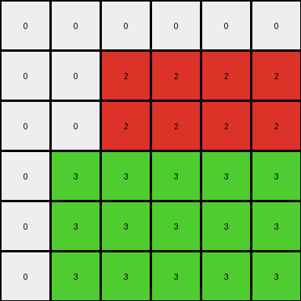
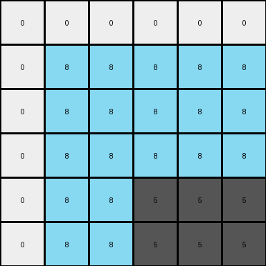

# 99fa7670 • 006 • refine_coder

---

Previous Code:
```python
"""
Identifies non-white pixels in the input grid and expands them to the right and down, filling their respective rows and columns in the output grid.
"""

import numpy as np

def get_non_white_pixels(grid):
    """Finds coordinates of all non-white pixels in the grid."""
    non_white_pixels = []
    for row_index, row in enumerate(grid):
        for col_index, pixel_value in enumerate(row):
            if pixel_value != 0:
                non_white_pixels.append((row_index, col_index, pixel_value))
    return non_white_pixels

def transform(input_grid):
    """Transforms the input grid by expanding non-white pixels to the right and down."""
    # Initialize output_grid as all white with the same dimensions as input
    output_grid = np.zeros_like(input_grid)
    
    # Get non-white pixels and their locations
    non_white_pixels = get_non_white_pixels(input_grid)
    
    # Iterate through the non-white pixels
    for row, col, value in non_white_pixels:
        # Fill the row to the right with the pixel's value
        output_grid[row, col:] = value
        # Fill the columns down with the pixel's value
        output_grid[row:, col:] = value
    
    return output_grid
```

Train Set Results:

## Example 1:

Input:
```
0 0 0 0 0 0
0 0 2 0 0 0
0 0 0 0 0 0
0 3 0 0 0 0
0 0 0 0 0 0
0 0 0 0 0 0
```
Expected Output:
```
0 0 0 0 0 0
0 0 2 2 2 2
0 0 0 0 0 2
0 3 3 3 3 3
0 0 0 0 0 3
0 0 0 0 0 3
```
Transformed Output:
```
0 0 0 0 0 0
0 0 2 2 2 2
0 0 2 2 2 2
0 3 3 3 3 3
0 3 3 3 3 3
0 3 3 3 3 3
```

match: False
pixels_off: 11
size_correct: True
color_palette_correct: True
correct_pixel_counts: False

## Example 2:

Input:
```
0 0 0
0 6 0
0 0 0
```
Expected Output:
```
0 0 0
0 6 6
0 0 6
```
Transformed Output:
```
0 0 0
0 6 6
0 6 6
```

match: False
pixels_off: 1
size_correct: True
color_palette_correct: True
correct_pixel_counts: False

## Example 3:

Input:
```
0 0 0 0 0 0
0 8 0 0 0 0
0 0 0 0 0 0
0 0 0 0 0 0
0 0 0 5 0 0
0 0 0 0 0 0
```
Expected Output:
```
0 0 0 0 0 0
0 8 8 8 8 8
0 0 0 0 0 8
0 0 0 0 0 8
0 0 0 5 5 5
0 0 0 0 0 5
```
Transformed Output:
```
0 0 0 0 0 0
0 8 8 8 8 8
0 8 8 8 8 8
0 8 8 8 8 8
0 8 8 5 5 5
0 8 8 5 5 5
```

match: False
pixels_off: 14
size_correct: True
color_palette_correct: True
correct_pixel_counts: False

## Example 4:

Input:
```
0 0 0 0 0
0 0 8 0 0
0 0 0 0 0
0 7 0 0 0
0 0 0 0 0
0 0 6 0 0
0 0 0 0 0
```
Expected Output:
```
0 0 0 0 0
0 0 8 8 8
0 0 0 0 8
0 7 7 7 7
0 0 0 0 7
0 0 6 6 6
0 0 0 0 6
```
Transformed Output:
```
0 0 0 0 0
0 0 8 8 8
0 0 8 8 8
0 7 7 7 7
0 7 7 7 7
0 7 6 6 6
0 7 6 6 6
```

match: False
pixels_off: 9
size_correct: True
color_palette_correct: True
correct_pixel_counts: False
Here's an analysis of the provided information and a strategy for refining the natural language program and the code:

**General Assessment:**

The initial code and natural language program were on the right track, identifying the core concept of expanding non-white pixels. However, the logic for expansion was too aggressive. It filled both the row *and* the entire remaining column from each non-white pixel, leading to overlaps and incorrect results in all examples beyond the most simple single object scenarios. The expected outputs demonstrate that each non-white pixel only extends its influence on its own row and on its own column, down to, but *not including* the next colored pixel (or the edge of the grid, if no other colored pixel exists). This "blocking" behavior of expansion needs to be implemented. The current implementation also did not follow the correct expansion behavior for multiple objects on the same row or column

**Strategy for Resolving Errors:**

1.  **Refine the Expansion Logic:** Instead of filling the entire remaining row and column, the code should fill only up to the next non-white pixel in each direction (down and right) or to the edge of the grid, whichever comes first.

2.  **Iterative Development:** Test the code after *each* significant change to ensure the fix for one example doesn't break another. We are learning to iterate!

**Metrics and Observations:**

Here's a breakdown of each example, highlighting key observations:

*   **Example 1:**
    *   Input has two non-white pixels (red, green).
    *   The red pixel should fill its row to the right edge.
    *   The red pixel should fill its column down to the row before the green.
    *   The green pixel should fill its row to the right edge.
    *  The green pixel should fill to bottom edge
    *   *Error:* Overlapping fill from red and green.

*   **Example 2:**
    *   Input has one non-white pixel (magenta).
    *   Magenta pixel should fill the rest of its row.
    *  Magenta pixel should fill the rest of its column
    *   *Error:* Although the column fill is small, it's still one too many.

*   **Example 3:**
    *   Input has two non-white pixels (azure, yellow).
    *   Azure should fill its row.
    *  Azure should extend down to before yellow row.
    *  Yellow should fill its row
    *  Yellow should fill its column
    *   *Error:* Overlapping fills, similar to Example 1.

*   **Example 4:**
    *   Three non-white pixels (azure, orange, magenta).
    *   More complex interaction, highlighting the need for "blocking" of the fill.
    *   *Error:* Incorrect fill interactions, especially with multiple colors.

**YAML Fact Block:**

```yaml
facts:
  - description: "Non-white pixels initiate expansion."
    type: "object_behavior"
    object: "non-white pixel"
    action: "expand"
  - description: "Expansion occurs to the right along the pixel's row."
    type: "expansion_direction"
    direction: "right"
    constraint: "row"
  - description: "Expansion occurs downwards along the pixel's column."
    type: "expansion_direction"
    direction: "down"
    constraint: "column"
  - description: "Expansion stops at the edge of the grid."
    type: "expansion_limit"
    limit: "grid_edge"
  - description: "Expansion of a pixel stops before another non-white pixel in its path."
    type: "expansion_limit"
    limit: "other_non_white_pixel"
  - description: "output dimensions are always same as input"
    type: size_constraint
```

**Natural Language Program:**

1.  **Initialization:** Create an output grid filled with white pixels (0), identical in size to the input grid.

2.  **Identify:** Locate all pixels in the input grid that are *not* white (color value not equal to 0).

3.  **Iterate:** For each non-white pixel:
    *   **Row Expansion:** Starting from the pixel's position, change the color of all pixels to the right, along the same row, to the color of the current pixel. Stop if you encounter another non-white pixel or the edge of the grid.
    *   **Column Expansion:** Starting from the pixel's position, change the color of all pixels downwards, along the same column, to the color of the current pixel. Stop if you encounter another non-white pixel or the edge of the grid.

4.  **Output:** The output grid now represents the transformed image.

**INSTRUCTIONS**

- generate a Python module to represent the natural language program 
- follow the template below
- all common math and science libraries are available
- create docstring only at top - but comment the workflow in the function
- use helper functions for common operations like finding objects, counting,
  measuring, moving, etc. 

remember - we are working iteratively - so this code will inform your future
self as we converge on the solution

*template:*

```python
"""
{{ natural language description of the transformation rule }}
"""

{{ imports }}

def transform(input_grid):
    # initialize output_grid

    # change output pixels 

    return output_grid

```
