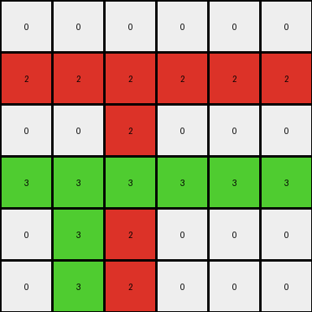
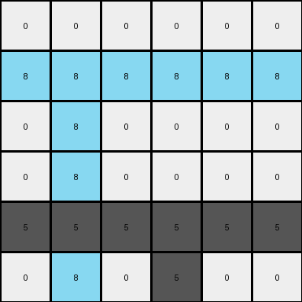
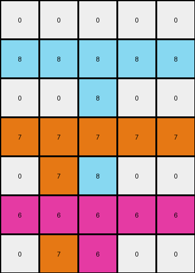

# 99fa7670 • 015 • refine_dreamer

---

Previous Code:
```python
"""
1.  **Identify Non-zero Pixels:** Locate all pixels in the input grid that have a non-zero value (i.e., not white).
2.  **Horizontal Expansion:** For each non-zero pixel, extend its color horizontally across its entire row, replacing any 0 values.
3. **Fill Down:** For each non-zero pixel, starting at their initial location, expand vertically down to the bottom of the grid.
"""

import numpy as np

def transform(input_grid):
    """Transforms the input grid according to the observed rule."""
    output_grid = np.copy(input_grid)
    rows, cols = output_grid.shape

    # Identify non-zero pixels and their positions
    non_zero_pixels = []
    for r in range(rows):
        for c in range(cols):
            if output_grid[r, c] != 0:
                non_zero_pixels.append((r, c, output_grid[r, c]))

    # Horizontal Expansion and fill down
    for r, c, color in non_zero_pixels:
        # Horizontal Expansion
        output_grid[r, :] = color
        # Fill Down.
        for i in range(r, rows):
            output_grid[i,c] = color
            
    return output_grid
```

Train Set Results:

## Example 1:

Input:
```
0 0 0 0 0 0
0 0 2 0 0 0
0 0 0 0 0 0
0 3 0 0 0 0
0 0 0 0 0 0
0 0 0 0 0 0
```
Expected Output:
```
0 0 0 0 0 0
0 0 2 2 2 2
0 0 0 0 0 2
0 3 3 3 3 3
0 0 0 0 0 3
0 0 0 0 0 3
```
Transformed Output:
```
0 0 0 0 0 0
2 2 2 2 2 2
0 0 2 0 0 0
3 3 3 3 3 3
0 3 2 0 0 0
0 3 2 0 0 0
```

match: False
pixels_off: 11
size_correct: True
color_palette_correct: True
correct_pixel_counts: False

## Example 2:

Input:
```
0 0 0
0 6 0
0 0 0
```
Expected Output:
```
0 0 0
0 6 6
0 0 6
```
Transformed Output:
```
0 0 0
6 6 6
0 6 0
```

match: False
pixels_off: 3
size_correct: True
color_palette_correct: True
correct_pixel_counts: False

## Example 3:

Input:
```
0 0 0 0 0 0
0 8 0 0 0 0
0 0 0 0 0 0
0 0 0 0 0 0
0 0 0 5 0 0
0 0 0 0 0 0
```
Expected Output:
```
0 0 0 0 0 0
0 8 8 8 8 8
0 0 0 0 0 8
0 0 0 0 0 8
0 0 0 5 5 5
0 0 0 0 0 5
```
Transformed Output:
```
0 0 0 0 0 0
8 8 8 8 8 8
0 8 0 0 0 0
0 8 0 0 0 0
5 5 5 5 5 5
0 8 0 5 0 0
```

match: False
pixels_off: 11
size_correct: True
color_palette_correct: True
correct_pixel_counts: False

## Example 4:

Input:
```
0 0 0 0 0
0 0 8 0 0
0 0 0 0 0
0 7 0 0 0
0 0 0 0 0
0 0 6 0 0
0 0 0 0 0
```
Expected Output:
```
0 0 0 0 0
0 0 8 8 8
0 0 0 0 8
0 7 7 7 7
0 0 0 0 7
0 0 6 6 6
0 0 0 0 6
```
Transformed Output:
```
0 0 0 0 0
8 8 8 8 8
0 0 8 0 0
7 7 7 7 7
0 7 8 0 0
6 6 6 6 6
0 7 6 0 0
```

match: False
pixels_off: 13
size_correct: True
color_palette_correct: True
correct_pixel_counts: False
**INSTRUCTIONS**

The code above was generated based on observations from the first training
example

we have tested the transform function on each of the task example inputs and
compared with the expected output

review each of the examples provided and the results and consider how the
natural language program should be updated to accommodate this new knowledge

respond with the following deliverables:

- general assessment of the information provided and strategy for resolving the
  errors
- gather metrics about each of the examples and results - use code_execution to
  develop accurate reports on your assumptions
- a YAML block documenting facts - Focus on identifying objects, their properties, and the actions performed on them.
- a natural language program - Be as clear and concise as possible, providing a complete description of the transformation rule.


your responses should be considered as information in a report - not a
conversation
