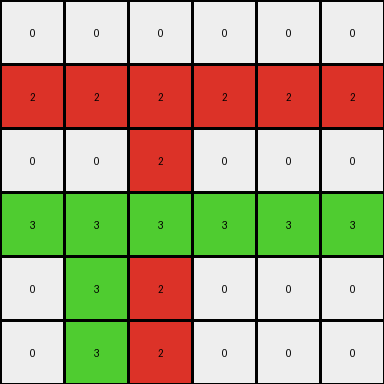
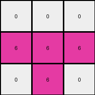
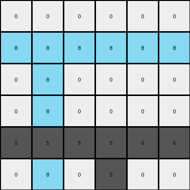
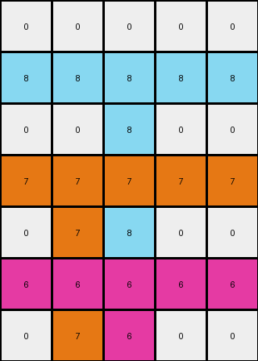

# 99fa7670 • 016 • refine_coder

---

Previous Code:
```python
"""
1.  **Identify Non-zero Pixels:** Locate all pixels in the input grid that have a non-zero value (i.e., not white).
2.  **Horizontal Expansion:** For each non-zero pixel, extend its color horizontally across its entire row, replacing any 0 values.
3. **Fill Down:** For each non-zero pixel, starting at their initial location, expand vertically down to the bottom of the grid.
"""

import numpy as np

def transform(input_grid):
    """Transforms the input grid according to the observed rule."""
    output_grid = np.copy(input_grid)
    rows, cols = output_grid.shape

    # Identify non-zero pixels and their positions
    non_zero_pixels = []
    for r in range(rows):
        for c in range(cols):
            if output_grid[r, c] != 0:
                non_zero_pixels.append((r, c, output_grid[r, c]))

    # Horizontal Expansion and fill down
    for r, c, color in non_zero_pixels:
        # Horizontal Expansion
        output_grid[r, :] = color
        # Fill Down.
        for i in range(r, rows):
            output_grid[i,c] = color
            
    return output_grid
```

Train Set Results:

## Example 1:

Input:
```
0 0 0 0 0 0
0 0 2 0 0 0
0 0 0 0 0 0
0 3 0 0 0 0
0 0 0 0 0 0
0 0 0 0 0 0
```
Expected Output:
```
0 0 0 0 0 0
0 0 2 2 2 2
0 0 0 0 0 2
0 3 3 3 3 3
0 0 0 0 0 3
0 0 0 0 0 3
```
Transformed Output:
```
0 0 0 0 0 0
2 2 2 2 2 2
0 0 2 0 0 0
3 3 3 3 3 3
0 3 2 0 0 0
0 3 2 0 0 0
```

match: False
pixels_off: 11
size_correct: True
color_palette_correct: True
correct_pixel_counts: False

## Example 2:

Input:
```
0 0 0
0 6 0
0 0 0
```
Expected Output:
```
0 0 0
0 6 6
0 0 6
```
Transformed Output:
```
0 0 0
6 6 6
0 6 0
```

match: False
pixels_off: 3
size_correct: True
color_palette_correct: True
correct_pixel_counts: False

## Example 3:

Input:
```
0 0 0 0 0 0
0 8 0 0 0 0
0 0 0 0 0 0
0 0 0 0 0 0
0 0 0 5 0 0
0 0 0 0 0 0
```
Expected Output:
```
0 0 0 0 0 0
0 8 8 8 8 8
0 0 0 0 0 8
0 0 0 0 0 8
0 0 0 5 5 5
0 0 0 0 0 5
```
Transformed Output:
```
0 0 0 0 0 0
8 8 8 8 8 8
0 8 0 0 0 0
0 8 0 0 0 0
5 5 5 5 5 5
0 8 0 5 0 0
```

match: False
pixels_off: 11
size_correct: True
color_palette_correct: True
correct_pixel_counts: False

## Example 4:

Input:
```
0 0 0 0 0
0 0 8 0 0
0 0 0 0 0
0 7 0 0 0
0 0 0 0 0
0 0 6 0 0
0 0 0 0 0
```
Expected Output:
```
0 0 0 0 0
0 0 8 8 8
0 0 0 0 8
0 7 7 7 7
0 0 0 0 7
0 0 6 6 6
0 0 0 0 6
```
Transformed Output:
```
0 0 0 0 0
8 8 8 8 8
0 0 8 0 0
7 7 7 7 7
0 7 8 0 0
6 6 6 6 6
0 7 6 0 0
```

match: False
pixels_off: 13
size_correct: True
color_palette_correct: True
correct_pixel_counts: False
Here's an analysis of the provided examples and results, along with an updated natural language program and a YAML block summarizing the observations.

**General Assessment:**

The initial natural language program and the generated code were on the right track but failed to accurately capture the nuanced interaction between horizontal expansion and fill-down operations. The code performs both operations independently, causing an "over-expansion" where colors spread incorrectly. The core issue is that the fill-down operation should only apply to the *original* non-zero pixels, not the ones created by horizontal expansion. The examples show the algorithm needs to consider horizontal expansion, but restrict vertical fill-down to the columns of original non-zero pixels.

**Strategy for Resolving Errors:**

1.  **Refine the Fill-Down Logic:** Modify the code to ensure that the fill-down operation is strictly linked to the *original* positions of the non-zero pixels. This means storing the initial column positions and only using them for the vertical expansion.

2. **Prioritize Operations**: Horizontal expansion is applied fully across a row, but the vertical "fill-down" is applied to a specific column.

**Example Analysis and Metrics:**

Here's a breakdown of each example, incorporating observations:

*   **Example 1:**
    *   Input Shape: (6, 6)
    *   Non-zero Pixels (original): (1, 2, red), (3, 1, green)
    *   Expected Behavior: Red expands horizontally and then the original red column fills down. Green expands horizontally, then original green column fills down.
    *   Observed Error: Fill-down affects columns where horizontal expansion happened.
*   **Example 2:**
    *   Input Shape: (3, 3)
    *   Non-zero Pixels (original): (1, 1, magenta)
    *   Expected Behavior: Magenta expands horizontally and then the original magenta column fills down.
    *   Observed Error: Same as Example 1.
*   **Example 3:**
    *   Input Shape: (6, 6)
    *   Non-zero Pixels (original): (1, 1, azure), (4, 3, yellow)
    *   Expected Behavior: Similar pattern, horizontal expansion then restricted vertical fill.
    *   Observed Error: Same as Example 1.
*   **Example 4:**
    *  Input shape: (7,5)
    *  Non-zero pixels: (1,2, azure), (3,1, orange), (5,2, magenta)
    *  Expected Behavior: Similar to other examples
    *  Observed Error: Same as other examples

**YAML Block (Facts):**

```yaml
observations:
  - task_id: 014
  - objects:
    - description: Non-zero pixels in the input grid.
      properties:
        - color: Defined by the pixel value (1-9).
        - original_position: (row, column) coordinates before any transformation.
  - actions:
    - name: Horizontal Expansion
      description:  A non-zero pixel's color replaces all 0 values in its row.
      scope: Row-level.
      precedence: Happens before fill-down.
    - name: Fill Down
      description: A non-zero pixel's color propagates vertically downwards from its original row.
      scope:  Column-level, limited to the original column of the non-zero pixel.
      precedence: Happens after horizontal expansion.
  - constraints:
     - Fill-down is constrained to the column of the original non-zero colored pixels.
```

**Natural Language Program:**

1.  **Identify Non-zero Pixels:** Find all pixels in the input grid that are not white (value 0). Record their color and original (row, column) position.

2.  **Horizontal Expansion:** For each non-zero pixel, set all pixels in its row to that pixel's color.

3.  **Restricted Fill-Down:** For each non-zero pixel identified in step 1, starting from its *original* row and *original* column, fill downwards in that column with the pixel's color until the bottom of the grid is reached.  This fill-down only occurs in the columns where non-zero pixels originally existed.

**INSTRUCTIONS**

- generate a Python module to represent the natural language program 
- follow the template below
- all common math and science libraries are available
- create docstring only at top - but comment the workflow in the function
- use helper functions for common operations like finding objects, counting,
  measuring, moving, etc. 

remember - we are working iteratively - so this code will inform your future
self as we converge on the solution

*template:*

```python
"""
{{ natural language description of the transformation rule }}
"""

{{ imports }}

def transform(input_grid):
    # initialize output_grid

    # change output pixels 

    return output_grid

```
