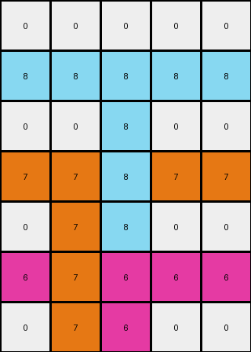

# 99fa7670 • 017 • refine_dreamer

---

Previous Code:
```python
"""
1.  **Identify Non-zero Pixels:** Find all pixels in the input grid that are not white (value 0). Record their color and original (row, column) position.
2.  **Horizontal Expansion:** For each non-zero pixel, set all pixels in its row to that pixel's color.
3.  **Restricted Fill-Down:** For each non-zero pixel identified in step 1, starting from its *original* row and *original* column, fill downwards in that column with the pixel's color until the bottom of the grid is reached.  This fill-down only occurs in the columns where non-zero pixels originally existed.
"""

import numpy as np

def transform(input_grid):
    """Transforms the input grid according to the observed rule."""
    output_grid = np.copy(input_grid)
    rows, cols = output_grid.shape

    # Identify non-zero pixels and their original positions
    non_zero_pixels = []
    for r in range(rows):
        for c in range(cols):
            if output_grid[r, c] != 0:
                non_zero_pixels.append((r, c, output_grid[r, c]))

    # Horizontal Expansion
    for r, c, color in non_zero_pixels:
        output_grid[r, :] = color

    # Restricted Fill-Down
    for r, c, color in non_zero_pixels:
        for i in range(r, rows):
            output_grid[i, c] = color

    return output_grid
```

Train Set Results:

## Example 1:

Input:
```
0 0 0 0 0 0
0 0 2 0 0 0
0 0 0 0 0 0
0 3 0 0 0 0
0 0 0 0 0 0
0 0 0 0 0 0
```
Expected Output:
```
0 0 0 0 0 0
0 0 2 2 2 2
0 0 0 0 0 2
0 3 3 3 3 3
0 0 0 0 0 3
0 0 0 0 0 3
```
Transformed Output:
```
0 0 0 0 0 0
2 2 2 2 2 2
0 0 2 0 0 0
3 3 2 3 3 3
0 3 2 0 0 0
0 3 2 0 0 0
```

match: False
pixels_off: 12
size_correct: True
color_palette_correct: True
correct_pixel_counts: False

## Example 2:

Input:
```
0 0 0
0 6 0
0 0 0
```
Expected Output:
```
0 0 0
0 6 6
0 0 6
```
Transformed Output:
```
0 0 0
6 6 6
0 6 0
```

match: False
pixels_off: 3
size_correct: True
color_palette_correct: True
correct_pixel_counts: False

## Example 3:

Input:
```
0 0 0 0 0 0
0 8 0 0 0 0
0 0 0 0 0 0
0 0 0 0 0 0
0 0 0 5 0 0
0 0 0 0 0 0
```
Expected Output:
```
0 0 0 0 0 0
0 8 8 8 8 8
0 0 0 0 0 8
0 0 0 0 0 8
0 0 0 5 5 5
0 0 0 0 0 5
```
Transformed Output:
```
0 0 0 0 0 0
8 8 8 8 8 8
0 8 0 0 0 0
0 8 0 0 0 0
5 8 5 5 5 5
0 8 0 5 0 0
```

match: False
pixels_off: 11
size_correct: True
color_palette_correct: True
correct_pixel_counts: False

## Example 4:

Input:
```
0 0 0 0 0
0 0 8 0 0
0 0 0 0 0
0 7 0 0 0
0 0 0 0 0
0 0 6 0 0
0 0 0 0 0
```
Expected Output:
```
0 0 0 0 0
0 0 8 8 8
0 0 0 0 8
0 7 7 7 7
0 0 0 0 7
0 0 6 6 6
0 0 0 0 6
```
Transformed Output:
```
0 0 0 0 0
8 8 8 8 8
0 0 8 0 0
7 7 8 7 7
0 7 8 0 0
6 7 6 6 6
0 7 6 0 0
```

match: False
pixels_off: 14
size_correct: True
color_palette_correct: True
correct_pixel_counts: False
**INSTRUCTIONS**

The code above was generated based on observations from the first training
example

we have tested the transform function on each of the task example inputs and
compared with the expected output

review each of the examples provided and the results and consider how the
natural language program should be updated to accommodate this new knowledge

respond with the following deliverables:

- general assessment of the information provided and strategy for resolving the
  errors
- gather metrics about each of the examples and results - use code_execution to
  develop accurate reports on your assumptions
- a YAML block documenting facts - Focus on identifying objects, their properties, and the actions performed on them.
- a natural language program - Be as clear and concise as possible, providing a complete description of the transformation rule.


your responses should be considered as information in a report - not a
conversation
