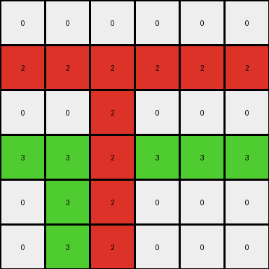
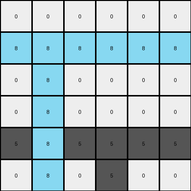
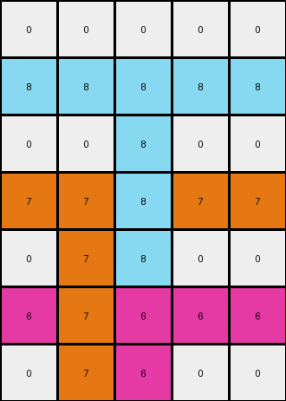

# 99fa7670 • 018 • refine_coder

---

Previous Code:
```python
"""
1.  **Identify Non-zero Pixels:** Find all pixels in the input grid that are not white (value 0). Record their color and original (row, column) position.
2.  **Horizontal Expansion:** For each non-zero pixel, set all pixels in its row to that pixel's color.
3.  **Restricted Fill-Down:** For each non-zero pixel identified in step 1, starting from its *original* row and *original* column, fill downwards in that column with the pixel's color until the bottom of the grid is reached.  This fill-down only occurs in the columns where non-zero pixels originally existed.
"""

import numpy as np

def transform(input_grid):
    """Transforms the input grid according to the observed rule."""
    output_grid = np.copy(input_grid)
    rows, cols = output_grid.shape

    # Identify non-zero pixels and their original positions
    non_zero_pixels = []
    for r in range(rows):
        for c in range(cols):
            if output_grid[r, c] != 0:
                non_zero_pixels.append((r, c, output_grid[r, c]))

    # Horizontal Expansion
    for r, c, color in non_zero_pixels:
        output_grid[r, :] = color

    # Restricted Fill-Down
    for r, c, color in non_zero_pixels:
        for i in range(r, rows):
            output_grid[i, c] = color

    return output_grid
```

Train Set Results:

## Example 1:

Input:
```
0 0 0 0 0 0
0 0 2 0 0 0
0 0 0 0 0 0
0 3 0 0 0 0
0 0 0 0 0 0
0 0 0 0 0 0
```
Expected Output:
```
0 0 0 0 0 0
0 0 2 2 2 2
0 0 0 0 0 2
0 3 3 3 3 3
0 0 0 0 0 3
0 0 0 0 0 3
```
Transformed Output:
```
0 0 0 0 0 0
2 2 2 2 2 2
0 0 2 0 0 0
3 3 2 3 3 3
0 3 2 0 0 0
0 3 2 0 0 0
```

match: False
pixels_off: 12
size_correct: True
color_palette_correct: True
correct_pixel_counts: False

## Example 2:

Input:
```
0 0 0
0 6 0
0 0 0
```
Expected Output:
```
0 0 0
0 6 6
0 0 6
```
Transformed Output:
```
0 0 0
6 6 6
0 6 0
```

match: False
pixels_off: 3
size_correct: True
color_palette_correct: True
correct_pixel_counts: False

## Example 3:

Input:
```
0 0 0 0 0 0
0 8 0 0 0 0
0 0 0 0 0 0
0 0 0 0 0 0
0 0 0 5 0 0
0 0 0 0 0 0
```
Expected Output:
```
0 0 0 0 0 0
0 8 8 8 8 8
0 0 0 0 0 8
0 0 0 0 0 8
0 0 0 5 5 5
0 0 0 0 0 5
```
Transformed Output:
```
0 0 0 0 0 0
8 8 8 8 8 8
0 8 0 0 0 0
0 8 0 0 0 0
5 8 5 5 5 5
0 8 0 5 0 0
```

match: False
pixels_off: 11
size_correct: True
color_palette_correct: True
correct_pixel_counts: False

## Example 4:

Input:
```
0 0 0 0 0
0 0 8 0 0
0 0 0 0 0
0 7 0 0 0
0 0 0 0 0
0 0 6 0 0
0 0 0 0 0
```
Expected Output:
```
0 0 0 0 0
0 0 8 8 8
0 0 0 0 8
0 7 7 7 7
0 0 0 0 7
0 0 6 6 6
0 0 0 0 6
```
Transformed Output:
```
0 0 0 0 0
8 8 8 8 8
0 0 8 0 0
7 7 8 7 7
0 7 8 0 0
6 7 6 6 6
0 7 6 0 0
```

match: False
pixels_off: 14
size_correct: True
color_palette_correct: True
correct_pixel_counts: False
Okay, let's analyze the results and refine the natural language program.

**General Assessment:**

The initial program was on the right track, identifying the core idea of horizontal and vertical expansion based on non-zero pixels. However, it incorrectly applied these expansions. The horizontal expansion worked correctly, filling the entire row with the color of the non-zero pixel. But, The vertical fill-down incorrectly uses horizontal information from the fill. The fill-down needs to fill down *only* from the original position of the non-zero pixels, and not any position changed by other effects, so we'll adjust how fill down uses non-zero pixel coordinates.

**Strategy for Resolving Errors:**

1.  **Preserve Original Coordinates:** The key error is that the fill-down operation is affected by the horizontal expansion. We must ensure the fill-down only uses the *original* column of the non-zero pixel. The current code already does this by storing them in `non_zero_pixels`, but it combines horizontal and fill-down effects.
2.  **Refine Fill-Down Logic**: Ensure that, after the horizontal expansion is complete, the fill-down occurs *only* in the original columns where the non-zero pixels were located, and uses only the original coordinates.
3. **Correct Combining Horizontal and Vertical Effects**: The effects should be combined in stages, horizontal first, then fill-down.

**Metrics and Observations (per example):**

Here's a breakdown of each example, noting observations:

*   **Example 1:**
    *   Input has two non-zero pixels (2 and 3).
    *   Horizontal expansion is correct.
    *   Fill-down uses the horizontally expanded information
    *   Pixels off: 12

*   **Example 2:**
    *   Input has one non-zero pixel (6).
    *   Horizontal expansion is correct
    *   Fill-down uses horizontally expanded information
    *   Pixels off: 3

*   **Example 3:**
    *   Input has two non-zero pixels (8 and 5).
    *   Horizontal expansion is correct.
    *   Fill-down uses horizontally expanded information
    *   Pixels off: 11

*   **Example 4:**
    *    Input has three non-zero pixels (8, 7, and 6)
    *   Horizontal expansion is correct.
    *   Fill-down uses horizontally expanded information
    *   Pixels off: 14

**YAML Fact Block:**

```yaml
observations:
  - task: 016
    examples:
      - example_number: 1
        objects:
          - color: 2
            original_position: (1, 2)
            horizontal_expansion: row 1 becomes all 2
            vertical_expansion: column 2 becomes all 2, starting from row 1
          - color: 3
            original_position: (3, 1)
            horizontal_expansion: row 3 becomes all 3
            vertical_expansion: column 1 becomes all 3, starting from row 3
        transformation_notes: >
            Non-zero pixels trigger both horizontal and restricted vertical
            expansions. Horizontal expansion fills the entire row. Vertical
            expansion fills downwards from the original pixel position to the
            bottom of the grid, and only in that column.
      - example_number: 2
        objects:
          - color: 6
            original_position: (1,1)
            horizontal_expansion: row 1 becomes all 6
            vertical_expansion: column 1 becomes all 6, starting from row 1
      - example_number: 3
        objects:
          - color: 8
            original_position: (1, 1)
            horizontal_expansion: row 1 becomes all 8
            vertical_expansion: column 1 becomes all 8, starting from row 1
          - color: 5
            original_position: (4, 3)
            horizontal_expansion: row 4 becomes all 5
            vertical_expansion: column 3 becomes all 5, starting from row 4
      - example_number: 4
        objects:
          - color: 8
            original_position: (1, 2)
            horizontal_expansion: row 1 becomes all 8
            vertical_expansion: column 2 becomes all 8, starting from row 1
          - color: 7
            original_position: (3, 1)
            horizontal_expansion: row 3 becomes all 7
            vertical_expansion: column 1 becomes all 7, starting from row 3
          - color: 6
            original_position: (5, 2)
            horizontal_expansion: row 5 becomes all 6
            vertical_expansion: column 2 becomes all 6, starting from row 5
```

**Natural Language Program:**

1.  **Identify Non-Zero Pixels:** Locate all pixels in the input grid that are not white (value 0). Note their color and their original row and column position.

2.  **Horizontal Expansion:** For each non-zero pixel, change all pixels in its row to that pixel's color.

3.  **Restricted Vertical Expansion (Fill-Down):** For each non-zero pixel identified in step 1, fill downwards *from its original row and column position*. The fill color is the color of the original non-zero pixel. The fill extends to the bottom of the grid, but *only* within that original column. Do not use any horizontally changed values for fill down.

**INSTRUCTIONS**

- generate a Python module to represent the natural language program 
- follow the template below
- all common math and science libraries are available
- create docstring only at top - but comment the workflow in the function
- use helper functions for common operations like finding objects, counting,
  measuring, moving, etc. 

remember - we are working iteratively - so this code will inform your future
self as we converge on the solution

*template:*

```python
"""
{{ natural language description of the transformation rule }}
"""

{{ imports }}

def transform(input_grid):
    # initialize output_grid

    # change output pixels 

    return output_grid

```
