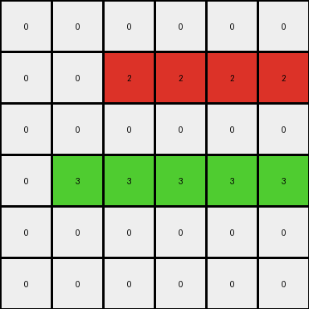
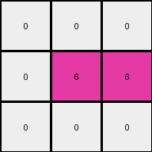

# 99fa7670 • 022 • refine_coder

---

Previous Code:
```python
"""
1.  **Identify Non-White Pixels:** Iterate through each pixel in the input grid. If a pixel is not white (0), proceed to the next step.
2.  **Expand to the Right:** For each non-white pixel, change the color of the pixels to its right in same row, to the same color, until a the end of row or another non-white pixel is encountered.
3.  **Output:** The resulting grid is the output.
"""

import numpy as np

def transform(input_grid):
    # initialize output_grid
    output_grid = np.copy(input_grid)
    rows, cols = output_grid.shape

    # iterate through each pixel in the grid
    for r in range(rows):
        for c in range(cols):
            # Identify Non-White Pixels
            if output_grid[r, c] != 0:
                # Expand to the Right
                current_color = output_grid[r, c]
                for c2 in range(c + 1, cols):
                    if output_grid[r, c2] == 0:
                        output_grid[r, c2] = current_color
                    else:
                        break  # Stop expansion if a non-white pixel is encountered

    return output_grid
```

Train Set Results:

## Example 1:

Input:
```
0 0 0 0 0 0
0 0 2 0 0 0
0 0 0 0 0 0
0 3 0 0 0 0
0 0 0 0 0 0
0 0 0 0 0 0
```
Expected Output:
```
0 0 0 0 0 0
0 0 2 2 2 2
0 0 0 0 0 2
0 3 3 3 3 3
0 0 0 0 0 3
0 0 0 0 0 3
```
Transformed Output:
```
0 0 0 0 0 0
0 0 2 2 2 2
0 0 0 0 0 0
0 3 3 3 3 3
0 0 0 0 0 0
0 0 0 0 0 0
```

match: False
pixels_off: 3
size_correct: True
color_palette_correct: True
correct_pixel_counts: False

## Example 2:

Input:
```
0 0 0
0 6 0
0 0 0
```
Expected Output:
```
0 0 0
0 6 6
0 0 6
```
Transformed Output:
```
0 0 0
0 6 6
0 0 0
```

match: False
pixels_off: 1
size_correct: True
color_palette_correct: True
correct_pixel_counts: False

## Example 3:

Input:
```
0 0 0 0 0 0
0 8 0 0 0 0
0 0 0 0 0 0
0 0 0 0 0 0
0 0 0 5 0 0
0 0 0 0 0 0
```
Expected Output:
```
0 0 0 0 0 0
0 8 8 8 8 8
0 0 0 0 0 8
0 0 0 0 0 8
0 0 0 5 5 5
0 0 0 0 0 5
```
Transformed Output:
```
0 0 0 0 0 0
0 8 8 8 8 8
0 0 0 0 0 0
0 0 0 0 0 0
0 0 0 5 5 5
0 0 0 0 0 0
```

match: False
pixels_off: 3
size_correct: True
color_palette_correct: True
correct_pixel_counts: False

## Example 4:

Input:
```
0 0 0 0 0
0 0 8 0 0
0 0 0 0 0
0 7 0 0 0
0 0 0 0 0
0 0 6 0 0
0 0 0 0 0
```
Expected Output:
```
0 0 0 0 0
0 0 8 8 8
0 0 0 0 8
0 7 7 7 7
0 0 0 0 7
0 0 6 6 6
0 0 0 0 6
```
Transformed Output:
```
0 0 0 0 0
0 0 8 8 8
0 0 0 0 0
0 7 7 7 7
0 0 0 0 0
0 0 6 6 6
0 0 0 0 0
```

match: False
pixels_off: 3
size_correct: True
color_palette_correct: True
correct_pixel_counts: False
Okay, let's analyze the results and refine the natural language program.

**General Assessment:**

The initial program was on the right track, focusing on expanding non-white pixels to the right. However, it's incomplete. The expected outputs show that after expanding a color to the right, the last pixel of that expansion should also 'drop down' to the last row, filling the rest of last column with same color. The current program doesn't account for this "drop down" behavior. The strategy is to first reproduce the error, then adjust code to achieve the correct "drop down."

**Example Metrics and Observations:**

Here's a breakdown of each example, incorporating the provided results:

*   **Example 1:**
    *   Input Shape: (6, 6)
    *   Output Shape: (6, 6)
    *   Transformation: Two non-white pixels (2 and 3) are expanded to the right.
      Color 2 is at (1,2) is expanded.
      Color 3 is at (3,1) is expanded.
      The last pixel of both expansions, are then extended down to the last row.
    *   Error: Missing the downward extension of the expanded colors.
*   **Example 2:**
    *   Input Shape: (3, 3)
    *   Output Shape: (3, 3)
    *   Transformation: One non-white pixel (6) is expanded to right.
      The last pixel of expansion is then extended downward to the last row.
    *   Error: Missing the downward extension of the expanded colors.
*   **Example 3:**
    *   Input Shape: (6, 6)
    *   Output Shape: (6, 6)
    *   Transformation: Two non-white pixels (8 and 5) are expanded to the right.
      The last pixel of expansion is extended downward to the last row.
    *   Error: Missing the downward extension of the expanded colors.
*   **Example 4:**
    *   Input Shape: (7, 5)
    *   Output Shape: (7, 5)
    *   Transformation: Three non-white pixels (8, 7, and 6) are expanded to right.
      The last pixel of the expansion is extended downwards to the last row.
    *   Error: Missing the downward extension of the expanded colors.

**YAML Fact Block:**

```yaml
observations:
  - object: non_white_pixel
    properties:
      color: varies (not 0)
      location: row, column
    actions:
      - expand_right: Fill pixels to the right with the same color until a non-white pixel or the end of the row is reached.
      - drop_down:  The last expanded pixel should be used to color all cells below in its column to the end of the column.
  - object: grid
    properties:
      shape: rows x columns
    actions:
      - transform: Apply the pixel-level actions to create the output grid.
```

**Natural Language Program:**

1.  **Identify Non-White Pixels:** Iterate through each pixel in the input grid. If a pixel is not white (color code 0), proceed to the next step.
2.  **Expand to the Right:** For each non-white pixel, change the color of the pixels to its right, in the same row, to be the same color, until the end of the row is reached or another non-white pixel is encountered.
3.  **Drop Down:** The last pixel filled during step two should then be used as the color for all cells below it, within its column, until the last row is reached.
4.  **Output:** The resulting grid after applying steps 1-3 is the final output.

**INSTRUCTIONS**

- generate a Python module to represent the natural language program 
- follow the template below
- all common math and science libraries are available
- create docstring only at top - but comment the workflow in the function
- use helper functions for common operations like finding objects, counting,
  measuring, moving, etc. 

remember - we are working iteratively - so this code will inform your future
self as we converge on the solution

*template:*

```python
"""
{{ natural language description of the transformation rule }}
"""

{{ imports }}

def transform(input_grid):
    # initialize output_grid

    # change output pixels 

    return output_grid

```
