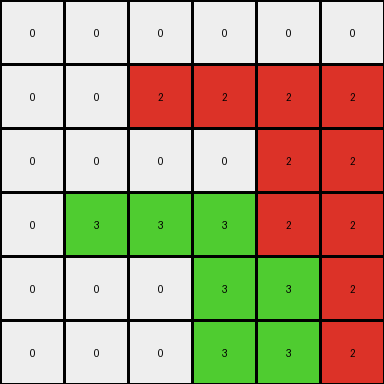
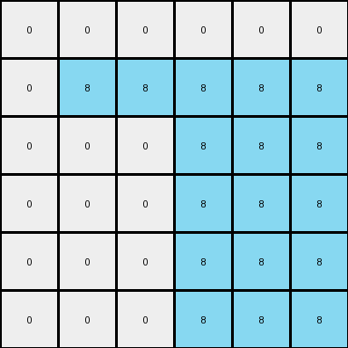
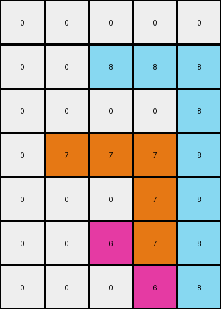

# 99fa7670 • 023 • refine_dreamer

---


Previous Code:
```python
"""
1.  **Identify Non-White Pixels:** Iterate through each pixel in the input grid. If a pixel is not white (color code 0), proceed to the next step.
2.  **Expand to the Right:** For each non-white pixel, change the color of the pixels to its right, in the same row, to be the same color, until the end of the row is reached or another non-white pixel is encountered.
3.  **Drop Down:** The last pixel filled during step two should then be used as the color for all cells below it, within its column, until the last row is reached.
4.  **Output:** The resulting grid after applying steps 1-3 is the final output.
"""

import numpy as np

def transform(input_grid):
    # initialize output_grid
    output_grid = np.copy(input_grid)
    rows, cols = output_grid.shape

    # iterate through each pixel in the grid
    for r in range(rows):
        for c in range(cols):
            # Identify Non-White Pixels
            if output_grid[r, c] != 0:
                # Expand to the Right
                current_color = output_grid[r, c]
                c2_end = cols # init end column
                for c2 in range(c + 1, cols):
                    if output_grid[r, c2] == 0:
                        output_grid[r, c2] = current_color
                    else:
                        c2_end = c2
                        break  # Stop expansion if a non-white pixel is encountered
                # Drop Down
                if c2_end == cols:
                    c2_end -= 1
                
                for r2 in range(r + 1, rows):
                  output_grid[r2,c2_end] = current_color

    return output_grid
```

Train Set Results:

## Example 1:

Input:
```
0 0 0 0 0 0
0 0 2 0 0 0
0 0 0 0 0 0
0 3 0 0 0 0
0 0 0 0 0 0
0 0 0 0 0 0
```
Expected Output:
```
0 0 0 0 0 0
0 0 2 2 2 2
0 0 0 0 0 2
0 3 3 3 3 3
0 0 0 0 0 3
0 0 0 0 0 3
```
Transformed Output:
```
0 0 0 0 0 0
0 0 2 2 2 2
0 0 0 0 2 2
0 3 3 3 2 2
0 0 0 3 3 2
0 0 0 3 3 2
```

match: False
pixels_off: 9
size_correct: True
color_palette_correct: True
correct_pixel_counts: False

## Example 2:

Input:
```
0 0 0
0 6 0
0 0 0
```
Expected Output:
```
0 0 0
0 6 6
0 0 6
```
Transformed Output:
```
0 0 0
0 6 6
0 0 6
```

match: True
pixels_off: 0
size_correct: True
color_palette_correct: True
correct_pixel_counts: True

## Example 3:

Input:
```
0 0 0 0 0 0
0 8 0 0 0 0
0 0 0 0 0 0
0 0 0 0 0 0
0 0 0 5 0 0
0 0 0 0 0 0
```
Expected Output:
```
0 0 0 0 0 0
0 8 8 8 8 8
0 0 0 0 0 8
0 0 0 0 0 8
0 0 0 5 5 5
0 0 0 0 0 5
```
Transformed Output:
```
0 0 0 0 0 0
0 8 8 8 8 8
0 0 0 8 8 8
0 0 0 8 8 8
0 0 0 8 8 8
0 0 0 8 8 8
```

match: False
pixels_off: 10
size_correct: True
color_palette_correct: True
correct_pixel_counts: False

## Example 4:

Input:
```
0 0 0 0 0
0 0 8 0 0
0 0 0 0 0
0 7 0 0 0
0 0 0 0 0
0 0 6 0 0
0 0 0 0 0
```
Expected Output:
```
0 0 0 0 0
0 0 8 8 8
0 0 0 0 8
0 7 7 7 7
0 0 0 0 7
0 0 6 6 6
0 0 0 0 6
```
Transformed Output:
```
0 0 0 0 0
0 0 8 8 8
0 0 0 0 8
0 7 7 7 8
0 0 0 7 8
0 0 6 7 8
0 0 0 6 8
```

match: False
pixels_off: 7
size_correct: True
color_palette_correct: True
correct_pixel_counts: False

**INSTRUCTIONS**

The code above was generated based on observations from the first training
example

we have tested the transform function on each of the task example inputs and
compared with the expected output

review each of the examples provided and the results and consider how the
natural language program should be updated to accommodate this new knowledge

respond with the following deliverables:

- general assessment of the information provided and strategy for resolving the
  errors
- gather metrics about each of the examples and results - use code_execution to
  develop accurate reports on your assumptions
- a YAML block documenting facts - Focus on identifying objects, their properties, and the actions performed on them.
- a natural language program - Be as clear and concise as possible, providing a complete description of the transformation rule.


your responses should be considered as information in a report - not a
conversation
