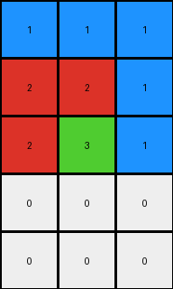
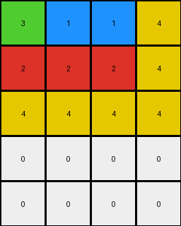
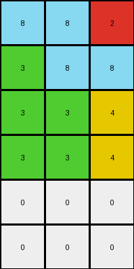

# 9af7a82c • 003 • refine_dreamer

---


Previous Code:
```python
"""
1.  **Determine Output Dimensions:** The output grid's height is determined based on how many rows containing a '1' value are present. That number of rows containing '1' + 2. Each row contains 1 value of '1'. The output grid's width is the same as the input's width.

2.  **Iterate through Input Grid:** For each column in the input grid, create a column of the output grid by duplicating the value the number of times as the number of rows.

3.  **Populate Output:**
    *   Iterate through each column from the input grid.
    *   For input grid columns: Create an output column where: The cells from top to bottom will contain a number from left to right of the input grid, and the rest will be filled with "0".
    *   Example input column `[2, 3, 1]` becomes output column `[1, 2, 3, 0, 0]`

In summary the transformation stacks the values from the input column into output column, and completes with white cells.
"""

import numpy as np

def transform(input_grid):
    # initialize output_grid
    input_grid = np.array(input_grid)
    rows_with_1 = np.count_nonzero(input_grid == 1)
    output_height =  input_grid.shape[0] + 2
    output_width = input_grid.shape[1]
    output_grid = np.zeros((output_height, output_width), dtype=int)

    # change output pixels
    for j in range(input_grid.shape[1]):
        # Get the values from the input column
        input_column_values = input_grid[:, j]

        # Rotate the values to match the order requested
        rotated_values = np.roll(input_column_values, -np.argmax(input_column_values == 1))

        # Place the rotated values at the beginning of output_grid
        output_grid[:input_grid.shape[0],j] = rotated_values


    return output_grid.tolist()
```

Train Set Results:

## Example 1:

Input:
```
2 2 1
2 3 1
1 1 1
```
Expected Output:
```
1 2 3
1 2 0
1 2 0
1 0 0
1 0 0
```
Transformed Output:
```
1 1 1
2 2 1
2 3 1
0 0 0
0 0 0
```

match: False
pixels_off: 9
size_correct: True
color_palette_correct: True
correct_pixel_counts: True

## Example 2:

Input:
```
3 1 1 4
2 2 2 4
4 4 4 4
```
Expected Output:
```
4 2 1 3
4 2 1 0
4 2 0 0
4 0 0 0
4 0 0 0
4 0 0 0
```
Transformed Output:
```
3 1 1 4
2 2 2 4
4 4 4 4
0 0 0 0
0 0 0 0
```

match: False
pixels_off: None
size_correct: False
color_palette_correct: True
correct_pixel_counts: False

## Example 3:

Input:
```
8 8 2
3 8 8
3 3 4
3 3 4
```
Expected Output:
```
3 8 4 2
3 8 4 0
3 8 0 0
3 8 0 0
3 0 0 0
```
Transformed Output:
```
8 8 2
3 8 8
3 3 4
3 3 4
0 0 0
0 0 0
```

match: False
pixels_off: None
size_correct: False
color_palette_correct: True
correct_pixel_counts: False

## Example 4:

Input:
```
1 1 1
2 2 1
2 8 1
2 8 1
```
Expected Output:
```
1 2 8
1 2 8
1 2 0
1 2 0
1 0 0
1 0 0
```
Transformed Output:
```
1 1 1
2 2 1
2 8 1
2 8 1
0 0 0
0 0 0
```

match: False
pixels_off: 12
size_correct: True
color_palette_correct: True
correct_pixel_counts: True

**INSTRUCTIONS**

The code above was generated based on observations from the first training
example

we have tested the transform function on each of the task example inputs and
compared with the expected output

review each of the examples provided and the results and consider how the
natural language program should be updated to accommodate this new knowledge

respond with the following deliverables:

- general assessment of the information provided and strategy for resolving the
  errors
- gather metrics about each of the examples and results - use code_execution to
  develop accurate reports on your assumptions
- a YAML block documenting facts - Focus on identifying objects, their properties, and the actions performed on them.
- a natural language program - Be as clear and concise as possible, providing a complete description of the transformation rule.


your responses should be considered as information in a report - not a
conversation
