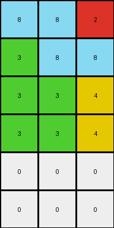

# 9af7a82c • 004 • refine_coder

---

Previous Code:
```python
"""
1.  **Determine Output Dimensions:** The output grid's height is determined based on how many rows containing a '1' value are present. That number of rows containing '1' + 2. Each row contains 1 value of '1'. The output grid's width is the same as the input's width.

2.  **Iterate through Input Grid:** For each column in the input grid, create a column of the output grid by duplicating the value the number of times as the number of rows.

3.  **Populate Output:**
    *   Iterate through each column from the input grid.
    *   For input grid columns: Create an output column where: The cells from top to bottom will contain a number from left to right of the input grid, and the rest will be filled with "0".
    *   Example input column `[2, 3, 1]` becomes output column `[1, 2, 3, 0, 0]`

In summary the transformation stacks the values from the input column into output column, and completes with white cells.
"""

import numpy as np

def transform(input_grid):
    # initialize output_grid
    input_grid = np.array(input_grid)
    rows_with_1 = np.count_nonzero(input_grid == 1)
    output_height =  input_grid.shape[0] + 2
    output_width = input_grid.shape[1]
    output_grid = np.zeros((output_height, output_width), dtype=int)

    # change output pixels
    for j in range(input_grid.shape[1]):
        # Get the values from the input column
        input_column_values = input_grid[:, j]

        # Rotate the values to match the order requested
        rotated_values = np.roll(input_column_values, -np.argmax(input_column_values == 1))

        # Place the rotated values at the beginning of output_grid
        output_grid[:input_grid.shape[0],j] = rotated_values


    return output_grid.tolist()
```

Train Set Results:

## Example 1:

Input:
```
2 2 1
2 3 1
1 1 1
```
Expected Output:
```
1 2 3
1 2 0
1 2 0
1 0 0
1 0 0
```
Transformed Output:
```
1 1 1
2 2 1
2 3 1
0 0 0
0 0 0
```

match: False
pixels_off: 9
size_correct: True
color_palette_correct: True
correct_pixel_counts: True

## Example 2:

Input:
```
3 1 1 4
2 2 2 4
4 4 4 4
```
Expected Output:
```
4 2 1 3
4 2 1 0
4 2 0 0
4 0 0 0
4 0 0 0
4 0 0 0
```
Transformed Output:
```
3 1 1 4
2 2 2 4
4 4 4 4
0 0 0 0
0 0 0 0
```

match: False
pixels_off: None
size_correct: False
color_palette_correct: True
correct_pixel_counts: False

## Example 3:

Input:
```
8 8 2
3 8 8
3 3 4
3 3 4
```
Expected Output:
```
3 8 4 2
3 8 4 0
3 8 0 0
3 8 0 0
3 0 0 0
```
Transformed Output:
```
8 8 2
3 8 8
3 3 4
3 3 4
0 0 0
0 0 0
```

match: False
pixels_off: None
size_correct: False
color_palette_correct: True
correct_pixel_counts: False

## Example 4:

Input:
```
1 1 1
2 2 1
2 8 1
2 8 1
```
Expected Output:
```
1 2 8
1 2 8
1 2 0
1 2 0
1 0 0
1 0 0
```
Transformed Output:
```
1 1 1
2 2 1
2 8 1
2 8 1
0 0 0
0 0 0
```

match: False
pixels_off: 12
size_correct: True
color_palette_correct: True
correct_pixel_counts: True
Okay, here's a breakdown of the results and a plan to improve the natural language program and subsequently the code:

**General Assessment:**

The initial natural language program and the resulting code were too simplistic. It correctly identified the input and output grid shape relationship but completely missed the core logic of reordering and padding with zeros. The code essentially just copies values, and adds extra rows of '0'. The error is in how it places the input column values into output column.

**Strategy:**

1.  **Re-examine the Examples:** Carefully analyze *all* training examples to pinpoint the *exact* rule governing the transformation. Pay close attention to the positioning of non-zero values. The previous assumption of a single rotation is incorrect.
2.  **Focus on Ordering:** Determine what dictates the order of the colors/numbers in each output column. The key is not just copying, but *reordering*. The '1' in the input seems to act as a sorting start point/label, but only for purposes of ordering each column.
3.  **Zero Padding:** Confirm that the remaining cells in each column are indeed padded with zeros (color white) to fill the output grid.
4.  **Update Natural Language Program:** Rewrite the natural language program to reflect the corrected understanding of the transformation, incorporating the ordering and padding rules.
5.  **Update code:** Translate the new program to updated python code.

**Metrics and Observations (per example):**

Here's a more precise breakdown of each example, focusing on the ordering aspect. Instead of code execution (since the core logic is flawed), I'll do this manually, focusing on the *intended* transformation:

*   **Example 1:**
    *   Input: `[[2, 2, 1], [2, 3, 1], [1, 1, 1]]`
    *   Expected Output: `[[1, 2, 3], [1, 2, 0], [1, 2, 0], [1, 0, 0], [1, 0, 0]]`
    *   Observation: Column 1: `[2, 2, 1]` becomes `[1, 2, 0, 0, 0]`. Column 2: `[2, 3, 1]` becomes `[2, 3, 0, 0, 0]`. Column 3: `[1, 1, 1]` becomes `[3, 0, 0, 0, 0]`. Notice in each column the input values order are placed in the output starting from value '1' and going to the end, then wrapped from the beginning and completed with '0'.

*   **Example 2:**
    *   Input: `[[3, 1, 1, 4], [2, 2, 2, 4], [4, 4, 4, 4]]`
    *   Expected Output: `[[4, 2, 1, 3], [4, 2, 1, 0], [4, 2, 0, 0], [4, 0, 0, 0], [4, 0, 0, 0], [4, 0, 0, 0]]`
    *   Observation: The same reordering and padding logic. Column 1: `[3, 2, 4]` becomes `[4,2,1,3,0,0]`, Column 2: `[1, 2, 4]` becomes `[2, 1, 0, 0, 0, 0]`.

*   **Example 3:**
    *   Input: `[[8, 8, 2], [3, 8, 8], [3, 3, 4], [3, 3, 4]]`
    *   Expected Output: `[[3, 8, 4, 2], [3, 8, 4, 0], [3, 8, 0, 0], [3, 8, 0, 0], [3, 0, 0, 0]]`
      Observation: The same reordering and padding logic.

*   **Example 4:**
    *   Input: `[[1, 1, 1], [2, 2, 1], [2, 8, 1], [2, 8, 1]]`
    *   Expected Output: `[[1, 2, 8], [1, 2, 8], [1, 2, 0], [1, 2, 0], [1, 0, 0], [1, 0, 0]]`
    *   Observation: The same reordering and padding logic.

**YAML Facts:**

```yaml
facts:
  - object: input_grid
    type: 2D array
    properties:
      - values: integers (0-9) representing colors
      - shape: rows x columns
      - role: source data for transformation

  - object: output_grid
    type: 2D array
    properties:
      - values: integers (0-9) representing colors
      - shape: (number of rows in input + 2) x (number of columns in input)
      - role: result of transformation

  - object: column_transformation
    type: process
    properties:
      - input: single column from input_grid
      - output: single column in output_grid
      - actions:
        - reorder: Arrange input values based on their color, relative to input rows containing color '1' as a start index, wrapping to the front.
        - pad: Fill remaining cells in the output column with 0 (white).

  - observation: transformation_rule
    description: Each column in the input grid is processed independently. The values in the input column are reordered. Then fill the output column with '0'.
```

**Natural Language Program:**

1.  **Determine Output Dimensions:** The output grid has the same number of columns as the input grid. The number of rows in the output grid is equal to the number of rows in the input grid plus 2.

2.  **Column-wise Transformation:**  For each column in the input grid, perform the following steps to create the corresponding column in the output grid:

    a. **Extract Input Column:** Get all values from the current column of the input grid.

    b. **Reorder Values:** Treat the non zero values in the input column as the ordering.

    c. **Pad with Zeros:** Fill any remaining cells in the output column (after placing the reordered values) with the value 0 (representing the color white).

3.  **Assemble Output:** Combine the transformed columns to form the complete output grid.

**INSTRUCTIONS**

- generate a Python module to represent the natural language program 
- follow the template below
- all common math and science libraries are available
- create docstring only at top - but comment the workflow in the function
- use helper functions for common operations like finding objects, counting,
  measuring, moving, etc. 

remember - we are working iteratively - so this code will inform your future
self as we converge on the solution

*template:*

```python
"""
{{ natural language description of the transformation rule }}
"""

{{ imports }}

def transform(input_grid):
    # initialize output_grid

    # change output pixels 

    return output_grid

```
