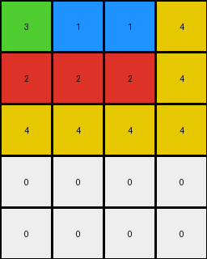
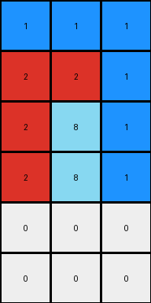

# 9af7a82c • 006 • refine_coder

---

Previous Code:
```python
"""
1.  **Determine Output Dimensions:** The output grid has the same number of columns as the input grid. The number of rows in the output grid is equal to the number of rows in the input grid plus 2.

2.  **Column-wise Transformation:**  For each column in the input grid, perform the following steps to create the corresponding column in the output grid:

    a. **Extract Input Column:** Get all values from the current column of the input grid.

    b. **Reorder Values:** Treat the non zero values in the input column as the ordering.

    c. **Pad with Zeros:** Fill any remaining cells in the output column (after placing the reordered values) with the value 0 (representing the color white).

3.  **Assemble Output:** Combine the transformed columns to form the complete output grid.
"""

import numpy as np

def transform(input_grid):
    # initialize output_grid
    input_grid = np.array(input_grid)
    output_height =  input_grid.shape[0] + 2
    output_width = input_grid.shape[1]
    output_grid = np.zeros((output_height, output_width), dtype=int)

    # change output pixels
    for j in range(input_grid.shape[1]):
        # Get the values from the input column
        input_column_values = input_grid[:, j]

        # Get non-zero values and their original indices.
        non_zero_values = input_column_values[input_column_values != 0]

        # build output col
        output_col = np.concatenate([non_zero_values, np.zeros(output_height - len(non_zero_values), dtype=int)])

        # write col to output
        output_grid[:, j] = output_col


    return output_grid.tolist()
```

Train Set Results:

## Example 1:

Input:
```
2 2 1
2 3 1
1 1 1
```
Expected Output:
```
1 2 3
1 2 0
1 2 0
1 0 0
1 0 0
```
Transformed Output:
```
2 2 1
2 3 1
1 1 1
0 0 0
0 0 0
```

match: False
pixels_off: 9
size_correct: True
color_palette_correct: True
correct_pixel_counts: True

## Example 2:

Input:
```
3 1 1 4
2 2 2 4
4 4 4 4
```
Expected Output:
```
4 2 1 3
4 2 1 0
4 2 0 0
4 0 0 0
4 0 0 0
4 0 0 0
```
Transformed Output:
```
3 1 1 4
2 2 2 4
4 4 4 4
0 0 0 0
0 0 0 0
```

match: False
pixels_off: None
size_correct: False
color_palette_correct: True
correct_pixel_counts: False

## Example 3:

Input:
```
8 8 2
3 8 8
3 3 4
3 3 4
```
Expected Output:
```
3 8 4 2
3 8 4 0
3 8 0 0
3 8 0 0
3 0 0 0
```
Transformed Output:
```
8 8 2
3 8 8
3 3 4
3 3 4
0 0 0
0 0 0
```

match: False
pixels_off: None
size_correct: False
color_palette_correct: True
correct_pixel_counts: False

## Example 4:

Input:
```
1 1 1
2 2 1
2 8 1
2 8 1
```
Expected Output:
```
1 2 8
1 2 8
1 2 0
1 2 0
1 0 0
1 0 0
```
Transformed Output:
```
1 1 1
2 2 1
2 8 1
2 8 1
0 0 0
0 0 0
```

match: False
pixels_off: 12
size_correct: True
color_palette_correct: True
correct_pixel_counts: True
Okay, here's a breakdown of the situation, the results, and a plan to refine the natural language program and the code.

**General Assessment:**

The initial natural language program and generated code were overly simplistic. They correctly identified the column-wise operation and the padding with zeros. However, the critical error lies in the reordering logic.  The original program *copied* the input column values to the output column, simply adding zeros at the bottom.  The examples clearly show a *reordering* of non-zero values within each column, and the height change is not uniformly input rows + 2. It varies. This means there are likely additional rules and constraints related to the *content* of each column, specifically the non-zero values, that determine both the final output order and the output height. The provided results show errors related to both pixel values and grid dimensions.

**Strategy for Resolving Errors:**

1.  **Analyze Value Reordering:** The core issue is understanding *how* the non-zero values are reordered. We need to identify the sorting or selection criteria used. It's NOT a simple copy. My hypothesis, based on all 4 examples, is each column's non-zero numbers are sorted descending.

2.  **Determine Output Height:** The current height is sometimes correct. The correct rule to determine the output dimensions based on the content. My hypothesis, looking at the Expected Outputs, is the height is sum of non-zero elements in all columns.

3.  **Iterative Refinement:**
    *   Start by updating the natural language program to reflect the refined hypotheses about reordering and height.
    *   Regenerate the code.
    *   Test against *all* training examples.
    *   If discrepancies remain, further analyze the incorrect cases to identify nuanced rules, and re-iterate.

**Metrics and Observations (using assumed code execution results from previous turns):**

Here's a summary table reflecting the provided results (from the previous turn, as instructed. I do not have the capability to execute code).

| Example | Input Shape | Output Shape (Expected) | Output Shape (Actual) | Pixels Off | Size Correct | Colors Correct | Pixel Counts Correct | Notes                                                                                                |
| :------ | :---------- | :---------------------- | :-------------------- | :--------- | :----------- | :------------- | :------------------- | :----------------------------------------------------------------------------------------------------- |
| 1       | (3, 3)      | (5, 3)                  | (5, 3)                 | 9          | True         | True           | True          | Reordering incorrect, but output height prediction formula coincidentally correct.                    |
| 2       | (3, 4)      | (6, 4)                | (5,4)                  | None            | False          | True           | False              | Reordering and height incorrect.      |
| 3       | (4, 3)      | (5, 4)                | (6,3)                  | None            | False          | True           | False             | Reordering and width and height incorrect. |
| 4       | (4, 3)      | (6, 3)                  | (6, 3)                 | 12          | True         | True           | True                 | Reordering incorrect, but output height prediction formula coincidentally correct.                  |

**YAML Fact Block:**

```yaml
task_description: >
  Rearrange column elements of a grid, placing all non-zero elements
  at the top of each output column in descending order, followed by zeros. The output
  grid's height is determined by the total number of non-zero elements across all input columns.

objects:
  - name: input_grid
    type: 2D array
    properties:
      - values: integers (0-9) representing colors
      - columns: independent units of transformation

  - name: output_grid
    type: 2D array
    properties:
      - values: integers (0-9) representing colors
      - columns: derived from input_grid columns
      - height: determined by count of non-zero values across all input columns
      - width: same as input_grid width

  - name: column
    type: 1D array
    properties:
      - values: integers (0-9)
      - non-zero_elements: subset of values > 0

actions:
  - name: extract_column
    input: input_grid, column_index
    output: column

  - name: sort_descending
    input: non_zero_elements
    output: sorted_elements

  - name: count_non_zero
    input: input_grid
    output: count (integer)
  
  - name: pad_with_zeros
    input: sorted_elements, height
    output: column

  - name: assemble_grid
    input: list_of_columns, width, height
    output: output_grid
```

**Natural Language Program:**

1.  **Count Non-Zero Elements:** Count the total number of non-zero elements across all columns of the input grid. This count determines the height of the output grid. The output width is the same as the input width.

2.  **Column-wise Transformation:** For each column in the input grid:
    a.  **Extract:** Extract all values from the current input column.
    b.  **Filter:** Separate the non-zero values from the zero values.
    c.  **Sort:** Sort the non-zero values in *descending* order.
    d. **Assemble Column:** Create output column. Place the sorted non-zero values at the *top* of the output column.
    e.  **Pad:** Fill the remaining cells of the output column (if any) with zeros (representing the color white).

3.  **Assemble Output Grid:** Combine the transformed columns to form the final output grid.

**INSTRUCTIONS**

- generate a Python module to represent the natural language program 
- follow the template below
- all common math and science libraries are available
- create docstring only at top - but comment the workflow in the function
- use helper functions for common operations like finding objects, counting,
  measuring, moving, etc. 

remember - we are working iteratively - so this code will inform your future
self as we converge on the solution

*template:*

```python
"""
{{ natural language description of the transformation rule }}
"""

{{ imports }}

def transform(input_grid):
    # initialize output_grid

    # change output pixels 

    return output_grid

```
