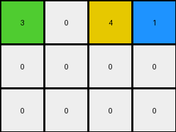

# 9af7a82c • 015 • refine_dreamer

---


Previous Code:
```python
"""
The transformation involves finding the positions of colors '3','8','4' and '2' in the input, preserving those, reordering the '4' and'2' columns, and setting cells to zero (white) below maintained elements.
"""

import numpy as np

def get_column(grid, col_index):
    return grid[:, col_index]

def set_column(grid, col_index, col_values):
    grid[:, col_index] = col_values

def find_first_instance_in_column(column, value):
     for i, val in enumerate(column):
        if val == value:
           return i
     return -1

def transform(input_grid):
    # initialize output_grid
    rows, cols = input_grid.shape
    output_grid = np.zeros((rows, cols), dtype=int)

    #find relevant columns
    col_3 = -1
    col_8 = -1
    col_4 = -1
    col_2 = -1

    for i in range(cols):
      col = get_column(input_grid, i)
      if find_first_instance_in_column(col, 3) != -1:
        col_3 = i
      if find_first_instance_in_column(col, 8) != -1:
        col_8 = i
      if find_first_instance_in_column(col, 4) != -1:
        col_4 = i
      if find_first_instance_in_column(col, 2) != -1:
        col_2 = i

    # copy and reorder the found columns to their new spot
    if (col_3 != -1):
       set_column(output_grid, 0, get_column(input_grid, col_3))
    if (col_8 != -1):
       set_column(output_grid, 1, get_column(input_grid, col_8))
    if (col_4 != -1):
       set_column(output_grid, 2, get_column(input_grid, col_4))
    if (col_2 != -1):
      set_column(output_grid, 3, get_column(input_grid, col_2))
    

    # zero out below maintained elements
    for c in range(cols):
        first_non_zero = -1
        for r in range(rows):
          if output_grid[r][c] != 0:
             first_non_zero = r
             break
        if first_non_zero != -1:
          for r in range(first_non_zero + 1, rows):
             output_grid[r][c] = 0

    return output_grid
```

Train Set Results:

## Example 1:

Input:
```
2 2 1
2 3 1
1 1 1
```
Expected Output:
```
1 2 3
1 2 0
1 2 0
1 0 0
1 0 0
```
match: ERROR: index 3 is out of bounds for axis 1 with size 3
pixels_off: None
size_correct: None
color_palette_correct: None
correct_pixel_counts: None

## Example 2:

Input:
```
3 1 1 4
2 2 2 4
4 4 4 4
```
Expected Output:
```
4 2 1 3
4 2 1 0
4 2 0 0
4 0 0 0
4 0 0 0
4 0 0 0
```
Transformed Output:
```
3 0 4 1
0 0 0 0
0 0 0 0
```

match: False
pixels_off: None
size_correct: False
color_palette_correct: True
correct_pixel_counts: False

## Example 3:

Input:
```
8 8 2
3 8 8
3 3 4
3 3 4
```
Expected Output:
```
3 8 4 2
3 8 4 0
3 8 0 0
3 8 0 0
3 0 0 0
```
match: ERROR: index 3 is out of bounds for axis 1 with size 3
pixels_off: None
size_correct: None
color_palette_correct: None
correct_pixel_counts: None

## Example 4:

Input:
```
1 1 1
2 2 1
2 8 1
2 8 1
```
Expected Output:
```
1 2 8
1 2 8
1 2 0
1 2 0
1 0 0
1 0 0
```
match: ERROR: index 3 is out of bounds for axis 1 with size 3
pixels_off: None
size_correct: None
color_palette_correct: None
correct_pixel_counts: None

**INSTRUCTIONS**

The code above was generated based on observations from the first training
example

we have tested the transform function on each of the task example inputs and
compared with the expected output

review each of the examples provided and the results and consider how the
natural language program should be updated to accommodate this new knowledge

respond with the following deliverables:

- general assessment of the information provided and strategy for resolving the
  errors
- gather metrics about each of the examples and results - use code_execution to
  develop accurate reports on your assumptions
- a YAML block documenting facts - Focus on identifying objects, their properties, and the actions performed on them.
- a natural language program - Be as clear and concise as possible, providing a complete description of the transformation rule.


your responses should be considered as information in a report - not a
conversation
