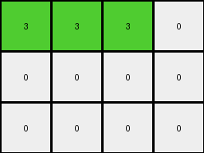

# 9af7a82c • 017 • refine_dreamer

---


Previous Code:
```python
"""
The transformation identifies columns containing the colors 3, 8, 4, or 2, preserves the elements at and above the first occurrence of these colors within those columns, stacks these preserved sections downwards in the output grid, and sets all cells below the stacked sections to 0. The preserved column sections maintain their 3, 8, 4, 2 order.
"""

import numpy as np

def find_first_occurrence(grid, color):
    """Finds the first occurrence of a color in a grid, column-wise."""
    rows, cols = grid.shape
    for j in range(cols):
        for i in range(rows):
            if grid[i, j] == color:
                return i, j
    return None, None

def transform(input_grid):
    # initialize output_grid
    rows, cols = input_grid.shape
    output_grid = np.zeros((rows, cols), dtype=int)
    color_order = [3, 8, 4, 2]
    
    # find first occurrences and their original column indices
    occurrences = []
    for color in color_order:
        row, col = find_first_occurrence(input_grid, color)
        if row is not None:
            occurrences.append((row, col, color))
    
    # Determine output height based on stacked sections
    output_rows = 0
    for row, col, _ in occurrences:
      output_rows = max(output_rows,rows)


    output_grid = np.zeros((output_rows, cols), dtype=int)

    # preserve, reorder, and stack in the new grid
    target_col = 0
    for row, col, color in occurrences:
        # Copy the relevant section of the column
        for i in range(row + 1):
            output_grid[i, target_col] = input_grid[i, col]
        target_col += 1
    
    #zero-out
    for j in range(cols):
       first_non_zero_row = -1
       for i in range(output_rows):
          if output_grid[i][j] != 0:
             first_non_zero_row = i
             break

       if first_non_zero_row != -1:  # found the color
           for i in range(first_non_zero_row + 1, output_rows):
              output_grid[i][j] = 0  # zero out
    

    return output_grid
```

Train Set Results:

## Example 1:

Input:
```
2 2 1
2 3 1
1 1 1
```
Expected Output:
```
1 2 3
1 2 0
1 2 0
1 0 0
1 0 0
```
Transformed Output:
```
2 2 0
0 0 0
0 0 0
```

match: False
pixels_off: None
size_correct: False
color_palette_correct: True
correct_pixel_counts: False

## Example 2:

Input:
```
3 1 1 4
2 2 2 4
4 4 4 4
```
Expected Output:
```
4 2 1 3
4 2 1 0
4 2 0 0
4 0 0 0
4 0 0 0
4 0 0 0
```
Transformed Output:
```
3 3 3 0
0 0 0 0
0 0 0 0
```

match: False
pixels_off: None
size_correct: False
color_palette_correct: True
correct_pixel_counts: False

## Example 3:

Input:
```
8 8 2
3 8 8
3 3 4
3 3 4
```
Expected Output:
```
3 8 4 2
3 8 4 0
3 8 0 0
3 8 0 0
3 0 0 0
```
match: ERROR: index 3 is out of bounds for axis 1 with size 3
pixels_off: None
size_correct: None
color_palette_correct: None
correct_pixel_counts: None

## Example 4:

Input:
```
1 1 1
2 2 1
2 8 1
2 8 1
```
Expected Output:
```
1 2 8
1 2 8
1 2 0
1 2 0
1 0 0
1 0 0
```
Transformed Output:
```
1 1 0
0 0 0
0 0 0
0 0 0
```

match: False
pixels_off: None
size_correct: False
color_palette_correct: True
correct_pixel_counts: False

**INSTRUCTIONS**

The code above was generated based on observations from the first training
example

we have tested the transform function on each of the task example inputs and
compared with the expected output

review each of the examples provided and the results and consider how the
natural language program should be updated to accommodate this new knowledge

respond with the following deliverables:

- general assessment of the information provided and strategy for resolving the
  errors
- gather metrics about each of the examples and results - use code_execution to
  develop accurate reports on your assumptions
- a YAML block documenting facts - Focus on identifying objects, their properties, and the actions performed on them.
- a natural language program - Be as clear and concise as possible, providing a complete description of the transformation rule.


your responses should be considered as information in a report - not a
conversation
