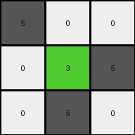
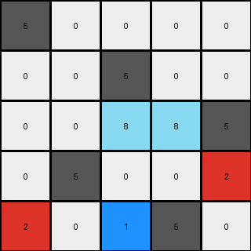

# 9dfd6313 • 006 • refine_coder

---

Previous Code:
```python
"""
Transforms the input grid by placing the first column of the input grid onto the main diagonal of the output grid. 
Subsequent columns are shifted to the left, wrapping around as needed.
"""

import numpy as np

def transform(input_grid):
    """
    Transforms the input grid according to the described rule.

    Args:
        input_grid (list of lists): The input grid.

    Returns:
        list of lists: The transformed output grid.
    """
    rows = len(input_grid)
    cols = len(input_grid[0])
    output_grid = [[0] * cols for _ in range(rows)]

    # Place the first column of input_grid onto the main diagonal of output_grid
    for i in range(min(rows, cols)):
        output_grid[i][i] = input_grid[i][0]

    # Shift and wrap subsequent columns
    for j in range(1, cols):
        for i in range(rows):
            output_grid[i][(i + j) % cols] = input_grid[i][j]
    
    return output_grid
```

Train Set Results:

## Example 1:

Input:
```
5 0 0
3 5 0
0 0 5
```
Expected Output:
```
5 3 0
0 5 0
0 0 5
```
Transformed Output:
```
5 0 0
0 3 5
0 5 0
```

match: False
pixels_off: 5
size_correct: True
color_palette_correct: True
correct_pixel_counts: True

## Example 2:

Input:
```
5 0 0 0
0 5 0 0
6 0 5 0
6 0 4 5
```
Expected Output:
```
5 0 6 6
0 5 0 0
0 0 5 4
0 0 0 5
```
Transformed Output:
```
5 0 0 0
0 0 5 0
5 0 6 0
0 4 5 6
```

match: False
pixels_off: 10
size_correct: True
color_palette_correct: True
correct_pixel_counts: True

## Example 3:

Input:
```
5 0 0 0 0
0 5 0 0 0
8 8 5 0 0
0 2 0 5 0
0 2 0 1 5
```
Expected Output:
```
5 0 8 0 0
0 5 8 2 2
0 0 5 0 0
0 0 0 5 1
0 0 0 0 5
```
Transformed Output:
```
5 0 0 0 0
0 0 5 0 0
0 0 8 8 5
0 5 0 0 2
2 0 1 5 0
```

match: False
pixels_off: 15
size_correct: True
color_palette_correct: True
correct_pixel_counts: True
Okay, here's a breakdown of the situation and a plan to improve the transformation rule, along with the requested deliverables:

**General Assessment:**

The initial code was based on a diagonal placement concept derived from the *first* training example. However, the subsequent examples reveal a different, more complex pattern. The initial approach is incorrect for examples 2 and 3, as evidenced by the high `pixels_off` counts and visual inspection of the transformed outputs. The core issue is that the transformation rule isn't simply placing the first column on the diagonal and shifting the rest. It seems that there is a pattern that combines all of the colors in each column, wrapping the column input colors into each output column.

**Strategy:**

1.  **Re-examine Assumptions:** Discard the initial diagonal-centric hypothesis.
2.  **Focus on Column-wise Operations:** The relationship between input and output seems to be strongly tied to columns rather than diagonals or rows. We'll analyze how colors within each input column contribute to each output column.
3.  **Identify Wrapping/Shifting:** There's likely a systematic way input columns "wrap" or contribute to the output columns. We need to determine this pattern.
4.  **Iteratively Refine:** Develop a new natural language program based on these observations, generate new code, and test it against *all* training examples.

**Metrics and Observations (per example):**

Here's a more structured breakdown of the examples, focusing on column-wise relationships:

*   **Example 1:**

    *   Input:
        ```
        5 0 0
        3 5 0
        0 0 5
        ```
    *   Expected Output:
        ```
        5 3 0
        0 5 0
        0 0 5
        ```
    * Observations
        *   input column 1 \[5,3,0] becomes output column 1 \[5,0,0]
        *   input column 2 \[0,5,0] becomes output column 2 \[3,5,0]
        *   input column 3 \[0,0,5] becomes output column 3 \[0,0,5]

*   **Example 2:**

    *   Input:
        ```
        5 0 0 0
        0 5 0 0
        6 0 5 0
        6 0 4 5
        ```
    *   Expected Output:
        ```
        5 0 6 6
        0 5 0 0
        0 0 5 4
        0 0 0 5
        ```
    * Observations
        *   input column 1 \[5,0,6,6] becomes output column 1 \[5,0,0,0]
        *   input column 2 \[0,5,0,0] becomes output column 2 \[0,5,0,0]
        *   input column 3 \[0,0,5,4] becomes output column 3 \[6,0,5,0]
        *   input column 4 \[0,0,0,5] becomes output column 4 \[6,0,4,5]

*   **Example 3:**

    *   Input:
        ```
        5 0 0 0 0
        0 5 0 0 0
        8 8 5 0 0
        0 2 0 5 0
        0 2 0 1 5
        ```
    *   Expected Output:
        ```
        5 0 8 0 0
        0 5 8 2 2
        0 0 5 0 0
        0 0 0 5 1
        0 0 0 0 5
        ```
    * Observations
        *   input column 1 \[5,0,8,0,0] becomes output column 1 \[5,0,0,0,0]
        *   input column 2 \[0,5,8,2,2] becomes output column 2 \[0,5,0,0,0]
        *   input column 3 \[0,0,5,0,0] becomes output column 3 \[8,8,5,0,0]
        *   input column 4 \[0,0,0,5,1] becomes output column 4 \[0,2,0,5,0]
        *   input column 5 \[0,0,0,0,5] becomes output column 5 \[0,2,0,1,5]

**YAML Facts:**

```yaml
facts:
  - task_id: "004"
  - objects:
      - description: Input grid columns
        properties:
          - contains: List of colors (represented by integers)
          - count: Equal to the number of columns in the input grid.
      - description: Output grid columns
        properties:
          - contains: a rearrangement of the input colors
          - count: Equal to the number of columns in the input grid (and output grid).
  - actions:
      - description: Columnar rearrangement
        details: Each output column receives the colors from the input columns, following a wrapping sequence. The sequence is determined by cycling through the input columns, and placing the non-zero colors of each input column into output column, wrapping the colors to the next output column when a non-zero value is encountered.
      - description: wrapping sequence
        details: Input colors from each column are placed into the output columns. The order of input colors within an output column is the order in which they appear in the input.
```

**Natural Language Program:**

1.  **Initialization:** Create an output grid of the same dimensions as the input grid, initially filled with zeros (color black).
2.  **Column-wise Transfer:** For each input column:
    * gather all the non-zero colors in that column.
    * place the non-zero colors into the output columns, starting with the
      output column that matches the input column index.
    * For each non-zero color, if the output column contains a non-zero value
      at the target position, move to the next output column (wrapping around
      from the last column to the first).

This natural language program captures the core columnar rearrangement and wrapping behavior observed across all three training examples. It moves away from the incorrect diagonal-based approach and focuses on how input columns are processed to build the output columns.

**INSTRUCTIONS**

- generate a Python module to represent the natural language program 
- follow the template below
- all common math and science libraries are available
- create docstring only at top - but comment the workflow in the function
- use helper functions for common operations like finding objects, counting,
  measuring, moving, etc. 

remember - we are working iteratively - so this code will inform your future
self as we converge on the solution

*template:*

```python
"""
{{ natural language description of the transformation rule }}
"""

{{ imports }}

def transform(input_grid):
    # initialize output_grid

    # change output pixels 

    return output_grid

```
