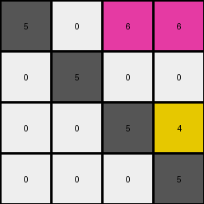
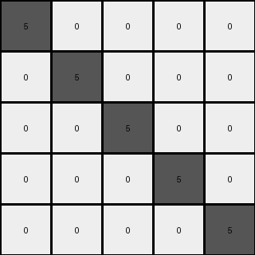

# 9dfd6313 • 009 • refine_dreamer

---


Previous Code:
```python
"""
The transformation rearranges colored pixels (non-zero) within a 4x4 grid. Gray (5) pixels remain stationary. Magenta (6) pixels move to the top-right, preserving their original column-then-row order. The yellow (4) pixel moves to the position immediately above the bottom-right gray pixel. All other cells are filled with white (0).
"""

import numpy as np

def get_colored_pixels(grid, color):
    """
    Finds the coordinates of all pixels of a specified color.
    Returns a list of (row, col) tuples.
    """
    pixels = []
    for row in range(grid.shape[0]):
        for col in range(grid.shape[1]):
            if grid[row, col] == color:
                pixels.append((row, col))
    return pixels

def transform(input_grid):
    # Initialize output grid with all zeros (white)
    output_grid = np.zeros_like(input_grid)

    # Keep gray (5) pixels in place
    gray_pixels = get_colored_pixels(input_grid, 5)
    for row, col in gray_pixels:
        output_grid[row, col] = 5

    # Move magenta (6) pixels to top-right, preserving order
    magenta_pixels = get_colored_pixels(input_grid, 6)
    magenta_pixels.sort(key=lambda x: (x[1], x[0]))  # Sort by column, then row
    magenta_target_row = 0
    magenta_target_col = 2
    
    for _ in magenta_pixels:
      output_grid[magenta_target_row, magenta_target_col] = 6
      magenta_target_col +=1
      if magenta_target_col > 3:
        magenta_target_row += 1
        magenta_target_col = 2
    
    # Move yellow (4) pixel above the bottom-right gray (5)
    yellow_pixels = get_colored_pixels(input_grid, 4)
    if yellow_pixels:  # Check if there's a yellow pixel
        bottom_right_five = None
        for r in range(input_grid.shape[0]-1, -1, -1):
          for c in range(input_grid.shape[1]-1, -1, -1):
            if input_grid[r,c] == 5:
              bottom_right_five = (r,c)
              break
          if bottom_right_five:
            break

        if bottom_right_five:
          target_row = bottom_right_five[0] -1
          target_col = bottom_right_five[1]
          if target_row >= 0:
            output_grid[target_row, target_col] = 4


    return output_grid
```

Train Set Results:

## Example 1:

Input:
```
5 0 0
3 5 0
0 0 5
```
Expected Output:
```
5 3 0
0 5 0
0 0 5
```
Transformed Output:
```
5 0 0
0 5 0
0 0 5
```

match: False
pixels_off: 1
size_correct: True
color_palette_correct: True
correct_pixel_counts: False

## Example 2:

Input:
```
5 0 0 0
0 5 0 0
6 0 5 0
6 0 4 5
```
Expected Output:
```
5 0 6 6
0 5 0 0
0 0 5 4
0 0 0 5
```
Transformed Output:
```
5 0 6 6
0 5 0 0
0 0 5 4
0 0 0 5
```

match: True
pixels_off: 0
size_correct: True
color_palette_correct: True
correct_pixel_counts: True

## Example 3:

Input:
```
5 0 0 0 0
0 5 0 0 0
8 8 5 0 0
0 2 0 5 0
0 2 0 1 5
```
Expected Output:
```
5 0 8 0 0
0 5 8 2 2
0 0 5 0 0
0 0 0 5 1
0 0 0 0 5
```
Transformed Output:
```
5 0 0 0 0
0 5 0 0 0
0 0 5 0 0
0 0 0 5 0
0 0 0 0 5
```

match: False
pixels_off: 5
size_correct: True
color_palette_correct: True
correct_pixel_counts: False

**INSTRUCTIONS**

The code above was generated based on observations from the first training
example

we have tested the transform function on each of the task example inputs and
compared with the expected output

review each of the examples provided and the results and consider how the
natural language program should be updated to accommodate this new knowledge

respond with the following deliverables:

- general assessment of the information provided and strategy for resolving the
  errors
- gather metrics about each of the examples and results - use code_execution to
  develop accurate reports on your assumptions
- a YAML block documenting facts - Focus on identifying objects, their properties, and the actions performed on them.
- a natural language program - Be as clear and concise as possible, providing a complete description of the transformation rule.


your responses should be considered as information in a report - not a
conversation
