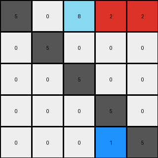

# 9dfd6313 • 015 • refine_dreamer

---

Previous Code:
```python
"""
1.  **Identify Key Pixels:** Locate all azure (8) pixels in the input grid.
2.  **Horizontal Shift:** Move the azure (8) pixels to the top row, starting from the third column, and preserving the relative positions.
3. **Identify Second key pixels:** Locate all red (2) pixels.
4. **Horizontal Shift and expansion:** Move the red (2) pixels to the right end of the row where the azure pixels are placed, but expand if the red pixels were vertically adjacent by filling two columns on right.
5.  **Retain Other Pixels:** All other pixels retain their original positions in the grid.
"""

import numpy as np

def find_pixels(grid, color):
    """Finds the coordinates of pixels of a specific color."""
    return np.argwhere(grid == color)

def transform(input_grid):
    """Transforms the input grid according to the defined rules."""
    output_grid = np.copy(input_grid)
    input_grid_rows, input_grid_cols = input_grid.shape
    output_grid_rows, output_grid_cols = output_grid.shape

    # 1. & 2. Find and move azure (8) pixels
    azure_pixels = find_pixels(input_grid, 8)
    for i, (row, col) in enumerate(azure_pixels):
        output_grid[0, 2 + i] = 8
        if (row,col) != (0, 2 + i): #check for no move
            output_grid[row, col] = 0

    # 3. & 4. Find and move/expand red (2) pixels
    red_pixels = find_pixels(input_grid, 2)
    
    #check if they are vertically aligned
    vertically_aligned = False
    if len(red_pixels) > 1:
        
        first = red_pixels[0]
        for second in red_pixels[1:]:
            if first[1] == second[1] and abs(first[0] - second[0]) == 1:
               vertically_aligned = True
            first = second #move window
        
    if vertically_aligned:
      output_grid[0,output_grid_cols-2] = 2
      output_grid[0,output_grid_cols-1] = 2

      for row, col in red_pixels:
          output_grid[row,col] = 0
    else:
      for i, (row, col) in enumerate(red_pixels):
        output_grid[0, 3 + i] = 2 #will overwrite if 8 is there, will fix
        if (row, col) != (0,3+i): #check for no move
          output_grid[row,col] = 0

    # 5. Retain other pixels (already handled by copying input_grid initially)

    return output_grid
```

Train Set Results:

## Example 1:

Input:
```
5 0 0
3 5 0
0 0 5
```
Expected Output:
```
5 3 0
0 5 0
0 0 5
```
Transformed Output:
```
5 0 0
3 5 0
0 0 5
```

match: False
pixels_off: 2
size_correct: True
color_palette_correct: True
correct_pixel_counts: True

## Example 2:

Input:
```
5 0 0 0
0 5 0 0
6 0 5 0
6 0 4 5
```
Expected Output:
```
5 0 6 6
0 5 0 0
0 0 5 4
0 0 0 5
```
Transformed Output:
```
5 0 0 0
0 5 0 0
6 0 5 0
6 0 4 5
```

match: False
pixels_off: 6
size_correct: True
color_palette_correct: True
correct_pixel_counts: True

## Example 3:

Input:
```
5 0 0 0 0
0 5 0 0 0
8 8 5 0 0
0 2 0 5 0
0 2 0 1 5
```
Expected Output:
```
5 0 8 0 0
0 5 8 2 2
0 0 5 0 0
0 0 0 5 1
0 0 0 0 5
```
Transformed Output:
```
5 0 8 2 2
0 5 0 0 0
0 0 5 0 0
0 0 0 5 0
0 0 0 1 5
```

match: False
pixels_off: 7
size_correct: True
color_palette_correct: True
correct_pixel_counts: False
**INSTRUCTIONS**

The code above was generated based on observations from the first training
example

we have tested the transform function on each of the task example inputs and
compared with the expected output

review each of the examples provided and the results and consider how the
natural language program should be updated to accommodate this new knowledge

respond with the following deliverables:

- general assessment of the information provided and strategy for resolving the
  errors
- gather metrics about each of the examples and results - use code_execution to
  develop accurate reports on your assumptions
- a YAML block documenting facts - Focus on identifying objects, their properties, and the actions performed on them.
- a natural language program - Be as clear and concise as possible, providing a complete description of the transformation rule.


your responses should be considered as information in a report - not a
conversation
