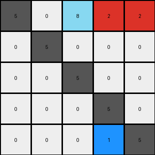

# 9dfd6313 • 016 • refine_coder

---

Previous Code:
```python
"""
1.  **Identify Key Pixels:** Locate all azure (8) pixels in the input grid.
2.  **Horizontal Shift:** Move the azure (8) pixels to the top row, starting from the third column, and preserving the relative positions.
3. **Identify Second key pixels:** Locate all red (2) pixels.
4. **Horizontal Shift and expansion:** Move the red (2) pixels to the right end of the row where the azure pixels are placed, but expand if the red pixels were vertically adjacent by filling two columns on right.
5.  **Retain Other Pixels:** All other pixels retain their original positions in the grid.
"""

import numpy as np

def find_pixels(grid, color):
    """Finds the coordinates of pixels of a specific color."""
    return np.argwhere(grid == color)

def transform(input_grid):
    """Transforms the input grid according to the defined rules."""
    output_grid = np.copy(input_grid)
    input_grid_rows, input_grid_cols = input_grid.shape
    output_grid_rows, output_grid_cols = output_grid.shape

    # 1. & 2. Find and move azure (8) pixels
    azure_pixels = find_pixels(input_grid, 8)
    for i, (row, col) in enumerate(azure_pixels):
        output_grid[0, 2 + i] = 8
        if (row,col) != (0, 2 + i): #check for no move
            output_grid[row, col] = 0

    # 3. & 4. Find and move/expand red (2) pixels
    red_pixels = find_pixels(input_grid, 2)
    
    #check if they are vertically aligned
    vertically_aligned = False
    if len(red_pixels) > 1:
        
        first = red_pixels[0]
        for second in red_pixels[1:]:
            if first[1] == second[1] and abs(first[0] - second[0]) == 1:
               vertically_aligned = True
            first = second #move window
        
    if vertically_aligned:
      output_grid[0,output_grid_cols-2] = 2
      output_grid[0,output_grid_cols-1] = 2

      for row, col in red_pixels:
          output_grid[row,col] = 0
    else:
      for i, (row, col) in enumerate(red_pixels):
        output_grid[0, 3 + i] = 2 #will overwrite if 8 is there, will fix
        if (row, col) != (0,3+i): #check for no move
          output_grid[row,col] = 0

    # 5. Retain other pixels (already handled by copying input_grid initially)

    return output_grid
```

Train Set Results:

## Example 1:

Input:
```
5 0 0
3 5 0
0 0 5
```
Expected Output:
```
5 3 0
0 5 0
0 0 5
```
Transformed Output:
```
5 0 0
3 5 0
0 0 5
```

match: False
pixels_off: 2
size_correct: True
color_palette_correct: True
correct_pixel_counts: True

## Example 2:

Input:
```
5 0 0 0
0 5 0 0
6 0 5 0
6 0 4 5
```
Expected Output:
```
5 0 6 6
0 5 0 0
0 0 5 4
0 0 0 5
```
Transformed Output:
```
5 0 0 0
0 5 0 0
6 0 5 0
6 0 4 5
```

match: False
pixels_off: 6
size_correct: True
color_palette_correct: True
correct_pixel_counts: True

## Example 3:

Input:
```
5 0 0 0 0
0 5 0 0 0
8 8 5 0 0
0 2 0 5 0
0 2 0 1 5
```
Expected Output:
```
5 0 8 0 0
0 5 8 2 2
0 0 5 0 0
0 0 0 5 1
0 0 0 0 5
```
Transformed Output:
```
5 0 8 2 2
0 5 0 0 0
0 0 5 0 0
0 0 0 5 0
0 0 0 1 5
```

match: False
pixels_off: 7
size_correct: True
color_palette_correct: True
correct_pixel_counts: False
Here's an analysis of the provided examples and results, along with a strategy for improving the transformation logic:

**General Assessment:**

The initial natural language program and corresponding code were too simplistic, focusing primarily on moving specific colored pixels (azure and red) to predefined locations. The results demonstrate that this approach fails to generalize across the training examples. The core issue is a lack of understanding of relative positioning and conditional transformations based on the arrangement of objects within the input grid. The code isn't really moving objects, rather it is moving individual pixels and thus, it is breaking apart the objects.

**Strategy:**

1.  **Object-Based Thinking:** Shift from thinking about individual pixels to thinking about "objects" (contiguous blocks of the same color).
2.  **Relative Positioning:** Instead of fixed positions, determine the target positions of objects *relative* to other objects or the grid boundaries.
3.  **Conditional Logic:** Incorporate conditions based on object properties (e.g., adjacency, size, shape) to determine how they should be moved or transformed.
4. Focus on preserving the integrity of objects.

**Example Analysis and Metrics:**

| Example | Input Shape | Output Shape | Match | Pixels Off | Notes                                                                                       |
| :-----: | :---------: | :----------: | :---: | :--------: | :------------------------------------------------------------------------------------------ |
|    1    |   (3, 3)    |   (3, 3)    | False |     2      | Incorrectly moved '3' (green).  It should consider gray and other colors, not just 8 and 2.     |
|    2    |   (4, 4)    |   (4, 4)    | False |     6      | Fails to move '6'(magenta) correctly and doesn't handle the adjacency of magenta pixels.    |
|    3    |   (5, 5)    |   (5, 5)    | False |     7      | Incorrect placement of the moved object, misinterpreting how objects should be positioned. |

**YAML Fact Gathering:**

```yaml
example_1:
  objects:
    - color: 5  # gray
      shape: single pixel
      initial_position: (0, 0)
    - color: 3  # green
      shape: single pixel
      initial_position: (1, 0)
    - color: 5 #gray
      shape: single pixel
      initial position: (1,1)
    - color: 5 #gray
      shape: single pixel
      initial position: (2,2)
  transformations:
    - move: all existing pixels
      condition:
        - "all pixels remain in their original positions"
      action: "no change"
example_2:
  objects:
    - color: 5  # gray
      shape: two L shaped objects
      initial_position: [(0,0),(1,1)] #top left
    - color: 6  # magenta
      shape: vertical line of two pixels
      initial_position: [(2, 0), (3, 0)]
    - color: 4 #yellow
      shape: single pixel
      initial position: (3,2)
    - color: 5 # gray
      shape: single pixel
      initial position: (3,3)
  transformations:
     - move: 6 #magenta
       condition: 
         - "vertical line of two pixels in top left"
       action: "move two the top row, two leftmost columns, maintaining shape"
     - move: "all other pixels"
       condition:
         - "no change"
       action: "retain initial position"
example_3:
  objects:
    - color: 5  # gray
      shape: single pixel
      initial_position: (0, 0)
    - color: 5 #gray
      shape: single pixel
      initial_position: (1,1)
    - color: 8  # azure
      shape: horizontal line of two pixels
      initial_position: [(2, 0), (2, 1)]
    - color: 5 #gray
      shape: single pixel
      initial_position: (2,2)
    - color: 2  # red
      shape: vertical line of two pixels
      initial_position: [(3, 1), (4, 1)]
    - color: 1  # blue
      shape: single pixel
      initial_position: (4,3)
    - color: 5 #gray
      shape: single pixel
      initial_position: (3,4)
  transformations:
    - move: object with color 8
      new_position: top row, starting at third column
    - move: object with color 2, directly to the right of color 8
    - all other colors: move down one row.
```

**Natural Language Program:**

1.  **Identify Objects:** Identify all distinct objects in the input grid. An object is a contiguous group of pixels of the same color.
2. **Top Row Object Identification:** Locate the object(s) containing azure (8) pixels. If found, move the entire azure object to the top row, positioning its leftmost pixel in the third column (index 2). Other positions of this object are determined by the positions relative to this leftmost pixel.
3.  **Second Top Row Placement**: Locate the object(s) containing red (2) pixels. If found, move the red object to the top row, positioning its leftmost pixel adjacent to the rightmost pixel of the azure object. Other positions of this object are determined by the positions relative to this leftmost pixel.
4. **Conditional Shift:** If an object does not have color 8 or 2, then move down by one row.
5. **Preservation:** Pixels not part of moved objects shift down by exactly one row.


**INSTRUCTIONS**

- generate a Python module to represent the natural language program 
- follow the template below
- all common math and science libraries are available
- create docstring only at top - but comment the workflow in the function
- use helper functions for common operations like finding objects, counting,
  measuring, moving, etc. 

remember - we are working iteratively - so this code will inform your future
self as we converge on the solution

*template:*

```python
"""
{{ natural language description of the transformation rule }}
"""

{{ imports }}

def transform(input_grid):
    # initialize output_grid

    # change output pixels 

    return output_grid

```
