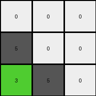
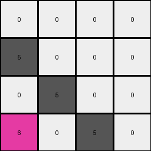
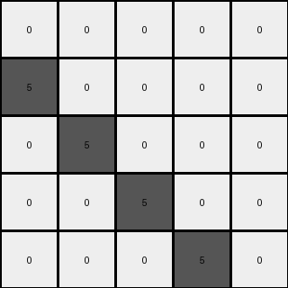

# 9dfd6313 • 017 • refine_dreamer

---


Previous Code:
```python
"""
1.  **Identify Objects:** Identify all distinct objects in the input grid. An object is a contiguous group of pixels of the same color.
2. **Top Row Object Identification:** Locate the object(s) containing azure (8) pixels. If found, move the entire azure object to the top row, positioning its leftmost pixel in the third column (index 2). Other positions of this object are determined by the positions relative to this leftmost pixel.
3.  **Second Top Row Placement**: Locate the object(s) containing red (2) pixels. If found, move the red object to the top row, positioning its leftmost pixel adjacent to the rightmost pixel of the azure object. Other positions of this object are determined by the positions relative to this leftmost pixel.
4. **Conditional Shift:** If an object does not have color 8 or 2, then move down by one row.
5. **Preservation:** Pixels not part of moved objects shift down by exactly one row.
"""

import numpy as np

def find_objects(grid):
    """Identifies distinct objects in the grid."""
    objects = []
    visited = np.zeros_like(grid, dtype=bool)

    rows, cols = grid.shape

    def is_valid(r, c):
        return 0 <= r < rows and 0 <= c < cols

    def dfs(r, c, color, current_object):
        if not is_valid(r, c) or visited[r, c] or grid[r, c] != color:
            return
        visited[r, c] = True
        current_object.append((r, c))
        for dr, dc in [(-1, 0), (1, 0), (0, -1), (0, 1)]:
            dfs(r + dr, c + dc, color, current_object)

    for r in range(rows):
        for c in range(cols):
            if not visited[r, c]:
                current_object = []
                dfs(r, c, grid[r, c], current_object)
                objects.append((grid[r, c], current_object))  # Store color and object pixels
    return objects

def move_object(grid, object_pixels, target_row, target_col_start):
    """Moves an object to a new location within the grid"""
    new_grid = np.copy(grid)

    #clear old positions
    for r, c in object_pixels:
        new_grid[r,c] = 0

    #compute the new positions
    min_col = min([c for _, c in object_pixels])
    for r,c in object_pixels:
        new_grid[target_row, target_col_start + (c - min_col)] = grid[r,c]

    return new_grid


def transform(input_grid):
    # initialize output_grid
    output_grid = np.zeros_like(input_grid)
    rows, cols = input_grid.shape

    # 1. Identify Objects
    objects = find_objects(input_grid)

    # 2. & 3. Move Azure and Red Objects
    azure_object = None
    red_object = None

    for color, pixels in objects:
        if color == 8:
            azure_object = pixels
        elif color == 2:
            red_object = pixels

    if azure_object is not None:
        output_grid = move_object(output_grid, azure_object, 0, 2)
    if red_object is not None:
       if azure_object is not None:
          max_azure_col = max([c for _, c in azure_object])
          output_grid = move_object(output_grid,red_object, 0, max_azure_col + 1 )
       else:
          output_grid = move_object(output_grid, red_object, 0, 2)

    # 4. & 5. Shift other objects/pixels down
    for color, pixels in objects:
       if color != 8 and color != 2:
            for r, c in pixels:
                if r + 1 < rows:
                    output_grid[r+1,c] = color

    return output_grid
```

Train Set Results:

## Example 1:

Input:
```
5 0 0
3 5 0
0 0 5
```
Expected Output:
```
5 3 0
0 5 0
0 0 5
```
Transformed Output:
```
0 0 0
5 0 0
3 5 0
```

match: False
pixels_off: 7
size_correct: True
color_palette_correct: True
correct_pixel_counts: False

## Example 2:

Input:
```
5 0 0 0
0 5 0 0
6 0 5 0
6 0 4 5
```
Expected Output:
```
5 0 6 6
0 5 0 0
0 0 5 4
0 0 0 5
```
Transformed Output:
```
0 0 0 0
5 0 0 0
0 5 0 0
6 0 5 0
```

match: False
pixels_off: 11
size_correct: True
color_palette_correct: True
correct_pixel_counts: False

## Example 3:

Input:
```
5 0 0 0 0
0 5 0 0 0
8 8 5 0 0
0 2 0 5 0
0 2 0 1 5
```
Expected Output:
```
5 0 8 0 0
0 5 8 2 2
0 0 5 0 0
0 0 0 5 1
0 0 0 0 5
```
Transformed Output:
```
0 0 0 0 0
5 0 0 0 0
0 5 0 0 0
0 0 5 0 0
0 0 0 5 0
```

match: False
pixels_off: 14
size_correct: True
color_palette_correct: True
correct_pixel_counts: False

**INSTRUCTIONS**

The code above was generated based on observations from the first training
example

we have tested the transform function on each of the task example inputs and
compared with the expected output

review each of the examples provided and the results and consider how the
natural language program should be updated to accommodate this new knowledge

respond with the following deliverables:

- general assessment of the information provided and strategy for resolving the
  errors
- gather metrics about each of the examples and results - use code_execution to
  develop accurate reports on your assumptions
- a YAML block documenting facts - Focus on identifying objects, their properties, and the actions performed on them.
- a natural language program - Be as clear and concise as possible, providing a complete description of the transformation rule.


your responses should be considered as information in a report - not a
conversation
