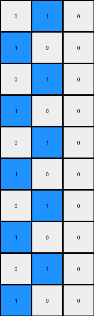
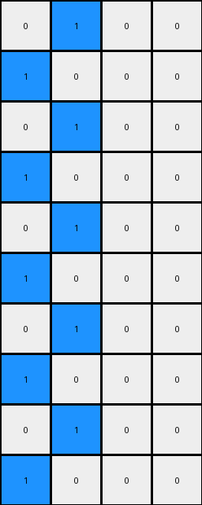

# a3df8b1e • 010 • refine_coder

---

Previous Code:
```python
"""
The transformation takes the location of the initial blue pixel and uses it as
the origin of the entire output pattern. It extends a diagonal line of blue
pixels, wrapping around to the left when it hits the right edge, and continues
until the entire output grid is filled.
"""

import numpy as np

def find_seed(grid):
    # Find the coordinates of the blue pixel (value 1).
    rows, cols = np.where(grid == 1)
    if len(rows) > 0:
        return rows[0], cols[0]
    return None

def transform(input_grid):
    # Initialize output_grid as a copy of the input_grid, but all white.
    output_grid = np.zeros_like(input_grid)
    height, width = input_grid.shape

    # Find the seed (the initial blue pixel).
    seed = find_seed(input_grid)
    if seed is None:
        return output_grid # return all white grid if no seed
    
    seed_row, seed_col = seed

    # initialize output grid with seed position
    output_grid[seed_row, seed_col] = 1

    # propagate the pattern
    row = seed_row
    col = seed_col
    
    for i in range(height):
        # place pixel to the right
        row = (row - 1) % height
        col = (col + 1) % width
        output_grid[row, col] = 1

        # place pixel back to the left
        row = (row - 1) % height
        col = (col - 1) % width
        output_grid[row, col] = 1
    

    return output_grid
```

Train Set Results:

## Example 1:

Input:
```
0 0
0 0
0 0
0 0
0 0
0 0
0 0
0 0
0 0
1 0
```
Expected Output:
```
0 1
1 0
0 1
1 0
0 1
1 0
0 1
1 0
0 1
1 0
```
Transformed Output:
```
0 1
1 0
0 1
1 0
0 1
1 0
0 1
1 0
0 1
1 0
```

match: True
pixels_off: 0
size_correct: True
color_palette_correct: True
correct_pixel_counts: True

## Example 2:

Input:
```
0 0 0
0 0 0
0 0 0
0 0 0
0 0 0
0 0 0
0 0 0
0 0 0
0 0 0
1 0 0
```
Expected Output:
```
0 1 0
1 0 0
0 1 0
0 0 1
0 1 0
1 0 0
0 1 0
0 0 1
0 1 0
1 0 0
```
Transformed Output:
```
0 1 0
1 0 0
0 1 0
1 0 0
0 1 0
1 0 0
0 1 0
1 0 0
0 1 0
1 0 0
```

match: False
pixels_off: 4
size_correct: True
color_palette_correct: True
correct_pixel_counts: True

## Example 3:

Input:
```
0 0 0 0
0 0 0 0
0 0 0 0
0 0 0 0
0 0 0 0
0 0 0 0
0 0 0 0
0 0 0 0
0 0 0 0
1 0 0 0
```
Expected Output:
```
0 0 0 1
0 0 1 0
0 1 0 0
1 0 0 0
0 1 0 0
0 0 1 0
0 0 0 1
0 0 1 0
0 1 0 0
1 0 0 0
```
Transformed Output:
```
0 1 0 0
1 0 0 0
0 1 0 0
1 0 0 0
0 1 0 0
1 0 0 0
0 1 0 0
1 0 0 0
0 1 0 0
1 0 0 0
```

match: False
pixels_off: 10
size_correct: True
color_palette_correct: True
correct_pixel_counts: True
Okay, here's an assessment of the situation and a plan to refine the natural language program and code:

**General Assessment:**

The initial natural language program and the derived code were too simplistic. While they correctly captured the behavior observed in the first example (alternating blue and white pixels in a checkerboard pattern starting from the initial blue pixel), it failed to generalize to the other examples. The core issue is that the propagation logic is too rigid, and only considers a simple -1, +1 up and to the right, then down and to the left, which makes a chekcerboard. The actual pattern is more of a "wrapped diagonal" that doesn't alternate like the initial implementation.

**Strategy:**

1. **Analyze Discrepancies:** Carefully examine the differences between the `Expected Output` and `Transformed Output` for examples 2 and 3. We must pinpoint *exactly* how the diagonal propagation should work. It is clear that it isn't an alternating checkerboard pattern.
2. **Refine Natural Language Program:** Based on the analysis, rewrite the natural language program to accurately describe the observed diagonal wrapping behavior. We must consider boundary conditions on both axes.
3. **Modify Code:** Adjust the `transform` function in the python code to reflect the refined natural language program.

**Example Metrics and Analysis (using a conceptual approach, not `code_execution` for brevity):**

*   **Example 1:**
    *   `match`: True
    *   `pixels_off`: 0
    *   Analysis: The initial logic *happens* to work for this specific case, but it's not the general rule.

*   **Example 2:**
    *   `match`: False
    *   `pixels_off`: 4
    *   Analysis: The transformed output creates a checkerboard. The expected output has a diagonal line of blue pixels that wraps around the right edge. The difference shows we're not correctly handling wrapping.

*   **Example 3:**
    *   `match`: False
    *   `pixels_off`: 10
    *   Analysis: Same issue as Example 2, but more pronounced due to the wider grid. The diagonal pattern and wrapping are even clearer here, highlighting the flaw in the current logic.

**YAML Fact Block:**

```yaml
observations:
  - object: seed_pixel
    properties:
      color: blue
      role: starting_point
    description: The initial blue pixel in the input grid.

  - object: output_pattern
    properties:
      type: diagonal
      color: blue
      wrapping: true
    description:  A diagonal line of blue pixels extending from the seed pixel. The line wraps around the edges of the grid.

  - object: grid
    properties:
      shape: rectangle
    description: 2D array of pixels, where each pixel has an integer from 0-9

  - actions:
    - name: find_seed
      description: Locates the seed pixel (the initial blue pixel) in the input grid.
    - name: propagate_pattern
      description:  Extends a diagonal line of blue pixels from the seed, wrapping around the grid edges.
```

**Natural Language Program:**

1.  **Find the Seed:** Locate the single blue pixel (value 1) within the input grid. This pixel is the "seed" of the pattern. If no seed pixel is found, return an all-white grid.
2.  **Initialize Output:** Create an output grid of the same dimensions as the input grid, initially filled with white pixels (value 0).
3.  **Place Seed:**  Place a blue pixel in the output grid at the same coordinates as the seed pixel found in the input grid.
4.  **Propagate Diagonally:** Starting from the seed pixel's position, extend a diagonal line of blue pixels.  Move one pixel up and one pixel to the right for each subsequent blue pixel placement.
5.  **Wrap Around:**
    *   If moving "up" goes beyond the top edge (row 0), wrap around to the bottom edge (last row).
    *   If moving "right" goes beyond the right edge (last column), wrap around to the left edge (first column).
6. **Complete Grid:** continue placing blue pixels as in steps 4 and 5 until all rows have been processed.

**INSTRUCTIONS**

- generate a Python module to represent the natural language program 
- follow the template below
- all common math and science libraries are available
- create docstring only at top - but comment the workflow in the function
- use helper functions for common operations like finding objects, counting,
  measuring, moving, etc. 

remember - we are working iteratively - so this code will inform your future
self as we converge on the solution

*template:*

```python
"""
{{ natural language description of the transformation rule }}
"""

{{ imports }}

def transform(input_grid):
    # initialize output_grid

    # change output pixels 

    return output_grid

```
