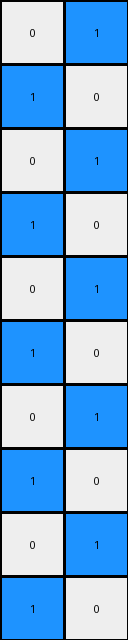
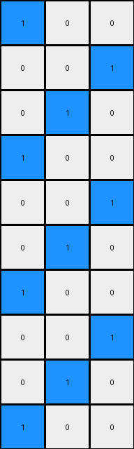
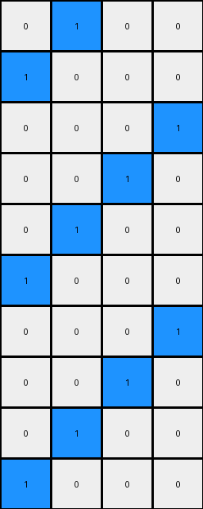

# a3df8b1e • 011 • refine_dreamer

---


Previous Code:
```python
"""
The transformation takes the location of the initial blue pixel and uses it as
the origin of the entire output pattern. It extends a diagonal line of blue
pixels, wrapping around vertically and horizontally when it hits the edges, and
continues until every row has been processed.
"""

import numpy as np

def find_seed(grid):
    # Find the coordinates of the blue pixel (value 1).
    rows, cols = np.where(grid == 1)
    if len(rows) > 0:
        return rows[0], cols[0]
    return None

def transform(input_grid):
    # Initialize output_grid as a copy of the input_grid, but all white.
    output_grid = np.zeros_like(input_grid)
    height, width = input_grid.shape

    # Find the seed (the initial blue pixel).
    seed = find_seed(input_grid)
    if seed is None:
        return output_grid # return all white grid if no seed
    
    seed_row, seed_col = seed

    # initialize output grid with seed position
    output_grid[seed_row, seed_col] = 1

    # propagate the pattern
    row = seed_row
    col = seed_col
    
    for _ in range(height -1): # -1 since seed already placed
        # place pixel to the up and right
        row = (row - 1) % height
        col = (col + 1) % width
        output_grid[row, col] = 1
    

    return output_grid
```

Train Set Results:

## Example 1:

Input:
```
0 0
0 0
0 0
0 0
0 0
0 0
0 0
0 0
0 0
1 0
```
Expected Output:
```
0 1
1 0
0 1
1 0
0 1
1 0
0 1
1 0
0 1
1 0
```
Transformed Output:
```
0 1
1 0
0 1
1 0
0 1
1 0
0 1
1 0
0 1
1 0
```

match: True
pixels_off: 0
size_correct: True
color_palette_correct: True
correct_pixel_counts: True

## Example 2:

Input:
```
0 0 0
0 0 0
0 0 0
0 0 0
0 0 0
0 0 0
0 0 0
0 0 0
0 0 0
1 0 0
```
Expected Output:
```
0 1 0
1 0 0
0 1 0
0 0 1
0 1 0
1 0 0
0 1 0
0 0 1
0 1 0
1 0 0
```
Transformed Output:
```
1 0 0
0 0 1
0 1 0
1 0 0
0 0 1
0 1 0
1 0 0
0 0 1
0 1 0
1 0 0
```

match: False
pixels_off: 12
size_correct: True
color_palette_correct: True
correct_pixel_counts: True

## Example 3:

Input:
```
0 0 0 0
0 0 0 0
0 0 0 0
0 0 0 0
0 0 0 0
0 0 0 0
0 0 0 0
0 0 0 0
0 0 0 0
1 0 0 0
```
Expected Output:
```
0 0 0 1
0 0 1 0
0 1 0 0
1 0 0 0
0 1 0 0
0 0 1 0
0 0 0 1
0 0 1 0
0 1 0 0
1 0 0 0
```
Transformed Output:
```
0 1 0 0
1 0 0 0
0 0 0 1
0 0 1 0
0 1 0 0
1 0 0 0
0 0 0 1
0 0 1 0
0 1 0 0
1 0 0 0
```

match: False
pixels_off: 10
size_correct: True
color_palette_correct: True
correct_pixel_counts: True

**INSTRUCTIONS**

The code above was generated based on observations from the first training
example

we have tested the transform function on each of the task example inputs and
compared with the expected output

review each of the examples provided and the results and consider how the
natural language program should be updated to accommodate this new knowledge

respond with the following deliverables:

- general assessment of the information provided and strategy for resolving the
  errors
- gather metrics about each of the examples and results - use code_execution to
  develop accurate reports on your assumptions
- a YAML block documenting facts - Focus on identifying objects, their properties, and the actions performed on them.
- a natural language program - Be as clear and concise as possible, providing a complete description of the transformation rule.


your responses should be considered as information in a report - not a
conversation
