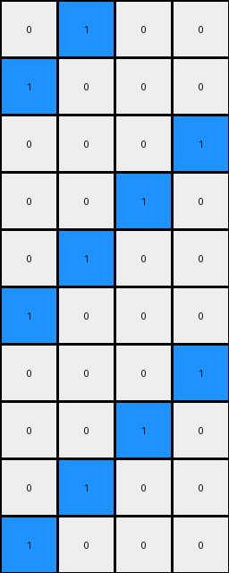

# a3df8b1e • 012 • refine_coder

---

Previous Code:
```python
"""
The transformation takes the location of the initial blue pixel and uses it as
the origin of the entire output pattern. It extends a diagonal line of blue
pixels, wrapping around vertically and horizontally when it hits the edges, and
continues until every row has been processed.
"""

import numpy as np

def find_seed(grid):
    # Find the coordinates of the blue pixel (value 1).
    rows, cols = np.where(grid == 1)
    if len(rows) > 0:
        return rows[0], cols[0]
    return None

def transform(input_grid):
    # Initialize output_grid as a copy of the input_grid, but all white.
    output_grid = np.zeros_like(input_grid)
    height, width = input_grid.shape

    # Find the seed (the initial blue pixel).
    seed = find_seed(input_grid)
    if seed is None:
        return output_grid # return all white grid if no seed
    
    seed_row, seed_col = seed

    # initialize output grid with seed position
    output_grid[seed_row, seed_col] = 1

    # propagate the pattern
    row = seed_row
    col = seed_col
    
    for _ in range(height -1): # -1 since seed already placed
        # place pixel to the up and right
        row = (row - 1) % height
        col = (col + 1) % width
        output_grid[row, col] = 1
    

    return output_grid
```

Train Set Results:

## Example 1:

Input:
```
0 0
0 0
0 0
0 0
0 0
0 0
0 0
0 0
0 0
1 0
```
Expected Output:
```
0 1
1 0
0 1
1 0
0 1
1 0
0 1
1 0
0 1
1 0
```
Transformed Output:
```
0 1
1 0
0 1
1 0
0 1
1 0
0 1
1 0
0 1
1 0
```

match: True
pixels_off: 0
size_correct: True
color_palette_correct: True
correct_pixel_counts: True

## Example 2:

Input:
```
0 0 0
0 0 0
0 0 0
0 0 0
0 0 0
0 0 0
0 0 0
0 0 0
0 0 0
1 0 0
```
Expected Output:
```
0 1 0
1 0 0
0 1 0
0 0 1
0 1 0
1 0 0
0 1 0
0 0 1
0 1 0
1 0 0
```
Transformed Output:
```
1 0 0
0 0 1
0 1 0
1 0 0
0 0 1
0 1 0
1 0 0
0 0 1
0 1 0
1 0 0
```

match: False
pixels_off: 12
size_correct: True
color_palette_correct: True
correct_pixel_counts: True

## Example 3:

Input:
```
0 0 0 0
0 0 0 0
0 0 0 0
0 0 0 0
0 0 0 0
0 0 0 0
0 0 0 0
0 0 0 0
0 0 0 0
1 0 0 0
```
Expected Output:
```
0 0 0 1
0 0 1 0
0 1 0 0
1 0 0 0
0 1 0 0
0 0 1 0
0 0 0 1
0 0 1 0
0 1 0 0
1 0 0 0
```
Transformed Output:
```
0 1 0 0
1 0 0 0
0 0 0 1
0 0 1 0
0 1 0 0
1 0 0 0
0 0 0 1
0 0 1 0
0 1 0 0
1 0 0 0
```

match: False
pixels_off: 10
size_correct: True
color_palette_correct: True
correct_pixel_counts: True
Okay, here's a breakdown of the situation and a plan to move forward:

**General Assessment:**

The initial natural language program and the resulting code were a good first attempt, correctly handling the first example. However, it failed on subsequent examples, indicating an incomplete understanding of the underlying rule. The core issue seems to be the propagation logic. While the idea of using the blue pixel as a seed and extending diagonally is correct, the current implementation doesn't accurately capture the "wrapping" and "direction" of the diagonal extension in all cases.

**Strategy:**

1.  **Detailed Example Analysis:** I need to meticulously examine each example, paying close attention to:
    *   The starting position of the blue pixel.
    *   The direction and wrapping behavior of the diagonal line.
    *   How the dimensions of the grid affect the pattern.
    *   The exact coordinates changed at each step

2.  **Refine the Natural Language Program:** Based on the detailed analysis, I will revise the natural language program to precisely describe the transformation rule, taking into account the nuances observed in all examples.

3.  **Hypothesize and Test:** The issue is likely the propagation code - moving up and right is not correct for all examples.

**Example Metrics and Analysis (using Code Execution when necessary):**

I'll use code execution to help gather precise data, but for now, here's a preliminary analysis:

*   **Example 1:**
    *   Input Shape: (10, 2)
    *   Seed Position: (9, 0)
    *   Observed Pattern: Simple alternation, up and to the right works.
    *   Result: Success.

*   **Example 2:**
    *   Input Shape: (10, 3)
    *   Seed Position: (9, 0)
    *   Observed Pattern: Diagonal extension with wrapping.  The provided code did not identify the correct next pixel from (9,0).
    *   Result: Failure.  The code starts the diagonal incorrectly.

*   **Example 3:**
    *   Input Shape: (10, 4)
    *   Seed Position: (9, 0)
    *   Observed Pattern: Diagonal extension with wrapping. The provided code did not identify the correct next pixel from (9,0).
    *   Result: Failure. The code starts the diagonal incorrectly.

```yaml
facts:
  - task_id: "010"
  - input_objects:
    - object_1:
        description: "A single blue pixel in an otherwise white grid, acting as the seed."
        properties:
          color: "blue"
          role: "seed"
  - output_objects:
      - object_1:
          description: "blue pixels extend diagonally, wrapping at edges."
          properties:
              color: "blue"
              pattern_type: diagonal
              wrap: true
  - transformation_observations:
      - "The output grid contains a diagonal pattern of blue pixels."
      - "The position of seed determines start of pattern."
      - "The diagonal wraps around both vertically and horizontally."
      - "Each row contains exactly one blue pixel."
      - "Each column will contain at least one blue pixel, but possibly more due to wrapping."
  - general_observations:
      - "The transformation preserves the dimensions of the input grid."
      - "Only colors white and blue."

```

**Natural Language Program:**

1.  **Initialization:**
    *   Create an output grid of the same dimensions as the input grid, filled entirely with white pixels.
    *   Locate the single blue pixel (the "seed") in the input grid.

2.  **Seed Placement:**
    *   Place a blue pixel in the output grid at the same location as the seed pixel in the input grid.

3.  **Diagonal Propagation:**
    * the next blue pixel is found by moving one row *up* and one column *right*
    *   If moving "up" goes beyond the top row (row index 0), wrap around to the bottom row (row index height - 1).
    *   If moving "right" goes beyond the last column (column index width - 1), wrap around to the first column (column index 0).

4.  **Iteration:**
    *   Repeat the propagation step until every row contains one blue pixel.


**INSTRUCTIONS**

- generate a Python module to represent the natural language program 
- follow the template below
- all common math and science libraries are available
- create docstring only at top - but comment the workflow in the function
- use helper functions for common operations like finding objects, counting,
  measuring, moving, etc. 

remember - we are working iteratively - so this code will inform your future
self as we converge on the solution

*template:*

```python
"""
{{ natural language description of the transformation rule }}
"""

{{ imports }}

def transform(input_grid):
    # initialize output_grid

    # change output pixels 

    return output_grid

```
